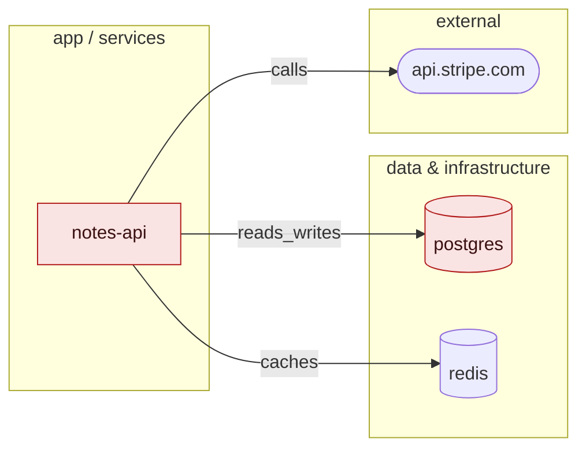

# VibeGuard

> Audits, repairs, hardens, tests, and reports on vibe-coded applications, bringing
> them closer to production grade.

**Detect → Explain → Repair → Test → Validate → Report**

An LLM will happily write you a working app in an afternoon. It will not tell you that
the login query is an f-string, that the session tokens come from `random`, that the
container runs as root with no healthcheck, that nothing is pinned, or that the deploy
workflow ships to production without running a test. VibeGuard finds those, explains
why each one matters, repairs the ones it can prove are safe, writes a test that fails
before the repair and passes after, and refuses — loudly — to claim anything it cannot
demonstrate.

Three rules it never breaks:

1. **Never claim FIXED without validation evidence.**
2. **Never make a high-risk change without approval.**
3. **Never overengineer.** Recommendations are proportional to the project — a 150-line
   CRUD app is never told to adopt Kubernetes, sharding, or a service mesh.

## Install

```bash
pipx install vibeguard          # recommended: isolated, on your PATH
pip install vibeguard
pip install "vibeguard[scanners]"   # + bandit, detect-secrets, pip-audit, checkov, semgrep
pip install "vibeguard[ai]"         # + the optional AI providers

docker run --rm -v "$PWD":/repo ghcr.io/vibeguard/vibeguard audit /repo
```

Nothing external is required. Every built-in rule is regex, AST, or config parsing and
runs with zero installs and zero network. External scanners are *merged in* when they
happen to be present. See [docs/INSTALL.md](docs/INSTALL.md).

## Quickstart

```bash
vibeguard audit examples/vulnerable-app
```

```
Findings by severity            Category scores (overall 55/100)
┏━━━━━━━━━━┳━━━━━━━┓            ┏━━━━━━━━━━━━━━━━━━━┳━━━━━━━┳━━━━━━━━━━┓
┃ severity ┃ count ┃            ┃ category          ┃ score ┃ findings ┃
┡━━━━━━━━━━╇━━━━━━━┩            ┡━━━━━━━━━━━━━━━━━━━╇━━━━━━━╇━━━━━━━━━━┩
│ critical │     7 │            │ security          │     0 │       22 │
│ high     │    27 │            │ secrets           │    13 │        6 │
│ medium   │    22 │            │ containers        │    28 │        9 │
│ low      │    18 │            │ api               │    47 │        8 │
│ info     │     3 │            │ database          │    57 │        4 │
│ total    │    77 │            │ …                 │       │          │
└──────────┴───────┘            └───────────────────┴───────┴──────────┘

          Master audit checklist (279 topics across 18 sections)
┏━━━━━━━━━━━━━━━━━━━┳━━━━━━┳━━━━━━┳━━━━━━━┳━━━━━━━━━━━━━━━━━┳━━━━━━━━━━━━━━━━┓
┃ section           ┃ pass ┃ fail ┃ fixed ┃ review_required ┃ not_applicable ┃
┡━━━━━━━━━━━━━━━━━━━╇━━━━━━╇━━━━━━╇━━━━━━━╇━━━━━━━━━━━━━━━━━╇━━━━━━━━━━━━━━━━┩
│ security          │    4 │   30 │     · │               · │              1 │
│ containers        │    · │    8 │     · │               · │             13 │
│ distributed       │    · │    · │     · │               · │             18 │
│ …                 │      │      │       │                 │                │
│ all               │   54 │   99 │     · │              21 │            104 │
└───────────────────┴──────┴──────┴───────┴─────────────────┴────────────────┘

│ VG-SEC-001   │ critical │ app.py:49  │ SQL injection via interpolated query   │
│ VG-SEC-010   │ high     │ app.py:32  │ Weak cryptographic primitive           │
│ VG-SEC-011   │ high     │ app.py:38  │ Cryptographically unsafe randomness    │
│ VG-SEC-015   │ high     │ app.py:21  │ Permissive CORS configuration          │
│ VG-CTR-001   │ high     │ Dockerfile │ Container runs as root                 │
```

Then repair what is provably safe:

```bash
vibeguard fix examples/vulnerable-app --safe
```

Each repair lands on its own commit on a `vibeguard/fix-YYYY-MM-DD` branch, with a
generated repro test as its evidence. See
[`examples/repaired-app/`](examples/repaired-app/) for a real run and its report.

## Commands

| Command | What it does |
|---|---|
| `vibeguard audit PATH` | Read-only scan. Never writes to the repository being scanned. |
| `vibeguard fix PATH` | Repair on a dedicated branch, one validated commit per fix. |
| `vibeguard report PATH` | Re-render the last recorded scan — no rescan, no repository access. |
| `vibeguard ci PATH` | Audit plus a severity gate. Exit 1 when the gate fails. |
| `vibeguard graph PATH` | Draw the inferred architecture as mermaid or SVG. Discovery only — no rules. |
| `vibeguard baseline create\|show PATH` | Accept today's findings so CI gates only on new ones. |
| `vibeguard doctor` | What is available here: python, git, tree-sitter, each adapter. |
| `vibeguard rules` | Every registered rule with its category, scale, and autofix class. |

Common flags: `--output table,json,jsonl,md,html,all` · `--local-only` · `--packs` ·
`--deep` (audit: every checklist topic) · `--safe` / `--interactive` /
`--deep-validate` / `--allow-no-git` (fix) · `--fail-on` / `--baseline` (ci) ·
`--format mermaid|svg` / `--out` (graph).

Exit codes: `0` ok · `1` findings at or above the threshold · `2` execution error ·
`3` refused, dirty git worktree.

### Visualising your architecture

Every markdown report opens with an **Architecture** section: the graph discovery
inferred — the app, its datastores, its brokers, the third-party hosts it calls — as a
mermaid `flowchart LR`, which GitHub and GitLab render inline. Nodes are coloured by
the category score that governs them (database nodes by the `database` score, external
services by `api`, the app itself by the overall score): green at 85 and above, amber
from 60, red below, grey when nothing measured it.



The HTML report says the same thing without needing a mermaid renderer: an
**Architecture & health at a glance** section of three inline SVGs — the diagram, the
category scores as bars, and the checklist as one stacked bar per section. They are
plain SVG with no script and no external reference, so the report still renders from a
CI artifact store with JavaScript disabled.

`vibeguard graph PATH` prints just the diagram, running discovery alone:

```bash
vibeguard graph .                              # mermaid on stdout
vibeguard graph . --format svg --out arch.svg  # standalone SVG file
```

It reuses the scores from `.vibeguard/history/` when a scan is recorded there, and
draws everything neutral when there is none — an unmeasured node must never look like
a healthy one.

## Modes

| Mode | Writes? | Applies | Asks | Typical use |
|---|---|---|---|---|
| `audit` | never | nothing | nothing | first look, dashboards |
| `fix --safe` | branch + commits | only `SAFE_AUTOFIX` | nothing | the default; unattended |
| `fix --interactive` | branch + commits | `SAFE_AUTOFIX` + approved `REVIEW_RECOMMENDED` | one unified diff at a time | a real hardening session |
| `ci` | report files | nothing | nothing | pull requests, pre-commit |

`MANUAL_CHANGE_REQUIRED` findings are never applied in any mode, and neither is
anything touching schemas, migrations, authentication, backups, or infrastructure
state — regardless of which flags you pass. Those get `REQUIRES_REVIEW` with
instructions.

## The pipeline

**Detect.** Discovery first: languages, frameworks, databases, ORMs, containers,
CI, and a scale class (`toy | small | medium | large`) from LOC, service count, and
data-sensitivity signals. Every rule declares the minimum scale it applies to, and
rules that do not apply report nothing. Then ~117 built-in rules run, plus any
external scanner that happens to be installed, deduplicated by fingerprint.

**Explain.** Every finding carries what is wrong *here*, why it matters in
consequences rather than jargon, a recommended follow-up, and references.

**Repair.** Git preflight (a dirty worktree is refused), a dedicated branch, and then
one finding at a time: the rule computes a deterministic whole-file patch and hands
back the sha256 of the content it read; the engine re-checks that sha immediately
before writing, so a file that changed underneath aborts its own fix.

**Test.** For a curated subset of rules VibeGuard *generates a pytest repro test*
before touching anything, runs it, and insists it fails. A test that passes on
unrepaired code reproduces nothing and is thrown away rather than used as evidence.

**Validate.** The applicable rungs of syntax → typecheck → lint → targeted tests →
full suite → build → container build → startup. Anything that already failed on the
untouched repository is *excluded* from the verdict and the exclusion is printed —
a project whose suite was already red cannot blame our patch, and cannot borrow a
green verdict either.

**Report.** `vibeguard-report.json` (canonical), `.md`, and a self-contained `.html`
with no external requests of any kind.

## The master checklist

`topics.yaml` holds **279 audit topics across 18 sections** — the completeness
guarantee. Every report accounts for every one of them, and the engine hard-fails its
own run if a topic goes missing. A topic is `pass`, `fail`, `fixed`, `not_applicable`
(with the reason), or `review_required` — and `review_required` is where topics with
no automated detector land. They are never quietly converted to `pass`.

## Safety model

* **Git is the undo button.** `fix` refuses a dirty worktree (exit 3), records HEAD,
  branches, and commits one logical change per fix with a conventional-commit subject
  ending in `[VG-XXX-NNN]`. Validation failure rolls the working tree back. Without a
  repository, `fix` is audit-only unless you pass `--allow-no-git` (then it writes a
  `.orig` backup per file).
* **`FIXED` is a claim about evidence.** It requires: the patch applied, no validator
  failed, at least one validator actually ran and passed, and — if a repro test
  existed — that it now passes. Anything less is downgraded to `UNVERIFIED`,
  `REQUIRES_REVIEW`, `FAILED`, or `NOT_ATTEMPTED`, and the report says which.
* **Destructive domains are refused in every mode.** Schema, migration, auth, backup,
  and infrastructure changes are reported, never applied.
* **Secrets are redacted at the Finding-creation boundary**, so no renderer can leak
  one.
* **Privacy.** The default AI provider is `null` and the whole pipeline works without
  a model. `--local-only` refuses any provider that is not on this machine, and skips
  scanners that contact a remote service. Any prompt that would leave the machine is
  announced first — an `ai.external_send` event and a printed notice, *before* the
  request. See [docs/PLUGINS.md](docs/PLUGINS.md).

## Memory: baselines, suppressions, regression

Fingerprints are `sha256(rule_id | path | normalised snippet)` — independent of line
numbers, so they survive reformatting and unrelated edits.

* **Baseline** (`.vibeguard/baseline.json`) is a *scheduling* decision: baselined
  findings are still detected, still listed, still scored. They only stop failing CI.
* **Suppressions** (`.vibeguard/suppressions.yml`, or inline
  `# vibeguard: ignore=VG-SEC-001 reason="..."`) require a reason, an author, and a
  date, are excluded from scoring, and are listed in every report. An expired one is
  ignored *and* its lapse is reported.
* **Regression diff** — `N new / N resolved / N regressed / N unchanged` against
  `.vibeguard/history/`, where *regressed* specifically means "fixed, then came back".

## About the score

The 0–100 numbers are **a heuristic, not science**. They exist to make trends legible
("secrets went from 40 to 95 after that PR"), not to rank projects against each other,
and certainly not to be quoted as a security certification. A category with no
applicable rules is excluded from the overall score rather than counted as perfect.
The exact formula is in [docs/SCORING.md](docs/SCORING.md).

## Embedding

```python
from vibeguard import Engine, VibeguardConfig
from vibeguard.core.events import EventBus

bus = EventBus()
bus.subscribe("scan.issue_found", lambda name, data: print(data["finding"]["title"]))
report = Engine(VibeguardConfig(), events=bus).audit("path/to/repo")
print(report.overall_before, len(report.findings))
```

`--output jsonl` streams the same events as one JSON object per line, and
[`plugin.json`](plugin.json) documents every event name and payload for agent hosts.
Third-party rule packs register under the `vibeguard.rules` entry point.

## Documentation

- [docs/INSTALL.md](docs/INSTALL.md) — install matrix, optional scanners, `doctor`
- [docs/RULES.md](docs/RULES.md) — writing a rule, and writing a `fix()` for it
- [docs/PLUGINS.md](docs/PLUGINS.md) — rule packs, adapters, AI providers, embedding
- [docs/SCORING.md](docs/SCORING.md) — the exact formula
- [docs/ARCHITECTURE.md](docs/ARCHITECTURE.md) — design and roadmap
- [docs/INTERFACES.md](docs/INTERFACES.md) — binding contracts (normative)
- [docs/DECISIONS.md](docs/DECISIONS.md) — every contract interpretation, and why

## Status

**0.2.0 — MVP complete.** 117 rules across 16 packs (20 registered; 4 language packs are reserved and empty), 8 external adapters, the 279-topic
master checklist, fix mode with git safety and a validation ladder, repro-test
generation, md/html/json reporting, baselines/suppressions/history/regression, the AI
provider layer, a GitHub Action, a Docker image, and pre-commit hooks.

Post-MVP: more language packs, deeper k8s/IaC coverage, LLM-assisted cross-file
analysis, PR-comment integration, a web dashboard.

## License

Apache-2.0.
