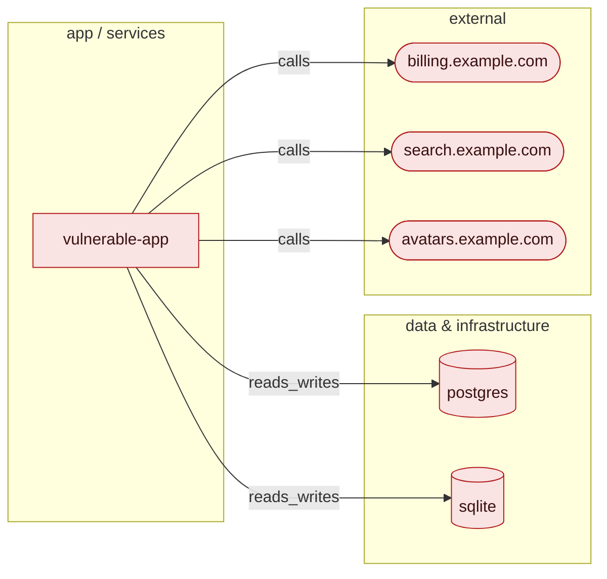

<div align="center">


# VibeGuard

**Production hardening for vibe-coded apps.**

[](https://github.com/Gypsy46n2/VibeGuard/releases)
[](pyproject.toml)
[](LICENSE)
[](tests/)
[](docs/RULES.md)
[](docs/RULES.md)

**Detect → Explain → Repair → Test → Validate → Report**

</div>

---

## What it does

An LLM will happily write you a working app in an afternoon. It will not tell you that
the login query is an f-string, that the session tokens come from `random`, that the
container runs as root with no healthcheck, that nothing is pinned, or that the deploy
workflow ships to production without running a test.

VibeGuard finds those, explains why each one matters, repairs the ones it can prove are
safe, writes a test that fails before the repair and passes after, and refuses —
loudly — to claim anything it cannot demonstrate.

Three rules it never breaks:

1. **Never claim FIXED without validation evidence.**
2. **Never make a high-risk change without approval.**
3. **Never overengineer.** Recommendations are proportional to the project — a 150-line
   CRUD app is never told to adopt Kubernetes, sharding, or a service mesh.

## Read-only by default

`vibeguard audit` reads your code and writes a report. It never edits a file, never
creates a branch, never commits. Repairs happen only when you ask for them by name —
`vibeguard fix`, on its own branch, one validated commit per fix.

The only thing an audit leaves behind is its own output: `vibeguard-report.*` and
`.vibeguard/` (history, baseline). Both can be moved or switched off:

```bash
vibeguard audit .  --report-dir /tmp/scan   # reports and .vibeguard/ land there, not here
vibeguard audit .  --no-write               # prints the table, writes nothing at all
vibeguard ci .     --no-write               # still gates; leaves zero footprint
```

Scanning someone else's repository, a read-only checkout, or a CI workspace you would
rather keep pristine is a supported case, not a workaround.

## Install

Requires **Python ≥3.11** and nothing else. Every built-in rule is regex, AST, or
config parsing, and runs with zero installs and zero network.

```bash
pipx install git+https://github.com/Gypsy46n2/VibeGuard.git     # CLI on your PATH
pip  install git+https://github.com/Gypsy46n2/VibeGuard.git     # into a virtualenv

# optional extras
pip install "vibeguard[scanners] @ git+https://github.com/Gypsy46n2/VibeGuard.git"
```

`[scanners]` adds bandit, detect-secrets, pip-audit, checkov, and semgrep; `[ai]` adds
the optional AI providers. External scanners are *merged in* when they happen to be
present — none of them is required. There is also a `Dockerfile`:

```bash
docker build -t vibeguard . && docker run --rm -v "$PWD":/repo vibeguard audit /repo
```

Full matrix, adapter notes, and `vibeguard doctor` in [docs/INSTALL.md](docs/INSTALL.md).

## Quickstart

```bash
vibeguard audit examples/vulnerable-app
```

```
                           Detected stack
languages         python (3)
frameworks        flask
databases         postgres, sqlite
package managers  pip
containers        docker, compose
ci/cd             github-actions
auth              jwt
scale             small — 146 LOC, 1 service(s), sensitive data: True

Findings by severity            Category scores (overall 55/100)
┏━━━━━━━━━━┳━━━━━━━┓            ┏━━━━━━━━━━━━━━━━━━━┳━━━━━━━┳━━━━━━━━━━┓
┃ severity ┃ count ┃            ┃ category          ┃ score ┃ findings ┃
┡━━━━━━━━━━╇━━━━━━━┩            ┡━━━━━━━━━━━━━━━━━━━╇━━━━━━━╇━━━━━━━━━━┩
│ critical │     7 │            │ security          │     0 │       22 │
│ high     │    27 │            │ secrets           │    13 │        6 │
│ medium   │    22 │            │ containers        │    28 │        9 │
│ low      │    18 │            │ api               │    47 │        8 │
│ info     │     3 │            │ database          │    57 │        4 │
│ total    │    77 │            │ …                 │       │          │
└──────────┴───────┘            └───────────────────┴───────┴──────────┘

            Master audit checklist (279 topics across 18 sections)
┏━━━━━━━━━━━━━━━━━━━┳━━━━━━┳━━━━━━┳━━━━━━━┳━━━━━━━━━━━━━━━━━┳━━━━━━━━━━━━━━━━┓
┃ section           ┃ pass ┃ fail ┃ fixed ┃ review_required ┃ not_applicable ┃
┡━━━━━━━━━━━━━━━━━━━╇━━━━━━╇━━━━━━╇━━━━━━━╇━━━━━━━━━━━━━━━━━╇━━━━━━━━━━━━━━━━┩
│ security          │    4 │   30 │     · │               · │              1 │
│ containers        │    · │    8 │     · │               · │             13 │
│ distributed       │    · │    · │     · │               · │             18 │
│ …                 │      │      │       │                 │                │
│ all               │   54 │  100 │     0 │              21 │            104 │
└───────────────────┴──────┴──────┴───────┴─────────────────┴────────────────┘
review_required includes topics with no automated detector yet — never silently passed.

│ VG-SEC-001   │ critical │ app.py:50              │ SQL injection via interpolated query │
│ VG-SCR-008   │ critical │ app.py:25              │ Hardcoded application or JWT secret  │
│ VG-SEC-011   │ high     │ app.py:39              │ Cryptographically unsafe randomness  │
│ VG-SEC-015   │ high     │ app.py:21              │ Permissive CORS configuration        │
│ VG-CTR-001   │ high     │ Dockerfile:2           │ Container runs as root               │
```

Then repair what is provably safe:

```bash
vibeguard fix examples/vulnerable-app --safe
```

Each repair lands on its own commit on a `vibeguard/fix-YYYY-MM-DD` branch, with a
generated repro test as its evidence.

## Web UI

If a terminal is not where you live, VibeGuard ships a local web app that does the same
things by clicking:

```bash
pip install "vibeguard[ui] @ git+https://github.com/Gypsy46n2/VibeGuard.git"
vibeguard ui                    # opens http://127.0.0.1:8321/ in your browser
vibeguard ui ~/code/my-app      # start the folder picker somewhere specific
```

Pick a folder from a point-and-click browser, press **Audit (read-only)**, and watch the
scan happen: stages as they run, findings counting up by severity as they are found.
When it finishes you get the readiness score, the architecture and category diagrams,
every finding expandable with its evidence and its fix, the full production checklist,
and the markdown / HTML / JSON reports to download. Scans are remembered per folder, so
the sidebar is your history. If anything is safely repairable, a separate card appears
*after* the results, tells you exactly what safe mode will do, and does nothing until
you tick the box and press the button.

The server binds `127.0.0.1` and nothing else, opens no outbound connections, and uses
the same engine, rules and report as the CLI — it is a front end, not a second
implementation. Use `--port` to move it and `--no-browser` to keep it in the terminal.

## What `fix` actually repairs

Autofix is deliberately narrow, and the README will not pretend otherwise. Of the 117
rules, **14 ship a deterministic `fix()`**:

| Safety class | Rules with a `fix()` | Applied by `--safe` | Applied by `--interactive` |
|---|---|---|---|
| `SAFE_AUTOFIX` | 2 | yes, unattended | yes |
| `REVIEW_RECOMMENDED` | 12 | no | yes, one diff at a time, on approval |
| `MANUAL_CHANGE_REQUIRED` / `INFORMATIONAL` | 0 | never | never |

So `--safe` is a conservative pass, not a magic wand. On
[`examples/repaired-app/`](examples/repaired-app/) — a real, reproducible run — it
applied and validated **5 repairs**, taking findings 77 → 72 and the overall score
55 → 57 (the `api` category 47 → 80). Everything else is reported for a human. That
directory exists specifically to show where automation stops and hands you the work.

## Architecture, drawn from your code

Every markdown report opens with an **Architecture** section: the app, its datastores,
and the third-party hosts it calls, as a mermaid `flowchart LR` that GitHub and GitLab
render inline. Nodes are coloured by the category score that governs them — green at
85 and above, amber from 60, red below, grey when nothing measured it. Real output for
`examples/vulnerable-app`:



The HTML report says the same thing without a mermaid renderer — three inline SVGs
(diagram, category bars, checklist) with no script and no external reference, so it
still renders from a CI artifact store with JavaScript disabled.

```bash
vibeguard graph .                              # mermaid on stdout
vibeguard graph . --format svg --out arch.svg  # standalone SVG file
```

An unmeasured node is always drawn neutral — it must never look like a healthy one.

## Commands

| Command | What it does |
|---|---|
| `vibeguard audit PATH` | Read-only scan. Never writes to the repository being scanned. |
| `vibeguard fix PATH` | Repair on a dedicated branch, one validated commit per fix. |
| `vibeguard report PATH` | Re-render the last recorded scan — no rescan, no repository access. |
| `vibeguard ci PATH` | Audit plus a severity gate. Exit 1 when the gate fails. |
| `vibeguard graph PATH` | Draw the inferred architecture as mermaid or SVG. Discovery only. |
| `vibeguard ui [PATH]` | Serve the local web UI on 127.0.0.1. Needs the `[ui]` extra. |
| `vibeguard baseline create\|show PATH` | Accept today's findings so CI gates only on new ones. |
| `vibeguard doctor` | What is available here: python, git, tree-sitter, each adapter. |
| `vibeguard rules` | Every registered rule with its category, scale, and autofix class. |

Common flags: `--output table,json,jsonl,md,html,all` · `--local-only` · `--packs` ·
`--deep` (audit) · `--safe` / `--interactive` / `--deep-validate` / `--allow-no-git`
(fix) · `--fail-on` / `--baseline` (ci) · `--format mermaid|svg` / `--out` (graph) ·
`--port` / `--no-browser` (ui).

Footprint flags: `--report-dir DIR` (audit, fix, ci, report, `baseline create|show`)
writes the reports *and* `DIR/.vibeguard/` there instead of into the repository, and
`--no-write` (audit, ci) writes nothing anywhere. History follows the reports, so the
regression diff and `vibeguard report --report-dir DIR` read from the same place.
Set it once with `report_dir = "…"` under `[vibeguard]` in `.vibeguard.toml`; the flag
wins over the file.

Exit codes: `0` ok · `1` findings at or above the threshold · `2` execution error ·
`3` refused, dirty git worktree.

## The pipeline

**Detect.** Discovery first — languages, frameworks, databases, ORMs, containers, CI,
and a scale class (`toy | small | medium | large`). Test, fixture, example, and
vendored trees are still scanned, but they do not get to define the stack or inflate
the scale: the Flask demo in your `examples/` folder is something your project
*carries*, not something it *is* (configurable via `fixture_paths`). Every rule
declares the minimum scale it applies to, and rules that do not apply report nothing. Then 117 built-in
rules across 16 packs run, plus any of the 8 external adapters that happen to be
installed (bandit, detect-secrets, pip-audit, checkov, semgrep, hadolint, trivy,
npm-audit), deduplicated by fingerprint.

**Explain.** Every finding carries what is wrong *here*, why it matters in consequences
rather than jargon, a recommended follow-up, and references.

**Repair.** Git preflight, a dedicated branch, then one finding at a time: the rule
computes a deterministic whole-file patch and hands back the sha256 of the content it
read; the engine re-checks that sha immediately before writing, so a file that changed
underneath aborts its own fix.

**Test.** For a curated subset of rules VibeGuard *generates a pytest repro test*
before touching anything, runs it, and insists it fails. A test that passes on
unrepaired code reproduces nothing and is thrown away rather than used as evidence.

**Validate.** The applicable rungs of syntax → typecheck → lint → targeted tests →
full suite → build → container build → startup. Anything that already failed on the
untouched repository is *excluded* from the verdict, and the exclusion is printed — a
project whose suite was already red cannot blame our patch, and cannot borrow a green
verdict either.

**Report.** `vibeguard-report.json` (canonical), `.md`, and a self-contained `.html`
with no external requests of any kind.

## The master checklist

`topics.yaml` holds **279 audit topics across 18 sections** — the completeness
guarantee. Every report accounts for every one of them, and the engine hard-fails its
own run if a topic goes missing. A topic is `pass`, `fail`, `fixed`, `not_applicable`
(with the reason), or `review_required` — and `review_required` is where topics with no
automated detector land. They are never quietly converted to `pass`.

## Safety model

* **Git is the undo button.** `fix` refuses a dirty worktree (exit 3), records HEAD,
  branches, and commits one logical change per fix with a conventional-commit subject
  ending in `[VG-XXX-NNN]`. Validation failure rolls the working tree back. Without a
  repository, `fix` is audit-only unless you pass `--allow-no-git` (then it writes a
  `.orig` backup per file).
* **`FIXED` is a claim about evidence.** It requires: the patch applied, no validator
  failed, at least one validator actually ran and passed, and — if a repro test existed
  — that it now passes. Anything less is downgraded to `UNVERIFIED`, `REQUIRES_REVIEW`,
  `FAILED`, or `NOT_ATTEMPTED`, and the report says which.
* **Destructive domains are refused in every mode.** Schema, migration, auth, backup,
  and infrastructure changes are reported, never applied — regardless of flags.
* **Secrets are redacted at the Finding-creation boundary**, so no renderer can leak one.
* **Privacy.** The default AI provider is `null` and the whole pipeline works without a
  model. `--local-only` refuses any provider that is not on this machine and skips
  scanners that contact a remote service. Any prompt that would leave the machine is
  announced first — an `ai.external_send` event and a printed notice, *before* the
  request.

## Baselines, suppressions, regression

Fingerprints are `sha256(rule_id | path | normalised snippet)` — independent of line
numbers, so they survive reformatting and unrelated edits.

* **Baseline** (`.vibeguard/baseline.json`) is a *scheduling* decision: baselined
  findings are still detected, still listed, still scored. They only stop failing CI.
* **Suppressions** (`.vibeguard/suppressions.yml`, or inline
  `# vibeguard: ignore=VG-SEC-001 reason="..."`) require a reason, an author, and a
  date, are excluded from scoring, and are listed in every report. An expired one is
  ignored *and* its lapse is reported.
* **Regression diff** — `N new / N resolved / N regressed / N unchanged` against
  `.vibeguard/history/`, where *regressed* means "fixed, then came back".

Under `--report-dir DIR` all three live in `DIR/.vibeguard/` and are read from there,
so runs given that directory compare against each other. Suppressions are authored by
you and are always read from the repository itself.

## CI

A composite GitHub Action ships in [`action.yml`](action.yml):

```yaml
- uses: Gypsy46n2/VibeGuard@v0.2.0
  with:
    path: .
    fail-on: high        # critical | high | medium | low | info
    local-only: "true"   # nothing leaves the runner
    baseline: "true"     # gate only on new findings
```

It installs VibeGuard, runs `vibeguard ci`, uploads `vibeguard-report.{json,md,html}`
as a workflow artifact, and fails the job only when the gate does. Pre-commit hooks
(`vibeguard-ci`, `vibeguard-audit`) are in [`.pre-commit-hooks.yaml`](.pre-commit-hooks.yaml).

## About the score

The 0–100 numbers are **a heuristic, not science**. They exist to make trends legible
("secrets went from 40 to 95 after that PR"), not to rank projects against each other,
and certainly not to be quoted as a security certification. A category with no
applicable rules is excluded from the overall score rather than counted as perfect.
The exact formula is in [docs/SCORING.md](docs/SCORING.md).

## Embedding

```python
from vibeguard import Engine, VibeguardConfig
from vibeguard.core.events import EventBus

bus = EventBus()
bus.subscribe("scan.issue_found", lambda name, data: print(data["finding"]["title"]))
report = Engine(VibeguardConfig(), events=bus).audit("path/to/repo")
print(report.overall_before, len(report.findings))
```

`--output jsonl` streams the same events as one JSON object per line, and
[`plugin.json`](plugin.json) documents every event name and payload for agent hosts.

## Documentation

| Document | Contents |
|---|---|
| [docs/INSTALL.md](docs/INSTALL.md) | Install matrix, optional scanners, `doctor` |
| [docs/RULES.md](docs/RULES.md) | Writing a rule, and writing a `fix()` for it |
| [docs/PLUGINS.md](docs/PLUGINS.md) | Rule packs, adapters, AI providers, embedding |
| [docs/SCORING.md](docs/SCORING.md) | The exact formula |
| [docs/ARCHITECTURE.md](docs/ARCHITECTURE.md) | Design and roadmap |
| [docs/INTERFACES.md](docs/INTERFACES.md) | Binding contracts (normative) |
| [docs/DECISIONS.md](docs/DECISIONS.md) | Every contract interpretation, and why |

## Contributing

New rules are the most useful contribution. [docs/RULES.md](docs/RULES.md) walks
through a rule end to end — `detect()`, the topics it answers, and the bar a `fix()`
has to clear before it may claim `SAFE_AUTOFIX`. Distributing rules separately is
covered in [docs/PLUGINS.md](docs/PLUGINS.md): third-party packs register under the
`vibeguard.rules` entry point and need no changes here.

```bash
git clone https://github.com/Gypsy46n2/VibeGuard.git && cd VibeGuard
pip install -e ".[dev]"
pytest && ruff check .
```

[`examples/vulnerable-app/`](examples/vulnerable-app/) is the fixture the integration
tests assert against — deliberately broken, and excluded from linting. Do not "fix" it.

## Status

**0.2.0 — MVP complete.** 117 rules across 16 packs (20 are registered; 4 language
packs are reserved and empty), 8 external adapters, the 279-topic master checklist,
and 1103 tests.

Post-MVP: more language packs, deeper k8s/IaC coverage, LLM-assisted cross-file
analysis, PR-comment integration, a web dashboard.

## License

[Apache-2.0](LICENSE) © 2026 VibeGuard contributors.
