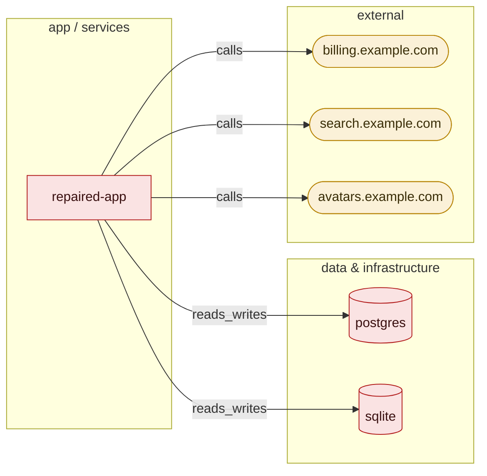

# VibeGuard report

_fix-safe scan of `examples/repaired-app` on 2026-08-25T17:04:28+00:00 by vibeguard 0.2.0._

## Architecture

6 node(s) and 5 edge(s) were inferred from the manifests, configuration and code. Node colour is the category score that governs that node — green ≥85, amber 60–84, red <60, grey unscored.



## Executive summary

|  |  |
|---|---|
| Repository | examples/repaired-app |
| Stack | python (3 files) · frameworks: flask · databases: postgres, sqlite · containers: docker, compose · CI/CD: github-actions |
| Scale | small — 146 LOC, 1 service(s), sensitive data: yes |
| Scan date | 2026-08-25T17:04:28+00:00 |
| Mode | fix-safe |
| VibeGuard version | 0.2.0 |
| Production readiness | 55/100 → 57/100 |
| Issues by severity | critical 7, high 27, medium 22, low 18, info 3 — 77 open in total |
| Repair outcomes | fixed 5 · requires review 28 · not attempted 38 · no automated repair attempted 6 |
| Checklist | 279 topics — pass 54 · fail 97 · fixed 3 · review_required 21 · not_applicable 104 |
| Suppressed | 0 — nothing waived |
| AI assistance | none — deterministic only |
| Local only | yes |

## Category dashboard

Overall readiness **55/100** → **57/100** after repairs.

| category | score |  | after |  | open findings | applicable |
|---|---|---|---|---|---|---|
| security | 0 | ···················· | 0 | ···················· | 22 | yes |
| secrets | 13 | ███················· | 13 | ███················· | 6 | yes |
| database | 57 | ███████████········· | 57 | ███████████········· | 4 | yes |
| api | 47 | █████████··········· | 80 | ████████████████···· | 8 | yes |
| reliability | 62 | ████████████········ | 62 | ████████████········ | 8 | yes |
| performance | 80 | ████████████████···· | 80 | ████████████████···· | 3 | yes |
| observability | 89 | ██████████████████·· | 89 | ██████████████████·· | 2 | yes |
| containers | 28 | ██████·············· | 28 | ██████·············· | 9 | yes |
| deployment | 73 | ███████████████····· | 73 | ███████████████····· | 2 | yes |
| dependencies | 70 | ██████████████······ | 70 | ██████████████······ | 8 | yes |
| testing | 90 | ██████████████████·· | 90 | ██████████████████·· | 1 | yes |
| scalability | 100 | ████████████████████ | 100 | ████████████████████ | 0 | yes |
| disaster_recovery | 60 | ████████████········ | 60 | ████████████········ | 3 | yes |
| maintainability | 100 | ████████████████████ | 100 | ████████████████████ | 0 | no — no applicable rules for this project |
| cost | 93 | ███████████████████· | 93 | ███████████████████· | 1 | yes |

> Scores are a heuristic (docs/SCORING.md), not a certification. Categories without applicable rules are excluded from the overall score rather than counted as perfect.

## Coverage

### Adapters

- bandit (skipped: not installed)
- detect-secrets (skipped: not installed)
- pip-audit (skipped: not installed)
- hadolint (skipped: not installed)
- trivy (skipped: not installed)
- checkov (skipped: not installed)
- semgrep (skipped: not installed)

### Validators

- syntax
- typecheck
- lint
- tests:targeted
- tests:full
- build
- container_build
- startup

### Validation baseline (pre-existing failures)

| step | result | detail |
|---|---|---|
| syntax | pass | parsed 3 python file(s) |
| typecheck | skipped | the project configures no mypy settings |
| lint | skipped | the project configures no ruff settings |
| tests:targeted | skipped | baseline run — the full suite rung covers the project |
| tests:full | skipped | the project has no test suite to run |
| build | skipped | no build step detected |
| container_build | skipped | container builds run only with --deep-validate |
| startup | skipped | start-up smoke tests are not implemented in the MVP: booting an unknown app needs its runtime configuration (ports, env, databases). Tracked as a known gap rather than faked. |

> A skipped adapter or validator is listed with its reason. This report never implies coverage it did not have.

## Master audit checklist

All 279 topics across 18 sections. Every topic carries an explicit status; none is silently skipped.

| section | pass | fail | fixed | review_required | not_applicable |
|---|---|---|---|---|---|
| api | 6 | 1 | 1 | 3 | 7 |
| containers | 0 | 8 | 0 | 0 | 13 |
| distributed | 0 | 0 | 0 | 0 | 18 |
| concurrency | 10 | 4 | 0 | 0 | 0 |
| database | 12 | 4 | 0 | 0 | 8 |
| security | 4 | 30 | 0 | 0 | 1 |
| secrets | 4 | 3 | 0 | 1 | 0 |
| deployment | 2 | 4 | 0 | 6 | 0 |
| observability | 0 | 5 | 0 | 0 | 10 |
| disaster-recovery | 4 | 3 | 0 | 4 | 3 |
| network | 0 | 4 | 1 | 2 | 10 |
| performance | 2 | 11 | 1 | 1 | 5 |
| scaling | 4 | 2 | 0 | 0 | 6 |
| cost | 3 | 6 | 0 | 1 | 1 |
| jobs | 0 | 1 | 0 | 0 | 11 |
| dependencies | 2 | 5 | 0 | 2 | 1 |
| iac | 1 | 4 | 0 | 1 | 3 |
| testing | 0 | 2 | 0 | 0 | 7 |

### api (18 topics)

| topic | status | detectors | findings | validation |
|---|---|---|---|---|
| Rate limiting | fail | VG-API-003 | VG-API-003:dda1780e538e | — |
| Caching | review_required | VG-API-008 | VG-API-008:15000a60c014 | advisory findings — human judgement required |
| Load balancing readiness | not_applicable | VG-API-009 | — | 1 detector(s) mapped, none applicable — requires scale >= medium (project is small) |
| Reverse proxies | not_applicable | VG-API-009 | — | 1 detector(s) mapped, none applicable — requires scale >= medium (project is small) |
| API gateways | not_applicable | VG-API-009 | — | 1 detector(s) mapped, none applicable — requires scale >= medium (project is small) |
| Timeouts | fixed | VG-API-001, VG-API-002 | VG-API-001:06206740c4ea, VG-API-001:22cd33b45c95, VG-API-001:763a20518104, VG-API-001:79a9fc8fbfd0, VG-API-001:e1da65a72dc8 | validated: syntax=pass, tests:repro=pass |
| Retries | pass | VG-API-004 | — | checked by 1 detector(s), no open findings |
| Exponential backoff | pass | VG-API-004 | — | checked by 1 detector(s), no open findings |
| Idempotency | pass | VG-API-007 | — | checked by 1 detector(s), no open findings |
| Request deduplication | pass | VG-API-007 | — | checked by 1 detector(s), no open findings |
| Circuit breakers | pass | VG-API-004 | — | checked by 1 detector(s), no open findings |
| Backpressure | not_applicable | VG-API-010 | — | 1 detector(s) mapped, none applicable — requires sse/websockets (not detected) |
| Long polling | not_applicable | VG-API-010 | — | 1 detector(s) mapped, none applicable — requires sse/websockets (not detected) |
| Server-Sent Events | not_applicable | VG-API-010 | — | 1 detector(s) mapped, none applicable — requires sse/websockets (not detected) |
| WebSockets | not_applicable | VG-API-010 | — | 1 detector(s) mapped, none applicable — requires sse/websockets (not detected) |
| Webhooks | pass | VG-API-006 | — | checked by 1 detector(s), no open findings |
| API versioning | review_required | VG-API-005 | VG-API-005:86065b5b4492 | advisory findings — human judgement required |
| Semantic versioning | review_required | VG-API-005 | VG-API-005:86065b5b4492 | advisory findings — human judgement required |

### containers (21 topics)

| topic | status | detectors | findings | validation |
|---|---|---|---|---|
| Docker | not_applicable | hadolint | — | 1 detector(s) mapped, none applicable — hadolint did not run |
| Docker Compose | fail | VG-CTR-007 | VG-CTR-007:b8787dedf89e | — |
| Kubernetes | not_applicable | VG-CTR-009 | — | 1 detector(s) mapped, none applicable — rule preconditions not met in this repository |
| Container health checks | fail | VG-CTR-002, VG-OBS-004 | VG-CTR-002:4705a3cd93c2 | — |
| Resource limits | fail | VG-CTR-008, VG-CTR-010, checkov | VG-CTR-008:d2cb7969c75d | — |
| Liveness probes | not_applicable | VG-CTR-009 | — | 1 detector(s) mapped, none applicable — rule preconditions not met in this repository |
| Readiness probes | not_applicable | VG-CTR-009 | — | 1 detector(s) mapped, none applicable — rule preconditions not met in this repository |
| Startup probes | not_applicable | VG-CTR-009 | — | 1 detector(s) mapped, none applicable — rule preconditions not met in this repository |
| Autoscaling configuration | not_applicable | VG-CTR-012 | — | 1 detector(s) mapped, none applicable — requires scale >= medium (project is small) |
| Horizontal scaling | not_applicable | VG-CTR-012 | — | 1 detector(s) mapped, none applicable — requires scale >= medium (project is small) |
| Vertical scaling | not_applicable | VG-CTR-010 | — | 1 detector(s) mapped, none applicable — rule preconditions not met in this repository |
| Rolling deployments | not_applicable | VG-CTR-012, VG-REL-008 | — | 2 detector(s) mapped, none applicable — requires scale >= medium (project is small) |
| Blue-green deployments | not_applicable | VG-CTR-012 | — | 1 detector(s) mapped, none applicable — requires scale >= medium (project is small) |
| Canary releases | not_applicable | VG-CTR-012 | — | 1 detector(s) mapped, none applicable — requires scale >= medium (project is small) |
| Rollbacks | not_applicable | VG-CTR-011 | — | 1 detector(s) mapped, none applicable — rule preconditions not met in this repository |
| Helm charts | not_applicable | VG-CTR-012 | — | 1 detector(s) mapped, none applicable — requires scale >= medium (project is small) |
| Build caching | fail | VG-CTR-004, hadolint | VG-CTR-004:74a9f510426e | — |
| Image size | fail | VG-COST-003, VG-CTR-006, hadolint | VG-CTR-006:1441bd6bd65f, VG-CTR-006:f73c9cff5eb8 | — |
| Image security | fail | VG-CTR-001, VG-CTR-003, VG-CTR-005, VG-CTR-011, hadolint, trivy | VG-CTR-001:9a5fc8dc304e, VG-CTR-003:dd57d70f6768, VG-CTR-005:f570420b4030 | — |
| Dependency pinning (images) | fail | VG-CTR-003, VG-CTR-011, hadolint | VG-CTR-003:dd57d70f6768 | — |
| Container privileges | fail | VG-CTR-001, VG-CTR-007, VG-CTR-011, checkov, hadolint | VG-CTR-001:9a5fc8dc304e, VG-CTR-007:b8787dedf89e | — |

### distributed (18 topics)

| topic | status | detectors | findings | validation |
|---|---|---|---|---|
| Service discovery | not_applicable | VG-REL-011 | — | 1 detector(s) mapped, none applicable — requires scale >= large (project is small) |
| Distributed locks | not_applicable | VG-REL-011 | — | 1 detector(s) mapped, none applicable — requires scale >= large (project is small) |
| Distributed transactions | not_applicable | VG-REL-011 | — | 1 detector(s) mapped, none applicable — requires scale >= large (project is small) |
| Saga patterns | not_applicable | VG-REL-011 | — | 1 detector(s) mapped, none applicable — requires scale >= large (project is small) |
| Event-driven architecture | not_applicable | VG-REL-010 | — | 1 detector(s) mapped, none applicable — requires kafka/pubsub/rabbitmq/redis/sqs (not detected) |
| Message queues | not_applicable | VG-REL-010 | — | 1 detector(s) mapped, none applicable — requires kafka/pubsub/rabbitmq/redis/sqs (not detected) |
| Pub/Sub | not_applicable | VG-REL-010 | — | 1 detector(s) mapped, none applicable — requires kafka/pubsub/rabbitmq/redis/sqs (not detected) |
| Dead-letter queues | not_applicable | VG-REL-010 | — | 1 detector(s) mapped, none applicable — requires kafka/pubsub/rabbitmq/redis/sqs (not detected) |
| Leader election | not_applicable | VG-REL-011 | — | 1 detector(s) mapped, none applicable — requires scale >= large (project is small) |
| Race conditions (distributed) | not_applicable | VG-REL-011 | — | 1 detector(s) mapped, none applicable — requires scale >= large (project is small) |
| Network partitions | not_applicable | VG-REL-011 | — | 1 detector(s) mapped, none applicable — requires scale >= large (project is small) |
| Clock skew | not_applicable | VG-REL-011 | — | 1 detector(s) mapped, none applicable — requires scale >= large (project is small) |
| Eventual consistency | not_applicable | VG-REL-011 | — | 1 detector(s) mapped, none applicable — requires scale >= large (project is small) |
| CAP trade-offs | not_applicable | VG-REL-011 | — | 1 detector(s) mapped, none applicable — requires scale >= large (project is small) |
| Split-brain scenarios | not_applicable | VG-REL-011 | — | 1 detector(s) mapped, none applicable — requires scale >= large (project is small) |
| Duplicate processing | not_applicable | VG-REL-010 | — | 1 detector(s) mapped, none applicable — requires kafka/pubsub/rabbitmq/redis/sqs (not detected) |
| Out-of-order events | not_applicable | VG-REL-010 | — | 1 detector(s) mapped, none applicable — requires kafka/pubsub/rabbitmq/redis/sqs (not detected) |
| Poison messages | not_applicable | VG-REL-010 | — | 1 detector(s) mapped, none applicable — requires kafka/pubsub/rabbitmq/redis/sqs (not detected) |

### concurrency (14 topics)

| topic | status | detectors | findings | validation |
|---|---|---|---|---|
| Race conditions | pass | VG-REL-006 | — | checked by 1 detector(s), no open findings |
| Deadlocks | pass | VG-REL-006 | — | checked by 1 detector(s), no open findings |
| Memory leaks | pass | VG-REL-005 | — | checked by 1 detector(s), no open findings |
| Thread safety | pass | VG-REL-006 | — | checked by 1 detector(s), no open findings |
| Resource leaks | fail | VG-REL-002 | VG-REL-002:fd41141b8d08, VG-REL-002:1bf9b6b62a45, VG-REL-002:3080fdf9f5c6, VG-REL-002:e73d03603a9b | — |
| Connection leaks | fail | VG-DB-002, VG-REL-002 | VG-REL-002:fd41141b8d08, VG-REL-002:1bf9b6b62a45, VG-REL-002:3080fdf9f5c6, VG-REL-002:e73d03603a9b | — |
| File-handle leaks | fail | VG-REL-002 | VG-REL-002:fd41141b8d08, VG-REL-002:1bf9b6b62a45, VG-REL-002:3080fdf9f5c6, VG-REL-002:e73d03603a9b | — |
| Worker starvation | pass | VG-REL-003, VG-REL-004 | — | checked by 2 detector(s), no open findings |
| Event-loop blocking | fail | VG-PERF-001, VG-REL-003 | VG-PERF-001:9085f870800c, VG-PERF-001:09ca06bc8c55 | — |
| Garbage-collection pressure | pass | VG-REL-005 | — | checked by 1 detector(s), no open findings |
| Garbage-collection behavior | pass | VG-REL-005 | — | checked by 1 detector(s), no open findings |
| Unbounded queues | pass | VG-REL-004 | — | checked by 1 detector(s), no open findings |
| Unbounded concurrency | pass | VG-REL-004 | — | checked by 1 detector(s), no open findings |
| Thread/process exhaustion | pass | VG-REL-004 | — | checked by 1 detector(s), no open findings |

### database (24 topics)

| topic | status | detectors | findings | validation |
|---|---|---|---|---|
| Database indexing | pass | VG-DB-004 | — | checked by 1 detector(s), no open findings |
| Missing indexes | pass | VG-DB-004 | — | checked by 1 detector(s), no open findings |
| Unused indexes | pass | VG-DB-004 | — | checked by 1 detector(s), no open findings |
| Query optimization | fail | VG-DB-001, VG-DB-003 | VG-DB-001:faa672f5bc68, VG-DB-003:3a15ed5e31e3, VG-DB-003:752769f1503b | — |
| N+1 queries | fail | VG-DB-001 | VG-DB-001:faa672f5bc68 | — |
| Connection pooling | pass | VG-DB-002 | — | checked by 1 detector(s), no open findings |
| Read replicas | not_applicable | VG-DB-010 | — | 1 detector(s) mapped, none applicable — requires scale >= large (project is small) |
| Sharding readiness | not_applicable | VG-DB-010 | — | 1 detector(s) mapped, none applicable — requires scale >= large (project is small) |
| Partitioning | not_applicable | VG-DB-010 | — | 1 detector(s) mapped, none applicable — requires scale >= large (project is small) |
| Replication | not_applicable | VG-DB-010 | — | 1 detector(s) mapped, none applicable — requires scale >= large (project is small) |
| Transactions | pass | VG-DB-007 | — | checked by 1 detector(s), no open findings |
| Isolation levels | not_applicable | VG-DB-009 | — | 1 detector(s) mapped, none applicable — requires scale >= medium (project is small) |
| Locking behavior | not_applicable | VG-DB-009 | — | 1 detector(s) mapped, none applicable — requires scale >= medium (project is small) |
| Optimistic locking | not_applicable | VG-DB-009 | — | 1 detector(s) mapped, none applicable — requires scale >= medium (project is small) |
| Pessimistic locking | not_applicable | VG-DB-009 | — | 1 detector(s) mapped, none applicable — requires scale >= medium (project is small) |
| Migration safety | pass | VG-DB-005 | — | checked by 1 detector(s), no open findings |
| Migration ordering | fail | VG-DB-006 | VG-DB-006:9750c4947dc8 | — |
| Schema versioning | fail | VG-DB-006 | VG-DB-006:9750c4947dc8 | — |
| Rollback strategy | pass | VG-DB-005 | — | checked by 1 detector(s), no open findings |
| Data integrity | pass | VG-DB-005, VG-DB-007 | — | checked by 2 detector(s), no open findings |
| Foreign keys | pass | VG-DB-008 | — | checked by 1 detector(s), no open findings |
| Unique constraints | pass | VG-DB-008 | — | checked by 1 detector(s), no open findings |
| Nullability | pass | VG-DB-008 | — | checked by 1 detector(s), no open findings |
| Referential integrity | pass | VG-DB-008 | — | checked by 1 detector(s), no open findings |

### security (35 topics)

| topic | status | detectors | findings | validation |
|---|---|---|---|---|
| SQL injection | fail | VG-SEC-001, VG-SEC-002, bandit, semgrep | VG-SEC-001:5f4a14f3b0ea, VG-SEC-001:e4ad5b9bd431, VG-SEC-001:811dd103d133, VG-SEC-001:740ac892ba4d | — |
| Cross-site scripting (XSS) | fail | VG-SEC-003, VG-SEC-004, semgrep | VG-SEC-003:9134b0ed3768, VG-SEC-003:2779d2d41296 | — |
| SSRF | fail | VG-SEC-005, semgrep | VG-SEC-005:4955ac609b8e | — |
| CSRF | fail | VG-SEC-006 | VG-SEC-006:284e9c46a4b5 | — |
| Authentication bypass | fail | VG-SEC-019 | VG-SEC-019:ae07c9d122b9 | — |
| Authorization failures | fail | VG-SEC-019 | VG-SEC-019:ae07c9d122b9 | — |
| IDOR | fail | VG-SEC-019 | VG-SEC-019:ae07c9d122b9 | — |
| Path traversal | pass | VG-SEC-008, VG-SEC-020, bandit, semgrep | — | checked by 2 detector(s), no open findings |
| Command injection | pass | VG-SEC-007, bandit, semgrep | — | checked by 1 detector(s), no open findings |
| Template injection | fail | VG-SEC-003, bandit, semgrep | VG-SEC-003:9134b0ed3768, VG-SEC-003:2779d2d41296 | — |
| Insecure deserialization | pass | VG-SEC-009, bandit, semgrep | — | checked by 1 detector(s), no open findings |
| File-upload vulnerabilities | pass | VG-SEC-008, VG-SEC-020, semgrep | — | checked by 2 detector(s), no open findings |
| Open redirects | fail | VG-SEC-013, semgrep | VG-SEC-013:7e80b5d54e7c | — |
| Sensitive-data exposure | fail | VG-OBS-001, VG-OBS-006, VG-SEC-012 | VG-OBS-001:3f65b9f8d0f7, VG-SEC-012:7255c79c6030, VG-SEC-012:33e58890fd87, VG-SEC-012:c6126699c3c7 | — |
| Hardcoded credentials | fail | VG-SCR-001, VG-SCR-002, VG-SCR-003, VG-SCR-004, VG-SCR-007, VG-SCR-008, bandit, detect-secrets, semgrep | VG-SCR-004:953e6d7f687e, VG-SCR-008:07f6c9500178, VG-SCR-008:fb65e5ec5b3d, VG-SCR-008:62d811df11d3 | — |
| Secret leakage | fail | VG-DEP-003, VG-SCR-001, VG-SCR-002, VG-SCR-005, VG-SCR-006, VG-SCR-007, detect-secrets, trivy | VG-SCR-006:2b2223fcbcf8 | — |
| Weak cryptography | fail | VG-SEC-010, bandit, semgrep | VG-SEC-010:4428c40645cb | — |
| Unsafe randomness | fail | VG-SEC-011, bandit | VG-SEC-011:02c659259678 | — |
| Dependency vulnerabilities | not_applicable | npm-audit, pip-audit, trivy | — | 3 detector(s) mapped, none applicable — npm-audit did not run; pip-audit did not run; trivy did not run |
| IAM | fail | VG-SEC-019 | VG-SEC-019:ae07c9d122b9 | — |
| OAuth | fail | VG-SEC-019 | VG-SEC-019:ae07c9d122b9 | — |
| JWT handling | fail | VG-SCR-008, VG-SEC-017, semgrep | VG-SCR-008:07f6c9500178, VG-SCR-008:fb65e5ec5b3d, VG-SCR-008:62d811df11d3, VG-SEC-017:fd06a486a3b9, VG-SEC-017:b0646c7cfcae | — |
| JWT expiration | fail | VG-SEC-017 | VG-SEC-017:fd06a486a3b9, VG-SEC-017:b0646c7cfcae | — |
| JWT rotation | fail | VG-SEC-017 | VG-SEC-017:fd06a486a3b9, VG-SEC-017:b0646c7cfcae | — |
| Session management | fail | VG-SCR-008, VG-SEC-006, VG-SEC-016 | VG-SCR-008:07f6c9500178, VG-SCR-008:fb65e5ec5b3d, VG-SCR-008:62d811df11d3, VG-SEC-006:284e9c46a4b5, VG-SEC-016:926aad6da667 | — |
| Cookie security | fail | VG-SEC-016 | VG-SEC-016:926aad6da667 | — |
| TLS | fail | VG-SEC-018, bandit | VG-SEC-018:13601a10cecf, VG-SEC-018:e0ac9ba42acb | — |
| Encryption at rest | fail | VG-SEC-010, checkov | VG-SEC-010:4428c40645cb | — |
| Encryption in transit | fail | VG-SEC-018, bandit | VG-SEC-018:13601a10cecf, VG-SEC-018:e0ac9ba42acb | — |
| CORS | fail | VG-SEC-015, semgrep | VG-SEC-015:2fa52529fbe1 | — |
| Content Security Policy | fail | VG-SEC-014 | VG-SEC-014:a7d01e5a4806 | — |
| Security headers | fail | VG-SEC-014 | VG-SEC-014:a7d01e5a4806 | — |
| WAF readiness | fail | VG-API-003, VG-SEC-014 | VG-API-003:dda1780e538e, VG-SEC-014:a7d01e5a4806 | — |
| DDoS protection readiness | fail | VG-API-003, VG-SEC-014 | VG-API-003:dda1780e538e, VG-SEC-014:a7d01e5a4806 | — |
| API authentication | fail | VG-API-006, VG-SEC-017, VG-SEC-019 | VG-SEC-017:fd06a486a3b9, VG-SEC-017:b0646c7cfcae, VG-SEC-019:ae07c9d122b9 | — |

### secrets (8 topics)

| topic | status | detectors | findings | validation |
|---|---|---|---|---|
| API keys committed to repository | pass | VG-SCR-001, VG-SCR-003, detect-secrets, trivy | — | checked by 2 detector(s), no open findings |
| Passwords in repository | fail | VG-SCR-004, detect-secrets | VG-SCR-004:953e6d7f687e | — |
| Tokens in repository | fail | VG-SCR-003, VG-SCR-008, detect-secrets | VG-SCR-008:07f6c9500178, VG-SCR-008:fb65e5ec5b3d, VG-SCR-008:62d811df11d3 | — |
| Private keys in repository | pass | VG-SCR-005, detect-secrets | — | checked by 1 detector(s), no open findings |
| Database credentials | pass | VG-SCR-007, detect-secrets | — | checked by 1 detector(s), no open findings |
| Cloud credentials | pass | VG-SCR-001, VG-SCR-002, detect-secrets, trivy | — | checked by 2 detector(s), no open findings |
| Environment secrets handling | fail | VG-CTR-005, VG-DEP-003, VG-DEP-005, VG-SCR-006, VG-SCR-009 | VG-CTR-005:f570420b4030, VG-SCR-006:2b2223fcbcf8, VG-SCR-009:e1af9b26224f | — |
| Secret store / vault migration | review_required | VG-SCR-009 | VG-SCR-009:e1af9b26224f | advisory findings — human judgement required |

### deployment (12 topics)

| topic | status | detectors | findings | validation |
|---|---|---|---|---|
| CI/CD pipelines | fail | VG-DEP-001, VG-DEP-002, VG-TEST-002 | VG-DEP-002:b3bb13627f98 | — |
| Deployment scripts | review_required | VG-DEP-006 | VG-DEP-006:b1fa55f9d91d | advisory findings — human judgement required |
| Environment separation (dev/staging/prod) | pass | VG-DEP-004, VG-DEP-005 | — | checked by 2 detector(s), no open findings |
| Feature flags | pass | VG-DEP-004 | — | checked by 1 detector(s), no open findings |
| Blue-green deployments | review_required | VG-DEP-006 | VG-DEP-006:b1fa55f9d91d | advisory findings — human judgement required |
| Canary deployments | review_required | VG-DEP-006 | VG-DEP-006:b1fa55f9d91d | advisory findings — human judgement required |
| Rolling deployments | review_required | VG-DEP-006 | VG-DEP-006:b1fa55f9d91d | advisory findings — human judgement required |
| Rollback procedures | review_required | VG-DEP-006 | VG-DEP-006:b1fa55f9d91d | advisory findings — human judgement required |
| Database migration sequencing | fail | VG-DB-005, VG-DB-006 | VG-DB-006:9750c4947dc8 | — |
| Zero-downtime deployment readiness | review_required | VG-DEP-006, VG-REL-008 | VG-DEP-006:b1fa55f9d91d | advisory findings — human judgement required |
| Build reproducibility | fail | VG-CTR-003, VG-DEP-001, VG-DEPS-001 | VG-CTR-003:dd57d70f6768, VG-DEPS-001:b65e4d9fab19 | — |
| Dangerous deploy workflows (deploy from dev machines) | fail | VG-DEP-002, VG-DEP-003 | VG-DEP-002:b3bb13627f98 | — |

### observability (15 topics)

| topic | status | detectors | findings | validation |
|---|---|---|---|---|
| Structured logging | fail | VG-OBS-001, VG-OBS-002 | VG-OBS-001:3f65b9f8d0f7, VG-OBS-002:e980c22e8060 | — |
| Log levels | fail | VG-OBS-001, VG-OBS-006 | VG-OBS-001:3f65b9f8d0f7 | — |
| Metrics | not_applicable | VG-OBS-007 | — | 1 detector(s) mapped, none applicable — requires scale >= medium (project is small) |
| Monitoring | fail | VG-OBS-002, VG-OBS-007 | VG-OBS-002:e980c22e8060 | — |
| Distributed tracing | not_applicable | VG-OBS-005 | — | 1 detector(s) mapped, none applicable — requires scale >= medium (project is small) |
| Correlation IDs | not_applicable | VG-OBS-005 | — | 1 detector(s) mapped, none applicable — requires scale >= medium (project is small) |
| Request IDs | not_applicable | VG-OBS-005 | — | 1 detector(s) mapped, none applicable — requires scale >= medium (project is small) |
| Error tracking | fail | VG-OBS-003, VG-REL-001 | VG-REL-001:f501bd43f8c2 | — |
| Alerts | not_applicable | VG-OBS-003 | — | 1 detector(s) mapped, none applicable — requires scale >= medium (project is small) |
| Health check endpoints | not_applicable | VG-OBS-004 | — | 1 detector(s) mapped, none applicable — requires scale >= medium (project is small) |
| Liveness checks | fail | VG-CTR-002, VG-OBS-004 | VG-CTR-002:4705a3cd93c2 | — |
| Readiness checks | not_applicable | VG-OBS-004 | — | 1 detector(s) mapped, none applicable — requires scale >= medium (project is small) |
| SLIs | not_applicable | VG-OBS-007 | — | 1 detector(s) mapped, none applicable — requires scale >= medium (project is small) |
| SLOs | not_applicable | VG-OBS-007 | — | 1 detector(s) mapped, none applicable — requires scale >= medium (project is small) |
| Error budgets | not_applicable | VG-OBS-007 | — | 1 detector(s) mapped, none applicable — requires scale >= medium (project is small) |

### disaster-recovery (14 topics)

| topic | status | detectors | findings | validation |
|---|---|---|---|---|
| Backups | fail | VG-DR-001, VG-DR-003 | VG-DR-001:9d1e5a4a5755, VG-DR-003:e0f08935babd | — |
| Backup frequency | fail | VG-DR-001 | VG-DR-001:9d1e5a4a5755 | — |
| Backup validation (tested restores) | pass | VG-DR-002 | — | checked by 1 detector(s), no open findings |
| Restore procedures | pass | VG-DR-002 | — | checked by 1 detector(s), no open findings |
| Disaster recovery plan | review_required | VG-DR-004 | VG-DR-004:6eff6df80b70 | advisory findings — human judgement required |
| Failover | not_applicable | VG-DR-006 | — | 1 detector(s) mapped, none applicable — requires scale >= large (project is small) |
| Multi-region readiness | not_applicable | VG-DR-006 | — | 1 detector(s) mapped, none applicable — requires scale >= large (project is small) |
| Database recovery | fail | VG-DR-001, VG-DR-003 | VG-DR-001:9d1e5a4a5755, VG-DR-003:e0f08935babd | — |
| Recovery-point objective | pass | VG-DR-002 | — | checked by 1 detector(s), no open findings |
| Recovery-time objective | pass | VG-DR-002 | — | checked by 1 detector(s), no open findings |
| Chaos engineering | not_applicable | VG-DR-005 | — | 1 detector(s) mapped, none applicable — requires scale >= large (project is small) |
| Production incident readiness | review_required | VG-DR-004 | VG-DR-004:6eff6df80b70 | advisory findings — human judgement required |
| On-call readiness | review_required | VG-DR-004 | VG-DR-004:6eff6df80b70 | advisory findings — human judgement required |
| Postmortem processes | review_required | VG-DR-004 | VG-DR-004:6eff6df80b70 | advisory findings — human judgement required |

### network (17 topics)

| topic | status | detectors | findings | validation |
|---|---|---|---|---|
| DNS | not_applicable | VG-NET-003 | — | 1 detector(s) mapped, none applicable — requires scale >= large (project is small) |
| TCP | not_applicable | VG-NET-003 | — | 1 detector(s) mapped, none applicable — requires scale >= large (project is small) |
| UDP | not_applicable | VG-NET-003 | — | 1 detector(s) mapped, none applicable — requires scale >= large (project is small) |
| HTTP/1.1 | fail | VG-NET-002 | VG-NET-002:bd7785087ae2, VG-NET-002:305593f6737d, VG-NET-002:8d42d12562db | — |
| HTTP/2 | not_applicable | VG-NET-003 | — | 1 detector(s) mapped, none applicable — requires scale >= large (project is small) |
| HTTP/3 | not_applicable | VG-NET-003 | — | 1 detector(s) mapped, none applicable — requires scale >= large (project is small) |
| gRPC | not_applicable | VG-NET-003 | — | 1 detector(s) mapped, none applicable — requires scale >= large (project is small) |
| WebSockets (transport) | not_applicable | VG-API-010 | — | 1 detector(s) mapped, none applicable — requires sse/websockets (not detected) |
| TLS configuration | fail | VG-SEC-018 | VG-SEC-018:13601a10cecf, VG-SEC-018:e0ac9ba42acb | — |
| Reverse proxies | not_applicable | VG-API-009 | — | 1 detector(s) mapped, none applicable — requires scale >= medium (project is small) |
| Proxies | not_applicable | VG-API-009 | — | 1 detector(s) mapped, none applicable — requires scale >= medium (project is small) |
| CDN configuration | not_applicable | VG-NET-001 | — | 1 detector(s) mapped, none applicable — requires scale >= medium (project is small) |
| Edge caching | review_required | VG-API-008, VG-NET-001 | VG-API-008:15000a60c014 | advisory findings — human judgement required |
| Cache invalidation | review_required | VG-API-008 | VG-API-008:15000a60c014 | advisory findings — human judgement required |
| Network timeouts | fixed | VG-API-001, VG-API-002 | VG-API-001:06206740c4ea, VG-API-001:22cd33b45c95, VG-API-001:763a20518104, VG-API-001:79a9fc8fbfd0, VG-API-001:e1da65a72dc8 | validated: syntax=pass, tests:repro=pass |
| Connection reuse | fail | VG-NET-002 | VG-NET-002:bd7785087ae2, VG-NET-002:305593f6737d, VG-NET-002:8d42d12562db | — |
| Keep-alive settings | fail | VG-NET-002 | VG-NET-002:bd7785087ae2, VG-NET-002:305593f6737d, VG-NET-002:8d42d12562db | — |

### performance (20 topics)

| topic | status | detectors | findings | validation |
|---|---|---|---|---|
| Latency | fail | VG-PERF-001 | VG-PERF-001:9085f870800c, VG-PERF-001:09ca06bc8c55 | — |
| Throughput | not_applicable | VG-TEST-005 | — | 1 detector(s) mapped, none applicable — requires scale >= medium (project is small) |
| P50 latency | fail | VG-PERF-001 | VG-PERF-001:9085f870800c, VG-PERF-001:09ca06bc8c55 | — |
| P95 latency | fail | VG-PERF-001 | VG-PERF-001:9085f870800c, VG-PERF-001:09ca06bc8c55 | — |
| P99 latency | fail | VG-PERF-001 | VG-PERF-001:9085f870800c, VG-PERF-001:09ca06bc8c55 | — |
| Tail latency | fail | VG-PERF-001 | VG-PERF-001:9085f870800c, VG-PERF-001:09ca06bc8c55 | — |
| Cold starts | not_applicable | VG-PERF-003 | — | 1 detector(s) mapped, none applicable — requires aws-lambda/cloud-functions/netlify/serverless-framework/vercel (not detected) |
| Serverless limits | not_applicable | VG-PERF-003 | — | 1 detector(s) mapped, none applicable — requires aws-lambda/cloud-functions/netlify/serverless-framework/vercel (not detected) |
| Database bottlenecks | fail | VG-DB-001, VG-DB-002 | VG-DB-001:faa672f5bc68 | — |
| Cache efficiency | review_required | VG-API-008 | VG-API-008:15000a60c014 | advisory findings — human judgement required |
| Network bottlenecks | fail | VG-COST-002, VG-NET-002 | VG-COST-002:cfed3e2a5375, VG-NET-002:bd7785087ae2, VG-NET-002:305593f6737d, VG-NET-002:8d42d12562db | — |
| Worker bottlenecks | not_applicable | VG-PERF-004 | — | 1 detector(s) mapped, none applicable — requires scale >= medium (project is small) |
| Memory usage | pass | VG-PERF-004, VG-REL-005 | — | checked by 1 detector(s), no open findings |
| CPU usage | not_applicable | VG-PERF-004 | — | 1 detector(s) mapped, none applicable — requires scale >= medium (project is small) |
| Excessive serialization | fail | VG-DB-003, VG-PERF-002 | VG-DB-003:3a15ed5e31e3, VG-DB-003:752769f1503b, VG-PERF-002:f9c7066200df | — |
| Large payloads | fail | VG-PERF-002 | VG-PERF-002:f9c7066200df | — |
| Duplicate requests | pass | VG-API-007 | — | checked by 1 detector(s), no open findings |
| Dependency latency | fixed | VG-API-001 | VG-API-001:06206740c4ea, VG-API-001:22cd33b45c95, VG-API-001:763a20518104, VG-API-001:79a9fc8fbfd0, VG-API-001:e1da65a72dc8 | validated: syntax=pass, tests:repro=pass |
| Slow queries | fail | VG-DB-003, VG-DB-004 | VG-DB-003:3a15ed5e31e3, VG-DB-003:752769f1503b | — |
| Build performance | fail | VG-CTR-004 | VG-CTR-004:74a9f510426e | — |

### scaling (12 topics)

| topic | status | detectors | findings | validation |
|---|---|---|---|---|
| Horizontal scaling | pass | VG-SCALE-001 | — | checked by 1 detector(s), no open findings |
| Vertical scaling | not_applicable | VG-SCALE-004 | — | 1 detector(s) mapped, none applicable — requires scale >= medium (project is small) |
| Autoscaling | not_applicable | VG-CTR-012, VG-SCALE-004 | — | 2 detector(s) mapped, none applicable — requires scale >= medium (project is small) |
| Statelessness | fail | VG-DR-003, VG-SCALE-001 | VG-DR-003:e0f08935babd | — |
| Session storage | pass | VG-SCALE-001 | — | checked by 1 detector(s), no open findings |
| Sticky sessions | pass | VG-SCALE-001 | — | checked by 1 detector(s), no open findings |
| Shared storage | fail | VG-DR-003, VG-SCALE-002 | VG-DR-003:e0f08935babd | — |
| Queue workers | not_applicable | VG-SCALE-004 | — | 1 detector(s) mapped, none applicable — requires scale >= medium (project is small) |
| Cache architecture | not_applicable | VG-SCALE-003 | — | 1 detector(s) mapped, none applicable — requires scale >= medium (project is small) |
| Database bottlenecks (scaling) | not_applicable | VG-DB-010 | — | 1 detector(s) mapped, none applicable — requires scale >= large (project is small) |
| Multi-instance behavior | pass | VG-REL-006, VG-SCALE-001 | — | checked by 2 detector(s), no open findings |
| Multi-region deployment | not_applicable | VG-DR-006 | — | 1 detector(s) mapped, none applicable — requires scale >= large (project is small) |

### cost (11 topics)

| topic | status | detectors | findings | validation |
|---|---|---|---|---|
| Overprovisioned resources | fail | VG-CTR-008, VG-CTR-010 | VG-CTR-008:d2cb7969c75d | — |
| Excessive cloud calls | fail | VG-COST-002 | VG-COST-002:cfed3e2a5375 | — |
| Excessive database queries | fail | VG-COST-004, VG-DB-001 | VG-DB-001:faa672f5bc68 | — |
| Unnecessary API requests | fail | VG-COST-002 | VG-COST-002:cfed3e2a5375 | — |
| Wasteful background jobs | pass | VG-COST-004 | — | checked by 1 detector(s), no open findings |
| Oversized containers | fail | VG-COST-003, VG-CTR-006 | VG-CTR-006:1441bd6bd65f, VG-CTR-006:f73c9cff5eb8 | — |
| Excessive logging | pass | VG-COST-001, VG-OBS-006 | — | checked by 2 detector(s), no open findings |
| Inefficient storage | pass | VG-COST-004 | — | checked by 1 detector(s), no open findings |
| Expensive network transfers | fail | VG-PERF-002 | VG-PERF-002:f9c7066200df | — |
| Poor caching | review_required | VG-API-008 | VG-API-008:15000a60c014 | advisory findings — human judgement required |
| Unnecessary serverless invocations | not_applicable | VG-PERF-003 | — | 1 detector(s) mapped, none applicable — requires aws-lambda/cloud-functions/netlify/serverless-framework/vercel (not detected) |

### jobs (12 topics)

| topic | status | detectors | findings | validation |
|---|---|---|---|---|
| Cron jobs | not_applicable | VG-REL-007 | — | 1 detector(s) mapped, none applicable — requires arq/bullmq/celery/dramatiq/rq/sidekiq (not detected) |
| Scheduled workers | not_applicable | VG-REL-007 | — | 1 detector(s) mapped, none applicable — requires arq/bullmq/celery/dramatiq/rq/sidekiq (not detected) |
| Job queues | not_applicable | VG-REL-009 | — | 1 detector(s) mapped, none applicable — requires arq/bullmq/celery/dramatiq/kafka/pubsub/rabbitmq/redis/rq/sidekiq/sqs (not detected) |
| Retry behavior | not_applicable | VG-REL-007 | — | 1 detector(s) mapped, none applicable — requires arq/bullmq/celery/dramatiq/rq/sidekiq (not detected) |
| Job deduplication | not_applicable | VG-REL-007 | — | 1 detector(s) mapped, none applicable — requires arq/bullmq/celery/dramatiq/rq/sidekiq (not detected) |
| Job locking | not_applicable | VG-REL-007 | — | 1 detector(s) mapped, none applicable — requires arq/bullmq/celery/dramatiq/rq/sidekiq (not detected) |
| Dead-letter handling | not_applicable | VG-REL-007 | — | 1 detector(s) mapped, none applicable — requires arq/bullmq/celery/dramatiq/rq/sidekiq (not detected) |
| Poison jobs | not_applicable | VG-REL-007 | — | 1 detector(s) mapped, none applicable — requires arq/bullmq/celery/dramatiq/rq/sidekiq (not detected) |
| Worker crash recovery | fail | VG-REL-001, VG-REL-008 | VG-REL-001:f501bd43f8c2 | — |
| Job observability | not_applicable | VG-REL-009 | — | 1 detector(s) mapped, none applicable — requires arq/bullmq/celery/dramatiq/kafka/pubsub/rabbitmq/redis/rq/sidekiq/sqs (not detected) |
| Job timeout behavior | not_applicable | VG-REL-007 | — | 1 detector(s) mapped, none applicable — requires arq/bullmq/celery/dramatiq/rq/sidekiq (not detected) |
| Job idempotency | not_applicable | VG-REL-007 | — | 1 detector(s) mapped, none applicable — requires arq/bullmq/celery/dramatiq/rq/sidekiq (not detected) |

### dependencies (10 topics)

| topic | status | detectors | findings | validation |
|---|---|---|---|---|
| Dependency conflicts | pass | VG-DEPS-003 | — | checked by 1 detector(s), no open findings |
| Outdated libraries | fail | VG-DEPS-002, npm-audit, pip-audit, trivy | VG-DEPS-002:c9d33faa38ce, VG-DEPS-002:eb49e57419ef, VG-DEPS-002:058adaf88688, VG-DEPS-002:6f08b58211ef, VG-DEPS-002:8ad6e28c5ca2 | — |
| Vulnerable dependencies | not_applicable | npm-audit, pip-audit, trivy | — | 3 detector(s) mapped, none applicable — npm-audit did not run; pip-audit did not run; trivy did not run |
| Duplicate dependencies | pass | VG-DEPS-003 | — | checked by 1 detector(s), no open findings |
| Abandoned packages | review_required | VG-DEPS-005 | VG-DEPS-005:ac933ca914b6 | advisory findings — human judgement required |
| Version incompatibilities | fail | VG-DEPS-002 | VG-DEPS-002:c9d33faa38ce, VG-DEPS-002:eb49e57419ef, VG-DEPS-002:058adaf88688, VG-DEPS-002:6f08b58211ef, VG-DEPS-002:8ad6e28c5ca2 | — |
| Transitive dependencies | review_required | VG-DEPS-005, npm-audit, pip-audit | VG-DEPS-005:ac933ca914b6 | advisory findings — human judgement required |
| Unpinned dependencies | fail | VG-DEPS-001, VG-DEPS-002 | VG-DEPS-001:b65e4d9fab19, VG-DEPS-002:c9d33faa38ce, VG-DEPS-002:eb49e57419ef, VG-DEPS-002:058adaf88688, VG-DEPS-002:6f08b58211ef, VG-DEPS-002:8ad6e28c5ca2 | — |
| Lockfiles | fail | VG-DEPS-001 | VG-DEPS-001:b65e4d9fab19 | — |
| Runtime incompatibilities | fail | VG-DEPS-004 | VG-DEPS-004:b12ef0ba1460 | — |

### iac (9 topics)

| topic | status | detectors | findings | validation |
|---|---|---|---|---|
| Insecure defaults | fail | VG-CTR-007, VG-CTR-011, checkov, trivy | VG-CTR-007:b8787dedf89e | — |
| Public resources | not_applicable | checkov, trivy | — | 2 detector(s) mapped, none applicable — checkov did not run; trivy did not run |
| Overly broad permissions | not_applicable | checkov, trivy | — | 2 detector(s) mapped, none applicable — checkov did not run; trivy did not run |
| Missing encryption | not_applicable | checkov, trivy | — | 2 detector(s) mapped, none applicable — checkov did not run; trivy did not run |
| Missing backups (IaC) | fail | VG-DR-001, checkov | VG-DR-001:9d1e5a4a5755 | — |
| Missing lifecycle rules | pass | VG-COST-004, checkov | — | checked by 1 detector(s), no open findings |
| Configuration drift | review_required | VG-DEP-006, checkov | VG-DEP-006:b1fa55f9d91d | advisory findings — human judgement required |
| Hardcoded secrets (IaC) | fail | VG-CTR-005, checkov, trivy | VG-CTR-005:f570420b4030 | — |
| Missing resource limits (IaC) | fail | VG-CTR-008, VG-CTR-010, checkov, trivy | VG-CTR-008:d2cb7969c75d | — |

### testing (9 topics)

| topic | status | detectors | findings | validation |
|---|---|---|---|---|
| Unit tests | fail | VG-MAINT-001, VG-TEST-002 | VG-MAINT-001:2f83b63568ef | — |
| Integration tests | not_applicable | VG-TEST-001 | — | 1 detector(s) mapped, none applicable — the project has no test suite at all — VG-MAINT-001 reports that, and this topic cannot be assessed until tests exist |
| API tests | not_applicable | VG-TEST-001 | — | 1 detector(s) mapped, none applicable — the project has no test suite at all — VG-MAINT-001 reports that, and this topic cannot be assessed until tests exist |
| Database tests | not_applicable | VG-TEST-003 | — | 1 detector(s) mapped, none applicable — the project has no test suite at all — VG-MAINT-001 reports that, and this topic cannot be assessed until tests exist |
| Security regression tests | not_applicable | VG-TEST-005 | — | 1 detector(s) mapped, none applicable — requires scale >= medium (project is small) |
| Concurrency tests | not_applicable | VG-TEST-005 | — | 1 detector(s) mapped, none applicable — requires scale >= medium (project is small) |
| End-to-end tests | not_applicable | VG-TEST-004 | — | 1 detector(s) mapped, none applicable — requires scale >= medium (project is small) |
| Smoke tests | fail | VG-DEP-002, VG-TEST-002, VG-TEST-004 | VG-DEP-002:b3bb13627f98 | — |
| Load tests | not_applicable | VG-TEST-005 | — | 1 detector(s) mapped, none applicable — requires scale >= medium (project is small) |

> `review_required` includes topics that have no automated detector yet. That is the honest fallback and is never converted to `pass`.

## Findings

### critical (7)

#### VG-SCR-008 — Hardcoded application or JWT signing secret

`app.py:25`

- **Issue ID:** VG-SCR-008:07f6c9500178
- **Rule:** VG-SCR-008
- **Category:** secrets
- **Severity:** critical
- **Confidence:** high
- **File:** app.py
- **Line:** 25
- **Description:** A signing secret is hardcoded at app.py:25.
- **Why It Matters:** The signing key is the only thing that proves a session cookie or JWT was issued by your application. Once it is readable in the repository, anyone can mint a token that claims to be any user — including an administrator — and your server will accept it as genuine. No password check, rate limit, or audit log stands in the way, and rotating the key logs every real user out.

**Evidence**

```
app.py:25
JWT_SECRET = "n0t3n3st-hs256-9f2c4ab71de85306"
```

- **Repair Performed:** status: requires_review · the rule declares this change as manual: an automated edit cannot preserve the intent here
- **Validation Result:** no validators ran
- **Residual Risk:** Generate a fresh random key (`python -c "import secrets; print(secrets.token_urlsafe(48))"`), set it as `SECRET_KEY` in the environment, and load it with `os.environ["SECRET_KEY"]` so start-up fails loudly when it is missing.
- **Recommended Follow-Up:** Generate a fresh random key (`python -c "import secrets; print(secrets.token_urlsafe(48))"`), set it as `SECRET_KEY` in the environment, and load it with `os.environ["SECRET_KEY"]` so start-up fails loudly when it is missing.
- **Autofix Safety:** manual_change_required
- **References:** https://cheatsheetseries.owasp.org/cheatsheets/JSON_Web_Token_for_Java_Cheat_Sheet.html<br>https://flask.palletsprojects.com/en/stable/config/#SECRET_KEY
- **Fingerprint:** 07f6c9500178b85167328d3e28a116bb24d5162c14d07eb2ed59f81e662b525b

#### VG-SCR-008 — Hardcoded application or JWT signing secret

`docker-compose.yml:11`

- **Issue ID:** VG-SCR-008:fb65e5ec5b3d
- **Rule:** VG-SCR-008
- **Category:** secrets
- **Severity:** critical
- **Confidence:** high
- **File:** docker-compose.yml
- **Line:** 11
- **Description:** A signing secret is hardcoded at docker-compose.yml:11.
- **Why It Matters:** The signing key is the only thing that proves a session cookie or JWT was issued by your application. Once it is readable in the repository, anyone can mint a token that claims to be any user — including an administrator — and your server will accept it as genuine. No password check, rate limit, or audit log stands in the way, and rotating the key logs every real user out.

**Evidence**

```
docker-compose.yml:11
JWT_SECRET: n0t3n3st-hs256-9f2c4ab71de85306
```

- **Repair Performed:** status: requires_review · the rule declares this change as manual: an automated edit cannot preserve the intent here
- **Validation Result:** no validators ran
- **Residual Risk:** Generate a fresh random key (`python -c "import secrets; print(secrets.token_urlsafe(48))"`), set it as `SECRET_KEY` in the environment, and load it with `os.environ["SECRET_KEY"]` so start-up fails loudly when it is missing.
- **Recommended Follow-Up:** Generate a fresh random key (`python -c "import secrets; print(secrets.token_urlsafe(48))"`), set it as `SECRET_KEY` in the environment, and load it with `os.environ["SECRET_KEY"]` so start-up fails loudly when it is missing.
- **Autofix Safety:** manual_change_required
- **References:** https://cheatsheetseries.owasp.org/cheatsheets/JSON_Web_Token_for_Java_Cheat_Sheet.html<br>https://flask.palletsprojects.com/en/stable/config/#SECRET_KEY
- **Fingerprint:** fb65e5ec5b3de14c1a3fd3e889f89566ff15e74b11b0ae7dbe99aca3123638d4

#### VG-SCR-008 — Hardcoded application or JWT signing secret

`.env:4`

- **Issue ID:** VG-SCR-008:62d811df11d3
- **Rule:** VG-SCR-008
- **Category:** secrets
- **Severity:** critical
- **Confidence:** high
- **File:** .env
- **Line:** 4
- **Description:** A signing secret is hardcoded at .env:4.
- **Why It Matters:** The signing key is the only thing that proves a session cookie or JWT was issued by your application. Once it is readable in the repository, anyone can mint a token that claims to be any user — including an administrator — and your server will accept it as genuine. No password check, rate limit, or audit log stands in the way, and rotating the key logs every real user out.

**Evidence**

```
.env:4
JWT_SECRET=n0t3n3st-hs256-9f2c4ab71de85306
```

- **Repair Performed:** status: requires_review · the rule declares this change as manual: an automated edit cannot preserve the intent here
- **Validation Result:** no validators ran
- **Residual Risk:** Generate a fresh random key (`python -c "import secrets; print(secrets.token_urlsafe(48))"`), set it as `SECRET_KEY` in the environment, and load it with `os.environ["SECRET_KEY"]` so start-up fails loudly when it is missing.
- **Recommended Follow-Up:** Generate a fresh random key (`python -c "import secrets; print(secrets.token_urlsafe(48))"`), set it as `SECRET_KEY` in the environment, and load it with `os.environ["SECRET_KEY"]` so start-up fails loudly when it is missing.
- **Autofix Safety:** manual_change_required
- **References:** https://cheatsheetseries.owasp.org/cheatsheets/JSON_Web_Token_for_Java_Cheat_Sheet.html<br>https://flask.palletsprojects.com/en/stable/config/#SECRET_KEY
- **Fingerprint:** 62d811df11d30bf0544a08c6bfd5bd5f93b2c30e9c9c4ab32aa311ab4acf0351

#### VG-SEC-001 — SQL injection via interpolated query

`app.py:50`

- **Issue ID:** VG-SEC-001:5f4a14f3b0ea
- **Rule:** VG-SEC-001
- **Category:** security
- **Severity:** critical
- **Confidence:** high
- **File:** app.py
- **Line:** 50
- **Description:** `cur.execute(...)` at app.py:50 receives a query built by string interpolation rather than a parameterised statement.
- **Why It Matters:** An attacker who controls any part of the query text can rewrite the statement: read every row of every table, forge a login, or drop the database outright. SQL injection is consistently one of the most exploited web vulnerabilities because a single reachable query is enough to lose the whole datastore.

**Evidence**

```
app.py:50
cur.execute(f"SELECT id, email FROM users WHERE email = '{email}' "
        f"AND password_hash = '{hash_password(password)}'")
```

- **Repair Performed:** status: not_attempted · review-recommended fix: run `vibeguard fix --interactive` to review the diff and approve it
- **Validation Result:** no validators ran
- **Residual Risk:** Keep the SQL text a constant and bind the values: `cur.execute('SELECT ... WHERE id = %s', (user_id,))`. Use SQLAlchemy `text(...).bindparams()` or the ORM query API for dynamic filters.
- **Recommended Follow-Up:** Keep the SQL text a constant and bind the values: `cur.execute('SELECT ... WHERE id = %s', (user_id,))`. Use SQLAlchemy `text(...).bindparams()` or the ORM query API for dynamic filters.
- **Autofix Safety:** review_recommended
- **References:** https://cheatsheetseries.owasp.org/cheatsheets/SQL_Injection_Prevention_Cheat_Sheet.html<br>https://cwe.mitre.org/data/definitions/89.html
- **Fingerprint:** 5f4a14f3b0ea6880609c5aa5a7787a72bf37f356d86a4d275cd4b1dc7c51e16a

#### VG-SEC-001 — SQL injection via interpolated query

`app.py:75`

- **Issue ID:** VG-SEC-001:e4ad5b9bd431
- **Rule:** VG-SEC-001
- **Category:** security
- **Severity:** critical
- **Confidence:** high
- **File:** app.py
- **Line:** 75
- **Description:** `cur.execute(...)` at app.py:75 receives a query built by string interpolation rather than a parameterised statement.
- **Why It Matters:** An attacker who controls any part of the query text can rewrite the statement: read every row of every table, forge a login, or drop the database outright. SQL injection is consistently one of the most exploited web vulnerabilities because a single reachable query is enough to lose the whole datastore.

**Evidence**

```
app.py:75
cur.execute(f"SELECT email FROM users WHERE id = {row['user_id']}")
```

- **Repair Performed:** status: not_attempted · review-recommended fix: run `vibeguard fix --interactive` to review the diff and approve it
- **Validation Result:** no validators ran
- **Residual Risk:** Keep the SQL text a constant and bind the values: `cur.execute('SELECT ... WHERE id = %s', (user_id,))`. Use SQLAlchemy `text(...).bindparams()` or the ORM query API for dynamic filters.
- **Recommended Follow-Up:** Keep the SQL text a constant and bind the values: `cur.execute('SELECT ... WHERE id = %s', (user_id,))`. Use SQLAlchemy `text(...).bindparams()` or the ORM query API for dynamic filters.
- **Autofix Safety:** review_recommended
- **References:** https://cheatsheetseries.owasp.org/cheatsheets/SQL_Injection_Prevention_Cheat_Sheet.html<br>https://cwe.mitre.org/data/definitions/89.html
- **Fingerprint:** e4ad5b9bd4319cb52c13235a2210cd29a8942ac9a0cbf714dddf9d2e84b13474

#### VG-SEC-001 — SQL injection via interpolated query

`db.py:39`

- **Issue ID:** VG-SEC-001:811dd103d133
- **Rule:** VG-SEC-001
- **Category:** security
- **Severity:** critical
- **Confidence:** high
- **File:** db.py
- **Line:** 39
- **Description:** `cur.execute(...)` at db.py:39 receives a query built by string interpolation rather than a parameterised statement.
- **Why It Matters:** An attacker who controls any part of the query text can rewrite the statement: read every row of every table, forge a login, or drop the database outright. SQL injection is consistently one of the most exploited web vulnerabilities because a single reachable query is enough to lose the whole datastore.

**Evidence**

```
db.py:39
cur.execute(f"SELECT * FROM notes WHERE user_id = {user_id}")
```

- **Repair Performed:** status: not_attempted · review-recommended fix: run `vibeguard fix --interactive` to review the diff and approve it
- **Validation Result:** no validators ran
- **Residual Risk:** Keep the SQL text a constant and bind the values: `cur.execute('SELECT ... WHERE id = %s', (user_id,))`. Use SQLAlchemy `text(...).bindparams()` or the ORM query API for dynamic filters.
- **Recommended Follow-Up:** Keep the SQL text a constant and bind the values: `cur.execute('SELECT ... WHERE id = %s', (user_id,))`. Use SQLAlchemy `text(...).bindparams()` or the ORM query API for dynamic filters.
- **Autofix Safety:** review_recommended
- **References:** https://cheatsheetseries.owasp.org/cheatsheets/SQL_Injection_Prevention_Cheat_Sheet.html<br>https://cwe.mitre.org/data/definitions/89.html
- **Fingerprint:** 811dd103d1335b1d6c21d4f890dd53ae48901f285308d6840b8fd946ca8a07fe

#### VG-SEC-001 — SQL injection via interpolated query

`db.py:45`

- **Issue ID:** VG-SEC-001:740ac892ba4d
- **Rule:** VG-SEC-001
- **Category:** security
- **Severity:** critical
- **Confidence:** high
- **File:** db.py
- **Line:** 45
- **Description:** `conn.execute(...)` at db.py:45 receives a query built by string interpolation rather than a parameterised statement.
- **Why It Matters:** An attacker who controls any part of the query text can rewrite the statement: read every row of every table, forge a login, or drop the database outright. SQL injection is consistently one of the most exploited web vulnerabilities because a single reachable query is enough to lose the whole datastore.

**Evidence**

```
db.py:45
conn.execute(f"INSERT INTO notes (user_id, title, body) VALUES ({user_id}, '{title}', '{body}')")
```

- **Repair Performed:** status: not_attempted · review-recommended fix: run `vibeguard fix --interactive` to review the diff and approve it
- **Validation Result:** no validators ran
- **Residual Risk:** Keep the SQL text a constant and bind the values: `cur.execute('SELECT ... WHERE id = %s', (user_id,))`. Use SQLAlchemy `text(...).bindparams()` or the ORM query API for dynamic filters.
- **Recommended Follow-Up:** Keep the SQL text a constant and bind the values: `cur.execute('SELECT ... WHERE id = %s', (user_id,))`. Use SQLAlchemy `text(...).bindparams()` or the ORM query API for dynamic filters.
- **Autofix Safety:** review_recommended
- **References:** https://cheatsheetseries.owasp.org/cheatsheets/SQL_Injection_Prevention_Cheat_Sheet.html<br>https://cwe.mitre.org/data/definitions/89.html
- **Fingerprint:** 740ac892ba4d52000405837c58c8535672477f96c0581fe30a75be3958dc8d3e

### high (27)

#### VG-API-003 — No rate limiting on a public HTTP service

`.`

- **Issue ID:** VG-API-003:dda1780e538e
- **Rule:** VG-API-003
- **Category:** api
- **Severity:** high
- **Confidence:** medium
- **File:** —
- **Description:** HTTP routes are served by flask but no rate limiter (flask-limiter, slowapi, django-ratelimit, express-rate-limit, @fastify/rate-limit, nginx limit_req, or API-gateway throttling) is configured.
- **Why It Matters:** Without a request-rate ceiling, one script can send thousands of requests a second and take the service down for everyone — no botnet required. It also removes the cost of guessing: login endpoints can be brute-forced, password-reset and SMS endpoints can be abused to run up your bill, and expensive queries can be replayed until the database falls over.

**Evidence**

```
.  # searched dependencies, middleware, and infrastructure config for any rate-limiting or throttling mechanism
```

- **Repair Performed:** status: requires_review · the rule declares this change as manual: an automated edit cannot preserve the intent here
- **Validation Result:** no validators ran
- **Residual Risk:** Add a limiter in front of every route — e.g. Flask-Limiter/SlowAPI in Python or `express-rate-limit` in Node — with a strict per-IP budget on authentication and any endpoint that sends mail, SMS, or money.
- **Recommended Follow-Up:** Add a limiter in front of every route — e.g. Flask-Limiter/SlowAPI in Python or `express-rate-limit` in Node — with a strict per-IP budget on authentication and any endpoint that sends mail, SMS, or money.
- **Autofix Safety:** manual_change_required
- **References:** https://owasp.org/API-Security/editions/2023/en/0xa4-unrestricted-resource-consumption/<br>https://flask-limiter.readthedocs.io/en/stable/
- **Fingerprint:** dda1780e538e502041c246501c685e598ec1223e32f34a5affabe45545eef97c

#### VG-CTR-001 — Container runs as root

`Dockerfile:2`

- **Issue ID:** VG-CTR-001:9a5fc8dc304e
- **Rule:** VG-CTR-001
- **Category:** containers
- **Severity:** high
- **Confidence:** high
- **File:** Dockerfile
- **Line:** 2
- **Description:** Dockerfile: the final stage never declares a USER, so the entrypoint runs as uid 0.
- **Why It Matters:** A process running as root inside a container is one container-escape or one mounted host path away from owning the host. It can also write to any bind mount, silently leaving root-owned files on the host filesystem. Running as an unprivileged user turns most remote-code-execution bugs into a contained nuisance.

**Evidence**

```
Dockerfile:2
FROM python:latest
```

- **Repair Performed:** status: not_attempted · review-recommended fix: run `vibeguard fix --interactive` to review the diff and approve it
- **Validation Result:** no validators ran
- **Residual Risk:** Add `RUN adduser --system --no-create-home app` and `USER app` to the final stage, and `chown` the application directory to that user before switching.
- **Recommended Follow-Up:** Add `RUN adduser --system --no-create-home app` and `USER app` to the final stage, and `chown` the application directory to that user before switching.
- **Autofix Safety:** review_recommended
- **References:** https://docs.docker.com/reference/dockerfile/#user<br>https://cheatsheetseries.owasp.org/cheatsheets/Docker_Security_Cheat_Sheet.html
- **Fingerprint:** 9a5fc8dc304efa48951efe9611e5b86bb567401c064ce18965512dd97f4adfff

#### VG-CTR-005 — Secret baked into the image

`Dockerfile:9`

- **Issue ID:** VG-CTR-005:f570420b4030
- **Rule:** VG-CTR-005
- **Category:** containers
- **Severity:** high
- **Confidence:** high
- **File:** Dockerfile
- **Line:** 9
- **Description:** Dockerfile:9 bakes a credential into an image layer.
- **Why It Matters:** Image layers are immutable and public to anyone who can pull the image — deleting the file in a later layer does not remove it. Anyone with registry read access, and anyone who receives the image, gets the credential. Rotating it means rebuilding and repushing every affected tag.

**Evidence**

```
Dockerfile:9  # ENV JWT_SECRET carries a credential-shaped value
ENV JWT_SECRET=n0t3n3st-hs256-9f2c4ab71de85306
```

- **Repair Performed:** status: requires_review · the rule declares this change as manual: an automated edit cannot preserve the intent here
- **Validation Result:** no validators ran
- **Residual Risk:** Remove the value from the Dockerfile: inject it at runtime (`docker run --env-file` / orchestrator secret) or, for build time only, use `RUN --mount=type=secret`. Then rotate the exposed credential and add the file to `.dockerignore`.
- **Recommended Follow-Up:** Remove the value from the Dockerfile: inject it at runtime (`docker run --env-file` / orchestrator secret) or, for build time only, use `RUN --mount=type=secret`. Then rotate the exposed credential and add the file to `.dockerignore`.
- **Autofix Safety:** manual_change_required
- **References:** https://docs.docker.com/build/building/secrets/<br>https://cheatsheetseries.owasp.org/cheatsheets/Docker_Security_Cheat_Sheet.html
- **Fingerprint:** f570420b4030b1c9344c9b5d0f7939531eaffe58c06ab48cae46b7f616b801b2

#### VG-CTR-007 — Compose service with elevated privileges

`docker-compose.yml`

- **Issue ID:** VG-CTR-007:b8787dedf89e
- **Rule:** VG-CTR-007
- **Category:** containers
- **Severity:** high
- **Confidence:** high
- **File:** docker-compose.yml
- **Description:** docker-compose.yml: service `web` weakens container isolation (`privileged: true`).
- **Why It Matters:** Each of these settings hands the container the keys to the host. A privileged container or a mounted `/var/run/docker.sock` is a full host takeover for anyone who gets code execution inside it — they can start a new container that mounts the host root filesystem. Host networking additionally exposes every port the container binds, bypassing your published-port list.

**Evidence**

```
docker-compose.yml  # service web: `privileged: true`
```

- **Repair Performed:** status: requires_review · the rule declares this change as manual: an automated edit cannot preserve the intent here
- **Validation Result:** no validators ran
- **Residual Risk:** Drop the elevated settings from `web`: remove `privileged`, `network_mode: host`, `pid: host` and the docker socket mount, replace broad `cap_add` entries with the single capability actually needed, and set a non-root `user:`.
- **Recommended Follow-Up:** Drop the elevated settings from `web`: remove `privileged`, `network_mode: host`, `pid: host` and the docker socket mount, replace broad `cap_add` entries with the single capability actually needed, and set a non-root `user:`.
- **Autofix Safety:** manual_change_required
- **References:** https://docs.docker.com/engine/security/<br>https://cheatsheetseries.owasp.org/cheatsheets/Docker_Security_Cheat_Sheet.html
- **Fingerprint:** b8787dedf89ecc115681d9dcb5f90e02941429c38774620c67c171f6696b9e24

#### VG-DB-001 — N+1 query pattern

`app.py:75`

- **Issue ID:** VG-DB-001:faa672f5bc68
- **Rule:** VG-DB-001
- **Category:** database
- **Severity:** high
- **Confidence:** medium
- **File:** app.py
- **Line:** 75
- **Description:** cur.execute(...) is executed inside a loop in app.py (line 75); the query count scales with the collection being iterated.
- **Why It Matters:** One page that lists 500 rows becomes 501 separate database round-trips. Each one costs a network hop and a connection slot, so the endpoint gets slower as the data grows and eventually exhausts the connection pool under normal traffic. It is also pure waste on a metered database: you pay per query.

**Evidence**

```
app.py:75
cur.execute(f"SELECT email FROM users WHERE id = {row['user_id']}")
```

- **Repair Performed:** status: requires_review · refused in every mode — database changes are never applied automatically
- **Validation Result:** no validators ran
- **Residual Risk:** Load the related rows in one query before the loop — e.g. `select_related()`/`prefetch_related()` (Django), `selectinload()`/`joinedload()` (SQLAlchemy), or a single `WHERE id IN (...)` fetch keyed into a dict.
- **Recommended Follow-Up:** Load the related rows in one query before the loop — e.g. `select_related()`/`prefetch_related()` (Django), `selectinload()`/`joinedload()` (SQLAlchemy), or a single `WHERE id IN (...)` fetch keyed into a dict.
- **Autofix Safety:** review_recommended
- **References:** https://docs.sqlalchemy.org/en/20/orm/queryguide/relationships.html<br>https://docs.djangoproject.com/en/stable/ref/models/querysets/#select-related
- **Fingerprint:** faa672f5bc68db08804c1d49da91c36f409dbfc838bb8ffa344fc20690e8b2dc

#### VG-DB-006 — Database schema with no migration tooling

`.`

- **Issue ID:** VG-DB-006:9750c4947dc8
- **Rule:** VG-DB-006
- **Category:** database
- **Severity:** high
- **Confidence:** high
- **File:** —
- **Description:** Schema definitions were found in db.py and the project uses postgres, sqlite, but no migration tool (alembic, django migrations, prisma migrate, knex, flyway, liquibase, sqitch, atlas) is configured.
- **Why It Matters:** Without migrations there is no record of what shape the database is supposed to be in, and no way to reproduce it. Staging drifts from production, a new developer's local database is missing columns the code expects, and every deploy needs someone to remember to run the right ALTER by hand at the right moment. The first forgotten step takes the application down with a column-does-not-exist error, and there is no rollback path.

**Evidence**

```
.  # searched for alembic.ini, knexfile, prisma/schema.prisma, flyway/liquibase/sqitch config, any migrations/ or versions/ directory, and migration dependencies in the manifests
```

- **Repair Performed:** status: requires_review · the rule declares this change as manual: an automated edit cannot preserve the intent here
- **Validation Result:** no validators ran
- **Residual Risk:** Adopt a migration tool and commit the initial migration alongside the models: `alembic init migrations` (SQLAlchemy), `manage.py makemigrations` (Django), `prisma migrate dev` (Prisma), or `knex migrate:make` (Knex). Run it in the deploy pipeline, never by hand.
- **Recommended Follow-Up:** Adopt a migration tool and commit the initial migration alongside the models: `alembic init migrations` (SQLAlchemy), `manage.py makemigrations` (Django), `prisma migrate dev` (Prisma), or `knex migrate:make` (Knex). Run it in the deploy pipeline, never by hand.
- **Autofix Safety:** manual_change_required
- **References:** https://alembic.sqlalchemy.org/en/latest/tutorial.html<br>https://www.prisma.io/docs/orm/prisma-migrate
- **Fingerprint:** 9750c4947dc89e27ed208c28b34268f9faca7ca015026b72be9f592548eec8d7

#### VG-DEP-002 — Deployment workflow that skips tests

`.github/workflows/deploy.yml`

- **Issue ID:** VG-DEP-002:b3bb13627f98
- **Rule:** VG-DEP-002
- **Category:** deployment
- **Severity:** high
- **Confidence:** high
- **File:** .github/workflows/deploy.yml
- **Description:** .github/workflows/deploy.yml: workflow `deploy` deploys on every push to the default branch and runs no tests beforehand.
- **Why It Matters:** The pipeline is a straight pipe from a developer's keyboard to production: a typo that breaks startup, a bad migration, or a deleted endpoint ships automatically and is discovered by users. Because nothing gates the deploy, the mean time to detection is however long it takes someone to complain.

**Evidence**

```
.github/workflows/deploy.yml  # workflow `deploy` runs on push and deploys in job(s) ship-it; no test step found
```

- **Repair Performed:** status: requires_review · the rule declares this change as manual: an automated edit cannot preserve the intent here
- **Validation Result:** no validators ran
- **Residual Risk:** Add a `test` job that runs the suite and make the deploy job `needs: [test]`, so a red build blocks the release. Gate the deploy on the default branch only (`if: github.ref == 'refs/heads/main'`).
- **Recommended Follow-Up:** Add a `test` job that runs the suite and make the deploy job `needs: [test]`, so a red build blocks the release. Gate the deploy on the default branch only (`if: github.ref == 'refs/heads/main'`).
- **Autofix Safety:** manual_change_required
- **References:** https://docs.github.com/actions/using-jobs/using-jobs-in-a-workflow<br>https://docs.github.com/actions/deployment/about-deployments
- **Fingerprint:** b3bb13627f98dc762bf91b4e012507596c2197580e357b6e0d448637f4e40407

#### VG-DR-001 — No backup configuration for a production datastore

`.`

- **Issue ID:** VG-DR-001:9d1e5a4a5755
- **Rule:** VG-DR-001
- **Category:** disaster_recovery
- **Severity:** high
- **Confidence:** medium
- **File:** —
- **Description:** Datastore(s) detected (postgres, sqlite) and the project is deployed (containers: compose, docker; CI deploy job in .github/workflows/deploy.yml), but VibeGuard found no backup signal in the repository: no pg_dump/mysqldump/mongodump script, no backup or snapshot cron/CI job, no managed-backup setting in infrastructure code (backup_retention_period, PointInTimeRecovery, VolumeSnapshot, velero), and no documented backup procedure. Backups configured only by hand in a cloud console would not be visible here — if that is the case, commit the configuration so it is reviewable and reproducible.
- **Why It Matters:** A database without backups is one bad migration, one accidental DELETE, or one deleted volume away from permanent data loss — customer records, orders, and accounts gone with no way to get them back. Recovery is not a thing you can arrange after the incident; the copy either already exists or it does not.

**Evidence**

```
.  # searched scripts, CI workflows, IaC, and docs for backup, snapshot, dump, retention, and PITR markers; none matched
```

- **Repair Performed:** status: requires_review · the rule declares this change as manual: an automated edit cannot preserve the intent here
- **Validation Result:** no validators ran
- **Residual Risk:** Enable managed backups on the datastore (for RDS/Cloud SQL set `backup_retention_period` and point-in-time recovery in the IaC that creates it), or add a scheduled `pg_dump`/`mysqldump`/`mongodump` job that writes to off-host storage, and record the schedule and retention in the README.
- **Recommended Follow-Up:** Enable managed backups on the datastore (for RDS/Cloud SQL set `backup_retention_period` and point-in-time recovery in the IaC that creates it), or add a scheduled `pg_dump`/`mysqldump`/`mongodump` job that writes to off-host storage, and record the schedule and retention in the README.
- **Autofix Safety:** manual_change_required
- **References:** https://www.postgresql.org/docs/current/backup.html<br>https://docs.aws.amazon.com/AmazonRDS/latest/UserGuide/BackupRestore.html
- **Fingerprint:** 9d1e5a4a57556bf7e57c7e12cd2ca32c47c9cd476f578abb39465733d4270404

#### VG-DR-003 — SQLite used as the production datastore in a container

`db.py:6`

- **Issue ID:** VG-DR-003:e0f08935babd
- **Rule:** VG-DR-003
- **Category:** disaster_recovery
- **Severity:** high
- **Confidence:** high
- **File:** db.py
- **Line:** 6
- **Description:** The SQLite database file 'notenest.db' is opened from application code, the project ships as a container (Dockerfile, docker-compose.yml), and no named volume, bind mount, or persistent volume claim was found in any container manifest. The database therefore lives on the container's writable layer and is destroyed on every redeploy or restart.
- **Why It Matters:** A container filesystem is thrown away every time the container is replaced — a redeploy, a crash restart, a node reschedule. With the database file inside it, every one of those events silently deletes all user data, with no error and no backup to fall back on. Teams typically discover this the first time they ship a second version and every account is gone.

**Evidence**

```
db.py:6
DB_PATH = os.environ.get("NOTENEST_DB", "notenest.db")
```

- **Repair Performed:** status: requires_review · the rule declares this change as manual: an automated edit cannot preserve the intent here
- **Validation Result:** no validators ran
- **Residual Risk:** Move the database file onto a mounted volume (in compose: a named volume mounted at the file's directory; in Kubernetes: a PersistentVolumeClaim with a matching volumeMount), or migrate to a managed Postgres/MySQL instance — and back it up.
- **Recommended Follow-Up:** Move the database file onto a mounted volume (in compose: a named volume mounted at the file's directory; in Kubernetes: a PersistentVolumeClaim with a matching volumeMount), or migrate to a managed Postgres/MySQL instance — and back it up.
- **Autofix Safety:** manual_change_required
- **References:** https://www.sqlite.org/whentouse.html<br>https://docs.docker.com/storage/volumes/
- **Fingerprint:** e0f08935babde1da06cb1dec4dc3e27841f10851008fb77c70495186b666f400

#### VG-SCR-004 — Hardcoded password

`app.py:26`

- **Issue ID:** VG-SCR-004:953e6d7f687e
- **Rule:** VG-SCR-004
- **Category:** secrets
- **Severity:** high
- **Confidence:** medium
- **File:** app.py
- **Line:** 26
- **Description:** A literal password is assigned at app.py:26.
- **Why It Matters:** A password committed to the repository is a password shared with everyone who ever clones it, and it is almost never rotated afterwards — the same string usually ends up protecting the production database months later. Because it lives in git history, deleting the line does not remove the exposure; the credential itself has to be changed everywhere it is used.

**Evidence**

```
app.py:26
ADMIN_PASSWORD = "Tr0ub4dor-notenest-admin"
```

- **Repair Performed:** status: requires_review · the rule declares this change as manual: an automated edit cannot preserve the intent here
- **Validation Result:** no validators ran
- **Residual Risk:** Change the password on the account it protects, then read it from the environment (`os.environ["DB_PASSWORD"]` / `process.env.DB_PASSWORD`) and supply it through your deployment platform's secret settings.
- **Recommended Follow-Up:** Change the password on the account it protects, then read it from the environment (`os.environ["DB_PASSWORD"]` / `process.env.DB_PASSWORD`) and supply it through your deployment platform's secret settings.
- **Autofix Safety:** manual_change_required
- **References:** https://cwe.mitre.org/data/definitions/259.html<br>https://owasp.org/www-community/vulnerabilities/Use_of_hard-coded_password
- **Fingerprint:** 953e6d7f687e4335a1f4647d49d56fb44219aacb969ef80f438ead7204007aa9

#### VG-SCR-006 — Environment file committed to the repository

`.env`

- **Issue ID:** VG-SCR-006:2b2223fcbcf8
- **Rule:** VG-SCR-006
- **Category:** secrets
- **Severity:** high
- **Confidence:** high
- **File:** .env
- **Description:** `.env` is tracked in the repository and no `.gitignore` entry covers it.
- **Why It Matters:** `.env` is where a project keeps everything it did not want in code: database passwords, API keys, signing secrets. Committing it hands all of them to anyone with repository access at once, and to the whole internet the moment the repository is made public. It is also the single most common way a hobby project leaks production credentials.

**Evidence**

```
.env  # environment file present in the scanned tree
```

- **Repair Performed:** status: requires_review · the rule declares this change as manual: an automated edit cannot preserve the intent here
- **Validation Result:** no validators ran
- **Residual Risk:** Add `.env` to `.gitignore`, run `git rm --cached .env`, commit a redacted `.env.example` documenting the keys, and rotate every credential the file contained.
- **Recommended Follow-Up:** Add `.env` to `.gitignore`, run `git rm --cached .env`, commit a redacted `.env.example` documenting the keys, and rotate every credential the file contained.
- **Autofix Safety:** manual_change_required
- **References:** https://12factor.net/config<br>https://git-scm.com/docs/gitignore
- **Fingerprint:** 2b2223fcbcf8c290d2eaf809537b066b583816345a3df1fa9fbc0273c925cf13

#### VG-SEC-003 — Unescaped template rendering

`templates/notes.html:9`

- **Issue ID:** VG-SEC-003:9134b0ed3768
- **Rule:** VG-SEC-003
- **Category:** security
- **Severity:** high
- **Confidence:** medium
- **File:** templates/notes.html
- **Line:** 9
- **Description:** templates/notes.html:9 disables HTML escaping (`|safe` or `autoescape false`), so the value is written to the page raw.
- **Why It Matters:** Escaping is what stops a user's name or comment from becoming executable markup. Turn it off and any stored text becomes a script that runs in every visitor's browser, stealing sessions and acting as that user. When the template string itself is dynamic, the attacker runs code on the server instead of the browser.

**Evidence**

```
templates/notes.html:9
<strong>{{ item.note.title | safe }}</strong>
```

- **Repair Performed:** status: requires_review · the rule declares this change as manual: an automated edit cannot preserve the intent here
- **Validation Result:** no validators ran
- **Residual Risk:** Drop the `|safe` filter and let auto-escaping run. If the value genuinely contains HTML, sanitise it first with a strict allowlist (bleach/nh3) and mark only the sanitised result safe.
- **Recommended Follow-Up:** Drop the `|safe` filter and let auto-escaping run. If the value genuinely contains HTML, sanitise it first with a strict allowlist (bleach/nh3) and mark only the sanitised result safe.
- **Autofix Safety:** manual_change_required
- **References:** https://cheatsheetseries.owasp.org/cheatsheets/Cross_Site_Scripting_Prevention_Cheat_Sheet.html<br>https://jinja.palletsprojects.com/en/stable/templates/#working-with-automatic-escaping
- **Fingerprint:** 9134b0ed37682f6df5e5a912bb14d76497e4edaa7da9fb86073b8b6555a46af7

#### VG-SEC-003 — Unescaped template rendering

`templates/notes.html:10`

- **Issue ID:** VG-SEC-003:2779d2d41296
- **Rule:** VG-SEC-003
- **Category:** security
- **Severity:** high
- **Confidence:** medium
- **File:** templates/notes.html
- **Line:** 10
- **Description:** templates/notes.html:10 disables HTML escaping (`|safe` or `autoescape false`), so the value is written to the page raw.
- **Why It Matters:** Escaping is what stops a user's name or comment from becoming executable markup. Turn it off and any stored text becomes a script that runs in every visitor's browser, stealing sessions and acting as that user. When the template string itself is dynamic, the attacker runs code on the server instead of the browser.

**Evidence**

```
templates/notes.html:10
<div>{{ item.note.body | safe }}</div>
```

- **Repair Performed:** status: requires_review · the rule declares this change as manual: an automated edit cannot preserve the intent here
- **Validation Result:** no validators ran
- **Residual Risk:** Drop the `|safe` filter and let auto-escaping run. If the value genuinely contains HTML, sanitise it first with a strict allowlist (bleach/nh3) and mark only the sanitised result safe.
- **Recommended Follow-Up:** Drop the `|safe` filter and let auto-escaping run. If the value genuinely contains HTML, sanitise it first with a strict allowlist (bleach/nh3) and mark only the sanitised result safe.
- **Autofix Safety:** manual_change_required
- **References:** https://cheatsheetseries.owasp.org/cheatsheets/Cross_Site_Scripting_Prevention_Cheat_Sheet.html<br>https://jinja.palletsprojects.com/en/stable/templates/#working-with-automatic-escaping
- **Fingerprint:** 2779d2d4129636586a6df6f25c7ef89b37fce4011e6fbeb80091e32be6e8f2a1

#### VG-SEC-005 — Outbound request to a user-controlled URL

`app.py:91`

- **Issue ID:** VG-SEC-005:4955ac609b8e
- **Rule:** VG-SEC-005
- **Category:** security
- **Severity:** high
- **Confidence:** medium
- **File:** app.py
- **Line:** 91
- **Description:** `requests.get(...)` at app.py:91 fetches a URL derived from request input. This is a heuristic: it matches request-shaped expressions and locals assigned from them, and is suppressed when an allowlist check appears in the same function.
- **Why It Matters:** Your server can reach places the internet cannot: cloud metadata endpoints that hand out credentials, internal admin panels, databases on the private network. If a user chooses the URL, they borrow that reach — SSRF is how a number of large cloud breaches started.

**Evidence**

```
app.py:91
requests.get(target)
```

- **Repair Performed:** status: not_attempted · review-recommended fix: run `vibeguard fix --interactive` to review the diff and approve it
- **Validation Result:** no validators ran
- **Residual Risk:** Resolve the URL and compare its host against an explicit allowlist before fetching, reject non-http(s) schemes and private/link-local addresses (169.254.169.254 in particular), and disable redirect following.
- **Recommended Follow-Up:** Resolve the URL and compare its host against an explicit allowlist before fetching, reject non-http(s) schemes and private/link-local addresses (169.254.169.254 in particular), and disable redirect following.
- **Autofix Safety:** review_recommended
- **References:** https://cheatsheetseries.owasp.org/cheatsheets/Server_Side_Request_Forgery_Prevention_Cheat_Sheet.html<br>https://cwe.mitre.org/data/definitions/918.html
- **Fingerprint:** 4955ac609b8ea6050d79800bf2b6921dababf40bfb186f37398a0145d4623085

#### VG-SEC-006 — No CSRF protection for session-authenticated requests

`.`

- **Issue ID:** VG-SEC-006:284e9c46a4b5
- **Rule:** VG-SEC-006
- **Category:** security
- **Severity:** high
- **Confidence:** medium
- **File:** —
- **Description:** Session-cookie authentication and state-changing routes were found, but no CSRF token, CSRF middleware, or SameSite=Strict session cookie is configured anywhere in the repository.
- **Why It Matters:** Browsers attach session cookies to any request to your domain, including ones triggered by a page the attacker controls. Without a CSRF defence, a logged-in user who merely visits a malicious page can have their email changed, funds transferred, or account deleted — no phishing form or stolen password needed.

**Evidence**

```
.  # session auth signal: app.py: set_cookie("session; searched for CSRFProtect/flask-wtf, django csrf middleware, csurf/csrf-csrf, and SameSite=Strict
```

- **Repair Performed:** status: requires_review · the rule declares this change as manual: an automated edit cannot preserve the intent here
- **Validation Result:** no validators ran
- **Residual Risk:** Enable the framework's CSRF middleware (Flask-WTF `CSRFProtect(app)`, Django's `CsrfViewMiddleware` plus ``, or `csrf-csrf` double-submit in Express) and set the session cookie to `SameSite=Lax` or `Strict` as defence in depth.
- **Recommended Follow-Up:** Enable the framework's CSRF middleware (Flask-WTF `CSRFProtect(app)`, Django's `CsrfViewMiddleware` plus ``, or `csrf-csrf` double-submit in Express) and set the session cookie to `SameSite=Lax` or `Strict` as defence in depth.
- **Autofix Safety:** manual_change_required
- **References:** https://cheatsheetseries.owasp.org/cheatsheets/Cross-Site_Request_Forgery_Prevention_Cheat_Sheet.html<br>https://flask-wtf.readthedocs.io/en/stable/csrf.html
- **Fingerprint:** 284e9c46a4b5b90785e0dcdd13fa81d3a0027ecf93c232b17ef15c8aa586b70c

#### VG-SEC-010 — Weak cryptographic primitive

`app.py:33`

- **Issue ID:** VG-SEC-010:4428c40645cb
- **Rule:** VG-SEC-010
- **Category:** security
- **Severity:** high
- **Confidence:** high
- **File:** app.py
- **Line:** 33
- **Description:** app.py:33 uses a MD5 digest in code that handles passwords, secrets, or tokens.
- **Why It Matters:** MD5 and SHA-1 collide on commodity hardware and, used for passwords, fall to off-the-shelf GPU cracking at billions of guesses per second; ECB mode leaks the shape of your plaintext straight through the ciphertext. When one of these protects credentials or tokens, a stolen database is a solved database.

**Evidence**

```
app.py:33
hashlib.md5
```

- **Repair Performed:** status: requires_review · the rule declares this change as manual: an automated edit cannot preserve the intent here
- **Validation Result:** no validators ran
- **Residual Risk:** Use SHA-256/SHA-3 for integrity digests, AES-GCM (never ECB) with a random per-message IV from `os.urandom`/`crypto.randomBytes` for encryption, and argon2id/bcrypt/scrypt — never a bare hash — for passwords.
- **Recommended Follow-Up:** Use SHA-256/SHA-3 for integrity digests, AES-GCM (never ECB) with a random per-message IV from `os.urandom`/`crypto.randomBytes` for encryption, and argon2id/bcrypt/scrypt — never a bare hash — for passwords.
- **Autofix Safety:** manual_change_required
- **References:** https://cheatsheetseries.owasp.org/cheatsheets/Cryptographic_Storage_Cheat_Sheet.html<br>https://cheatsheetseries.owasp.org/cheatsheets/Password_Storage_Cheat_Sheet.html
- **Fingerprint:** 4428c40645cbaddc66f578a52cfebb9fe77560954a9b6816a7b69e07436866b0

#### VG-SEC-011 — Cryptographically unsafe randomness for a security value

`app.py:39`

- **Issue ID:** VG-SEC-011:02c659259678
- **Rule:** VG-SEC-011
- **Category:** security
- **Severity:** high
- **Confidence:** medium
- **File:** app.py
- **Line:** 39
- **Description:** `random.choice(...)` at app.py:39 produces a value whose name marks it as security-sensitive, but the source is a predictable pseudo-random generator.
- **Why It Matters:** These generators are built for simulations, not secrets: their output follows from internal state an attacker can reconstruct after seeing a handful of values. Once reconstructed, every future password-reset link, session id, or one-time code is predictable, and accounts can be taken over without any password ever being guessed.

**Evidence**

```
app.py:39
def make_session_token(user_id):
session_token = "".join(random.choice(alphabet) for _ in range(24))
```

- **Repair Performed:** status: not_attempted · review-recommended fix: run `vibeguard fix --interactive` to review the diff and approve it
- **Validation Result:** no validators ran
- **Residual Risk:** Generate the value with a CSPRNG: `secrets.token_urlsafe(32)` / `secrets.choice(...)` in Python, `crypto.randomBytes(32).toString('hex')` or `crypto.randomUUID()` in Node.
- **Recommended Follow-Up:** Generate the value with a CSPRNG: `secrets.token_urlsafe(32)` / `secrets.choice(...)` in Python, `crypto.randomBytes(32).toString('hex')` or `crypto.randomUUID()` in Node.
- **Autofix Safety:** review_recommended
- **References:** https://cheatsheetseries.owasp.org/cheatsheets/Cryptographic_Storage_Cheat_Sheet.html#secure-random-number-generation<br>https://docs.python.org/3/library/secrets.html
- **Fingerprint:** 02c659259678c70d0ddc3518fade2af6d5074a7cefd36d89bdd17241ee198edc

#### VG-SEC-012 — Debug mode enabled

`.env:2`

- **Issue ID:** VG-SEC-012:7255c79c6030
- **Rule:** VG-SEC-012
- **Category:** security
- **Severity:** high
- **Confidence:** high
- **File:** .env
- **Line:** 2
- **Description:** .env:2 enables debug/development mode unconditionally.
- **Why It Matters:** A debug error page hands a visitor your source code, environment variables, and database credentials the moment anything throws. The Werkzeug debugger goes further and offers a Python prompt inside your process; it has been used to take over servers found by simple internet-wide scans.

**Evidence**

```
.env:2
FLASK_ENV=development
```

- **Repair Performed:** status: not_attempted · review-recommended fix: run `vibeguard fix --interactive` to review the diff and approve it
- **Validation Result:** no validators ran
- **Residual Risk:** Drive the flag from configuration and default it off: `debug = os.getenv('FLASK_DEBUG', '0') == '1'`, `DEBUG = os.environ.get('DJANGO_DEBUG') == 'true'`, and set `NODE_ENV=production` in the production image.
- **Recommended Follow-Up:** Drive the flag from configuration and default it off: `debug = os.getenv('FLASK_DEBUG', '0') == '1'`, `DEBUG = os.environ.get('DJANGO_DEBUG') == 'true'`, and set `NODE_ENV=production` in the production image.
- **Autofix Safety:** review_recommended
- **References:** https://flask.palletsprojects.com/en/stable/debugging/<br>https://docs.djangoproject.com/en/stable/ref/settings/#debug
- **Fingerprint:** 7255c79c6030c57d6b1b07f5a09492f940676eb5718a0130432fad3fc24cf87b

#### VG-SEC-012 — Debug mode enabled

`app.py:113`

- **Issue ID:** VG-SEC-012:33e58890fd87
- **Rule:** VG-SEC-012
- **Category:** security
- **Severity:** high
- **Confidence:** high
- **File:** app.py
- **Line:** 113
- **Description:** app.py:113 enables debug/development mode unconditionally.
- **Why It Matters:** A debug error page hands a visitor your source code, environment variables, and database credentials the moment anything throws. The Werkzeug debugger goes further and offers a Python prompt inside your process; it has been used to take over servers found by simple internet-wide scans.

**Evidence**

```
app.py:113
app.run(host="0.0.0.0", port=5000, debug=True)
```

- **Repair Performed:** status: not_attempted · review-recommended fix: run `vibeguard fix --interactive` to review the diff and approve it
- **Validation Result:** no validators ran
- **Residual Risk:** Drive the flag from configuration and default it off: `debug = os.getenv('FLASK_DEBUG', '0') == '1'`, `DEBUG = os.environ.get('DJANGO_DEBUG') == 'true'`, and set `NODE_ENV=production` in the production image.
- **Recommended Follow-Up:** Drive the flag from configuration and default it off: `debug = os.getenv('FLASK_DEBUG', '0') == '1'`, `DEBUG = os.environ.get('DJANGO_DEBUG') == 'true'`, and set `NODE_ENV=production` in the production image.
- **Autofix Safety:** review_recommended
- **References:** https://flask.palletsprojects.com/en/stable/debugging/<br>https://docs.djangoproject.com/en/stable/ref/settings/#debug
- **Fingerprint:** 33e58890fd87f0f87c387107fce06559846672ba692832803679ecabe534afaf

#### VG-SEC-012 — Debug mode enabled

`docker-compose.yml:10`

- **Issue ID:** VG-SEC-012:c6126699c3c7
- **Rule:** VG-SEC-012
- **Category:** security
- **Severity:** high
- **Confidence:** high
- **File:** docker-compose.yml
- **Line:** 10
- **Description:** docker-compose.yml:10 enables debug/development mode unconditionally.
- **Why It Matters:** A debug error page hands a visitor your source code, environment variables, and database credentials the moment anything throws. The Werkzeug debugger goes further and offers a Python prompt inside your process; it has been used to take over servers found by simple internet-wide scans.

**Evidence**

```
docker-compose.yml:10
FLASK_ENV: development
```

- **Repair Performed:** status: not_attempted · review-recommended fix: run `vibeguard fix --interactive` to review the diff and approve it
- **Validation Result:** no validators ran
- **Residual Risk:** Drive the flag from configuration and default it off: `debug = os.getenv('FLASK_DEBUG', '0') == '1'`, `DEBUG = os.environ.get('DJANGO_DEBUG') == 'true'`, and set `NODE_ENV=production` in the production image.
- **Recommended Follow-Up:** Drive the flag from configuration and default it off: `debug = os.getenv('FLASK_DEBUG', '0') == '1'`, `DEBUG = os.environ.get('DJANGO_DEBUG') == 'true'`, and set `NODE_ENV=production` in the production image.
- **Autofix Safety:** review_recommended
- **References:** https://flask.palletsprojects.com/en/stable/debugging/<br>https://docs.djangoproject.com/en/stable/ref/settings/#debug
- **Fingerprint:** c6126699c3c7dca951259bda1d9317a555d33ba6ebf9e79cb404f6996c882166

#### VG-SEC-015 — Permissive CORS configuration

`app.py:21`

- **Issue ID:** VG-SEC-015:2fa52529fbe1
- **Rule:** VG-SEC-015
- **Category:** security
- **Severity:** high
- **Confidence:** high
- **File:** app.py
- **Line:** 21
- **Description:** app.py:21 allows any origin to call this API while also allowing credentials, which browsers only honour for a named origin and which exposes session-authenticated data.
- **Why It Matters:** CORS is what stops a random website from reading your API's responses in a logged-in user's browser. Open it to every origin — especially with credentials allowed — and any page the user visits can call your API as them and read the result, turning a single visit into full account data disclosure.

**Evidence**

```
app.py:21
CORS(app, resources={r"/*": {"origins": "*"}}, supports_credentials=True)
```

- **Repair Performed:** status: requires_review · the rule declares this change as manual: an automated edit cannot preserve the intent here
- **Validation Result:** no validators ran
- **Residual Risk:** Replace the wildcard with an explicit list of trusted origins (`CORS(app, origins=['https://app.example.com'])`, `cors({ origin: ['https://app.example.com'], credentials: true })`) and drive that list from configuration per environment.
- **Recommended Follow-Up:** Replace the wildcard with an explicit list of trusted origins (`CORS(app, origins=['https://app.example.com'])`, `cors({ origin: ['https://app.example.com'], credentials: true })`) and drive that list from configuration per environment.
- **Autofix Safety:** manual_change_required
- **References:** https://developer.mozilla.org/en-US/docs/Web/HTTP/CORS<br>https://cheatsheetseries.owasp.org/cheatsheets/HTML5_Security_Cheat_Sheet.html#cross-origin-resource-sharing
- **Fingerprint:** 2fa52529fbe13399eee8e3a9cd0d4b0e3bf4dfb653f6f65fa0f9868746576ec9

#### VG-SEC-016 — Session cookie without Secure, HttpOnly, or SameSite

`app.py:62`

- **Issue ID:** VG-SEC-016:926aad6da667
- **Rule:** VG-SEC-016
- **Category:** security
- **Severity:** high
- **Confidence:** high
- **File:** app.py
- **Line:** 62
- **Description:** `response.set_cookie(...)` at app.py:62 does not set Secure, HttpOnly, SameSite. Session cookies need Secure, HttpOnly, and SameSite.
- **Why It Matters:** Without HttpOnly, any cross-site scripting bug can read the session cookie and hand the attacker a logged-in session. Without Secure, the cookie travels in clear text over any accidental plain-HTTP request. Without SameSite, the browser attaches it to cross-site requests, which is what makes CSRF work at all.

**Evidence**

```
app.py:62
response.set_cookie("session", token)
```

- **Repair Performed:** status: not_attempted · review-recommended fix: run `vibeguard fix --interactive` to review the diff and approve it
- **Validation Result:** no validators ran
- **Residual Risk:** Set every flag on the cookie: `response.set_cookie('session', value, secure=True, httponly=True, samesite='Lax')` or `res.cookie('sid', value, { secure: true, httpOnly: true, sameSite: 'lax' })`.
- **Recommended Follow-Up:** Set every flag on the cookie: `response.set_cookie('session', value, secure=True, httponly=True, samesite='Lax')` or `res.cookie('sid', value, { secure: true, httpOnly: true, sameSite: 'lax' })`.
- **Autofix Safety:** review_recommended
- **References:** https://cheatsheetseries.owasp.org/cheatsheets/Session_Management_Cheat_Sheet.html<br>https://developer.mozilla.org/en-US/docs/Web/HTTP/Cookies#security
- **Fingerprint:** 926aad6da66773607a08dbc9da5022a62c782e3f15aa567556047edebdd999e5

#### VG-SEC-017 — Unsafe JWT handling

`app.py:59`

- **Issue ID:** VG-SEC-017:fd06a486a3b9
- **Rule:** VG-SEC-017
- **Category:** security
- **Severity:** high
- **Confidence:** high
- **File:** app.py
- **Line:** 59
- **Description:** app.py:59: `jwt.encode` issues a token with no expiry claim
- **Why It Matters:** A JWT is only an identity claim if its signature is checked against an algorithm you chose: skip verification, accept `alg: none`, or leave the algorithm open and anyone can mint a token that says they are an administrator. Tokens without an expiry never stop working, so a single leaked token is a permanent back door that logging out does not close.

**Evidence**

```
app.py:59
jwt.encode({"sub": row[0]}, JWT_SECRET, algorithm="HS256")
```

- **Repair Performed:** status: requires_review · the rule declares this change as manual: an automated edit cannot preserve the intent here
- **Validation Result:** no validators ran
- **Residual Risk:** Always verify: `jwt.decode(token, key, algorithms=['RS256'])` / `jwt.verify(token, key, { algorithms: ['RS256'] })`, and issue short-lived tokens (`exp` / `expiresIn: '15m'`) with a refresh flow for longer sessions.
- **Recommended Follow-Up:** Always verify: `jwt.decode(token, key, algorithms=['RS256'])` / `jwt.verify(token, key, { algorithms: ['RS256'] })`, and issue short-lived tokens (`exp` / `expiresIn: '15m'`) with a refresh flow for longer sessions.
- **Autofix Safety:** manual_change_required
- **References:** https://cheatsheetseries.owasp.org/cheatsheets/JSON_Web_Token_for_Java_Cheat_Sheet.html<br>https://pyjwt.readthedocs.io/en/stable/api.html#jwt.decode
- **Fingerprint:** fd06a486a3b92f9df18abd6ef9918a2ba0433f9f73510bae3f9da01c26644ef4

#### VG-SEC-017 — Unsafe JWT handling

`app.py:99`

- **Issue ID:** VG-SEC-017:b0646c7cfcae
- **Rule:** VG-SEC-017
- **Category:** security
- **Severity:** high
- **Confidence:** high
- **File:** app.py
- **Line:** 99
- **Description:** app.py:99: `jwt.decode` decodes the token with signature verification disabled
- **Why It Matters:** A JWT is only an identity claim if its signature is checked against an algorithm you chose: skip verification, accept `alg: none`, or leave the algorithm open and anyone can mint a token that says they are an administrator. Tokens without an expiry never stop working, so a single leaked token is a permanent back door that logging out does not close.

**Evidence**

```
app.py:99
jwt.decode(token, options={"verify_signature": False})
```

- **Repair Performed:** status: requires_review · the rule declares this change as manual: an automated edit cannot preserve the intent here
- **Validation Result:** no validators ran
- **Residual Risk:** Always verify: `jwt.decode(token, key, algorithms=['RS256'])` / `jwt.verify(token, key, { algorithms: ['RS256'] })`, and issue short-lived tokens (`exp` / `expiresIn: '15m'`) with a refresh flow for longer sessions.
- **Recommended Follow-Up:** Always verify: `jwt.decode(token, key, algorithms=['RS256'])` / `jwt.verify(token, key, { algorithms: ['RS256'] })`, and issue short-lived tokens (`exp` / `expiresIn: '15m'`) with a refresh flow for longer sessions.
- **Autofix Safety:** manual_change_required
- **References:** https://cheatsheetseries.owasp.org/cheatsheets/JSON_Web_Token_for_Java_Cheat_Sheet.html<br>https://pyjwt.readthedocs.io/en/stable/api.html#jwt.decode
- **Fingerprint:** b0646c7cfcae85e7255155689555d9f2956ea3f87c6e276435f48e7104aeebd6

#### VG-SEC-018 — TLS certificate verification disabled

`.github/workflows/deploy.yml:18`

- **Issue ID:** VG-SEC-018:13601a10cecf
- **Rule:** VG-SEC-018
- **Category:** security
- **Severity:** high
- **Confidence:** high
- **File:** .github/workflows/deploy.yml
- **Line:** 18
- **Description:** .github/workflows/deploy.yml:18 disables TLS certificate verification for an outbound connection.
- **Why It Matters:** Encryption without verification protects nothing: anyone positioned between you and the server — a compromised router, a hostile Wi-Fi network, a misconfigured proxy — can present their own certificate, read the API keys and personal data you send, and alter the response you act on. It usually gets added to silence a certificate error and then ships to production.

**Evidence**

```
.github/workflows/deploy.yml:18
curl -k -X POST https://deploy.example.com/hooks/notenest
```

- **Repair Performed:** status: not_attempted · review-recommended fix: run `vibeguard fix --interactive` to review the diff and approve it
- **Validation Result:** no validators ran
- **Residual Risk:** Remove the flag and make verification succeed instead: point the client at the correct CA bundle (`verify='/path/ca.pem'`, `NODE_EXTRA_CA_CERTS`, `certifi`) or fix the server's certificate chain. Never disable verification outside a throwaway local test.
- **Recommended Follow-Up:** Remove the flag and make verification succeed instead: point the client at the correct CA bundle (`verify='/path/ca.pem'`, `NODE_EXTRA_CA_CERTS`, `certifi`) or fix the server's certificate chain. Never disable verification outside a throwaway local test.
- **Autofix Safety:** review_recommended
- **References:** https://cheatsheetseries.owasp.org/cheatsheets/Transport_Layer_Security_Cheat_Sheet.html<br>https://requests.readthedocs.io/en/latest/user/advanced/#ssl-cert-verification
- **Fingerprint:** 13601a10cecf782b0281d4f8e56e9c67477c4bc1a988c310f03bce253f3a58a4

#### VG-SEC-018 — TLS certificate verification disabled

`app.py:88`

- **Issue ID:** VG-SEC-018:e0ac9ba42acb
- **Rule:** VG-SEC-018
- **Category:** security
- **Severity:** high
- **Confidence:** high
- **File:** app.py
- **Line:** 88
- **Description:** app.py:88 disables TLS certificate verification for an outbound connection.
- **Why It Matters:** Encryption without verification protects nothing: anyone positioned between you and the server — a compromised router, a hostile Wi-Fi network, a misconfigured proxy — can present their own certificate, read the API keys and personal data you send, and alter the response you act on. It usually gets added to silence a certificate error and then ships to production.

**Evidence**

```
app.py:88
verify=False,
```

- **Repair Performed:** status: not_attempted · review-recommended fix: run `vibeguard fix --interactive` to review the diff and approve it
- **Validation Result:** no validators ran
- **Residual Risk:** Remove the flag and make verification succeed instead: point the client at the correct CA bundle (`verify='/path/ca.pem'`, `NODE_EXTRA_CA_CERTS`, `certifi`) or fix the server's certificate chain. Never disable verification outside a throwaway local test.
- **Recommended Follow-Up:** Remove the flag and make verification succeed instead: point the client at the correct CA bundle (`verify='/path/ca.pem'`, `NODE_EXTRA_CA_CERTS`, `certifi`) or fix the server's certificate chain. Never disable verification outside a throwaway local test.
- **Autofix Safety:** review_recommended
- **References:** https://cheatsheetseries.owasp.org/cheatsheets/Transport_Layer_Security_Cheat_Sheet.html<br>https://requests.readthedocs.io/en/latest/user/advanced/#ssl-cert-verification
- **Fingerprint:** e0ac9ba42acbf56b39f11fe8b58d4a9821c86070668d4a6e1155b0b99a4b2717

#### VG-SEC-019 — Privileged route without an authentication check

`app.py:103`

- **Issue ID:** VG-SEC-019:ae07c9d122b9
- **Rule:** VG-SEC-019
- **Category:** security
- **Severity:** high
- **Confidence:** medium
- **File:** app.py
- **Line:** 103
- **Description:** app.py:103 exposes `/admin/export`, whose name signals privileged access, with no auth decorator, middleware, or in-body check. This is a name-and-shape heuristic: it cannot see auth applied by a wrapper it does not recognise or by a gateway outside the repository, so confirm before acting.
- **Why It Matters:** Broken access control is the most common serious web flaw: an unprotected admin or delete endpoint is exploited by simply visiting the URL, with no attack technique at all. Where the path carries someone else's id, a missing ownership check lets any logged-in user read or destroy another user's data.

**Evidence**

```
app.py:103
@app.route("/admin/export")
```

- **Repair Performed:** status: requires_review · refused in every mode — topic security.api-authentication covers migration, schema, or authentication behaviour
- **Validation Result:** no validators ran
- **Residual Risk:** Add the project's auth guard to this handler (`@login_required` / `requireAuth` middleware / `Depends(get_current_user)`) and, where the path carries an id, assert the caller owns the record or holds the required role before returning it.
- **Recommended Follow-Up:** Add the project's auth guard to this handler (`@login_required` / `requireAuth` middleware / `Depends(get_current_user)`) and, where the path carries an id, assert the caller owns the record or holds the required role before returning it.
- **Autofix Safety:** review_recommended
- **References:** https://owasp.org/Top10/A01_2021-Broken_Access_Control/<br>https://cheatsheetseries.owasp.org/cheatsheets/Authorization_Cheat_Sheet.html
- **Fingerprint:** ae07c9d122b96b15ac2ae9c7982e1152f332bd1e06f4da8308068e7954658883

### medium (22)

#### VG-API-001 — Outbound HTTP request without a timeout (Python)

`app.py:85`

- **Issue ID:** VG-API-001:06206740c4ea
- **Rule:** VG-API-001
- **Category:** api
- **Severity:** medium
- **Confidence:** high
- **File:** app.py
- **Line:** 85
- **Description:** requests.post() at app.py:85 passes no timeout= and no session-level default timeout is in scope, so it can block forever.
- **Why It Matters:** requests, httpx and urllib wait forever by default. When the far end stops answering — a hung load balancer, a dropped packet, a dependency under load — the worker thread handling your user's request is stuck too. A handful of such calls exhausts the worker pool and the whole app stops responding, even to healthy traffic.

**Evidence**

```
app.py:85
requests.post(
        f"{BILLING_API}/events",
        json={"note": note_id, "kind": "share"},
        verify=False,
    )
```


**Original Code**

```
        verify=False,
```


**Corrected Code**

```
        verify=False, timeout=30
```

- **Repair Performed:** status: fixed · Add `timeout=30` to `requests.post(...)` at app.py:85 so the call cannot block forever. · commit: 71d696817cc6
- **Tests Performed:** repro test: .vibeguard/repro/test_vg_api_001_06206740c4ea.py · validators run: syntax, tests:repro · skipped: typecheck (the project configures no mypy settings); lint (the project configures no ruff settings); tests:targeted (no test framework detected for the changed files); tests:full (the project has no test suite to run); build (no build step detected); container_build (container builds run only with --deep-validate); startup (start-up smoke tests are not implemented in the MVP: booting an unknown app needs its runtime configuration (ports, env, databases). Tracked as a known gap rather than faked.)
- **Validation Result:** syntax=pass, typecheck=skipped, lint=skipped, tests:targeted=skipped, tests:full=skipped, build=skipped, container_build=skipped, startup=skipped, tests:repro=pass
- **Residual Risk:** not exercised by: typecheck, lint, tests:targeted, tests:full, build, container_build, startup
- **Recommended Follow-Up:** Pass an explicit timeout, e.g. `requests.post(..., timeout=(3.05, 10))` for requests, or build the client once with `httpx.Client(timeout=httpx.Timeout(10.0, connect=3.0))`.
- **Autofix Safety:** safe_autofix
- **References:** https://requests.readthedocs.io/en/latest/user/advanced/#timeouts<br>https://www.python-httpx.org/advanced/timeouts/
- **Fingerprint:** 06206740c4ea35e97a06cca595bb15714bcb64d683fd5e263cb32f85b14fddd1

#### VG-API-001 — Outbound HTTP request without a timeout (Python)

`app.py:91`

- **Issue ID:** VG-API-001:22cd33b45c95
- **Rule:** VG-API-001
- **Category:** api
- **Severity:** medium
- **Confidence:** high
- **File:** app.py
- **Line:** 91
- **Description:** requests.get() at app.py:91 passes no timeout= and no session-level default timeout is in scope, so it can block forever.
- **Why It Matters:** requests, httpx and urllib wait forever by default. When the far end stops answering — a hung load balancer, a dropped packet, a dependency under load — the worker thread handling your user's request is stuck too. A handful of such calls exhausts the worker pool and the whole app stops responding, even to healthy traffic.

**Evidence**

```
app.py:91
requests.get(target)
```


**Original Code**

```
    mirrored = requests.get(target)
```


**Corrected Code**

```
    mirrored = requests.get(target, timeout=30)
```

- **Repair Performed:** status: fixed · Add `timeout=30` to `requests.get(...)` at app.py:91 so the call cannot block forever. · commit: 83282a73fb33
- **Tests Performed:** repro test: .vibeguard/repro/test_vg_api_001_22cd33b45c95.py · validators run: syntax, tests:repro · skipped: typecheck (the project configures no mypy settings); lint (the project configures no ruff settings); tests:targeted (no test framework detected for the changed files); tests:full (the project has no test suite to run); build (no build step detected); container_build (container builds run only with --deep-validate); startup (start-up smoke tests are not implemented in the MVP: booting an unknown app needs its runtime configuration (ports, env, databases). Tracked as a known gap rather than faked.)
- **Validation Result:** syntax=pass, typecheck=skipped, lint=skipped, tests:targeted=skipped, tests:full=skipped, build=skipped, container_build=skipped, startup=skipped, tests:repro=pass
- **Residual Risk:** not exercised by: typecheck, lint, tests:targeted, tests:full, build, container_build, startup
- **Recommended Follow-Up:** Pass an explicit timeout, e.g. `requests.get(..., timeout=(3.05, 10))` for requests, or build the client once with `httpx.Client(timeout=httpx.Timeout(10.0, connect=3.0))`.
- **Autofix Safety:** safe_autofix
- **References:** https://requests.readthedocs.io/en/latest/user/advanced/#timeouts<br>https://www.python-httpx.org/advanced/timeouts/
- **Fingerprint:** 22cd33b45c9524f6d83c8be267bce3e676b560b3d661ed1ca0636e631fd431da

#### VG-API-001 — Outbound HTTP request without a timeout (Python)

`integrations.py:11`

- **Issue ID:** VG-API-001:763a20518104
- **Rule:** VG-API-001
- **Category:** api
- **Severity:** medium
- **Confidence:** high
- **File:** integrations.py
- **Line:** 11
- **Description:** requests.post() at integrations.py:11 passes no timeout= and no session-level default timeout is in scope, so it can block forever.
- **Why It Matters:** requests, httpx and urllib wait forever by default. When the far end stops answering — a hung load balancer, a dropped packet, a dependency under load — the worker thread handling your user's request is stuck too. A handful of such calls exhausts the worker pool and the whole app stops responding, even to healthy traffic.

**Evidence**

```
integrations.py:11
requests.post(
        f"{SEARCH_API}/index",
        json={"id": note_id, "body": body},
    )
```


**Original Code**

```
        json={"id": note_id, "body": body},
```


**Corrected Code**

```
        json={"id": note_id, "body": body}, timeout=30
```

- **Repair Performed:** status: fixed · Add `timeout=30` to `requests.post(...)` at integrations.py:11 so the call cannot block forever. · commit: ddf806f56504
- **Tests Performed:** repro test: .vibeguard/repro/test_vg_api_001_763a20518104.py · validators run: syntax, tests:repro · skipped: typecheck (the project configures no mypy settings); lint (the project configures no ruff settings); tests:targeted (no test framework detected for the changed files); tests:full (the project has no test suite to run); build (no build step detected); container_build (container builds run only with --deep-validate); startup (start-up smoke tests are not implemented in the MVP: booting an unknown app needs its runtime configuration (ports, env, databases). Tracked as a known gap rather than faked.)
- **Validation Result:** syntax=pass, typecheck=skipped, lint=skipped, tests:targeted=skipped, tests:full=skipped, build=skipped, container_build=skipped, startup=skipped, tests:repro=pass
- **Residual Risk:** not exercised by: typecheck, lint, tests:targeted, tests:full, build, container_build, startup
- **Recommended Follow-Up:** Pass an explicit timeout, e.g. `requests.post(..., timeout=(3.05, 10))` for requests, or build the client once with `httpx.Client(timeout=httpx.Timeout(10.0, connect=3.0))`.
- **Autofix Safety:** safe_autofix
- **References:** https://requests.readthedocs.io/en/latest/user/advanced/#timeouts<br>https://www.python-httpx.org/advanced/timeouts/
- **Fingerprint:** 763a20518104c8e9a46bf8908ed95628b1c2b78f5e59a9be26eca99fc2d05aab

#### VG-API-001 — Outbound HTTP request without a timeout (Python)

`integrations.py:19`

- **Issue ID:** VG-API-001:79a9fc8fbfd0
- **Rule:** VG-API-001
- **Category:** api
- **Severity:** medium
- **Confidence:** high
- **File:** integrations.py
- **Line:** 19
- **Description:** requests.get() at integrations.py:19 passes no timeout= and no session-level default timeout is in scope, so it can block forever.
- **Why It Matters:** requests, httpx and urllib wait forever by default. When the far end stops answering — a hung load balancer, a dropped packet, a dependency under load — the worker thread handling your user's request is stuck too. A handful of such calls exhausts the worker pool and the whole app stops responding, even to healthy traffic.

**Evidence**

```
integrations.py:19
requests.get(f"{AVATAR_API}/{email}.png")
```


**Original Code**

```
    response = requests.get(f"{AVATAR_API}/{email}.png")
```


**Corrected Code**

```
    response = requests.get(f"{AVATAR_API}/{email}.png", timeout=30)
```

- **Repair Performed:** status: fixed · Add `timeout=30` to `requests.get(...)` at integrations.py:19 so the call cannot block forever. · commit: 1a84095c6229
- **Tests Performed:** repro test: .vibeguard/repro/test_vg_api_001_79a9fc8fbfd0.py · validators run: syntax, tests:repro · skipped: typecheck (the project configures no mypy settings); lint (the project configures no ruff settings); tests:targeted (no test framework detected for the changed files); tests:full (the project has no test suite to run); build (no build step detected); container_build (container builds run only with --deep-validate); startup (start-up smoke tests are not implemented in the MVP: booting an unknown app needs its runtime configuration (ports, env, databases). Tracked as a known gap rather than faked.)
- **Validation Result:** syntax=pass, typecheck=skipped, lint=skipped, tests:targeted=skipped, tests:full=skipped, build=skipped, container_build=skipped, startup=skipped, tests:repro=pass
- **Residual Risk:** not exercised by: typecheck, lint, tests:targeted, tests:full, build, container_build, startup
- **Recommended Follow-Up:** Pass an explicit timeout, e.g. `requests.get(..., timeout=(3.05, 10))` for requests, or build the client once with `httpx.Client(timeout=httpx.Timeout(10.0, connect=3.0))`.
- **Autofix Safety:** safe_autofix
- **References:** https://requests.readthedocs.io/en/latest/user/advanced/#timeouts<br>https://www.python-httpx.org/advanced/timeouts/
- **Fingerprint:** 79a9fc8fbfd0608d86a4624fc7bc63f6a96402a4d712bedb10b3410e2dfdec60

#### VG-API-001 — Outbound HTTP request without a timeout (Python)

`integrations.py:27`

- **Issue ID:** VG-API-001:e1da65a72dc8
- **Rule:** VG-API-001
- **Category:** api
- **Severity:** medium
- **Confidence:** high
- **File:** integrations.py
- **Line:** 27
- **Description:** requests.post() at integrations.py:27 passes no timeout= and no session-level default timeout is in scope, so it can block forever.
- **Why It Matters:** requests, httpx and urllib wait forever by default. When the far end stops answering — a hung load balancer, a dropped packet, a dependency under load — the worker thread handling your user's request is stuck too. A handful of such calls exhausts the worker pool and the whole app stops responding, even to healthy traffic.

**Evidence**

```
integrations.py:27
requests.post(subscriber["webhook"], json={"note": note_id})
```


**Original Code**

```
            requests.post(subscriber["webhook"], json={"note": note_id})
```


**Corrected Code**

```
            requests.post(subscriber["webhook"], json={"note": note_id}, timeout=30)
```

- **Repair Performed:** status: fixed · Add `timeout=30` to `requests.post(...)` at integrations.py:27 so the call cannot block forever. · commit: 8e9898ee0b9b
- **Tests Performed:** repro test: .vibeguard/repro/test_vg_api_001_e1da65a72dc8.py · validators run: syntax, tests:repro · skipped: typecheck (the project configures no mypy settings); lint (the project configures no ruff settings); tests:targeted (no test framework detected for the changed files); tests:full (the project has no test suite to run); build (no build step detected); container_build (container builds run only with --deep-validate); startup (start-up smoke tests are not implemented in the MVP: booting an unknown app needs its runtime configuration (ports, env, databases). Tracked as a known gap rather than faked.)
- **Validation Result:** syntax=pass, typecheck=skipped, lint=skipped, tests:targeted=skipped, tests:full=skipped, build=skipped, container_build=skipped, startup=skipped, tests:repro=pass
- **Residual Risk:** not exercised by: typecheck, lint, tests:targeted, tests:full, build, container_build, startup
- **Recommended Follow-Up:** Pass an explicit timeout, e.g. `requests.post(..., timeout=(3.05, 10))` for requests, or build the client once with `httpx.Client(timeout=httpx.Timeout(10.0, connect=3.0))`.
- **Autofix Safety:** safe_autofix
- **References:** https://requests.readthedocs.io/en/latest/user/advanced/#timeouts<br>https://www.python-httpx.org/advanced/timeouts/
- **Fingerprint:** e1da65a72dc8dde8e9cb1cb4c0d3d537fc6215ac06bc61bcfdd5246ace0804c1

#### VG-COST-002 — Billed API or cloud call inside a loop

`integrations.py:27`

- **Issue ID:** VG-COST-002:cfed3e2a5375
- **Rule:** VG-COST-002
- **Category:** cost
- **Severity:** medium
- **Confidence:** medium
- **File:** integrations.py
- **Line:** 27
- **Description:** `requests.post(...)` is called inside a loop at integrations.py:27 and no batching, chunking, or pagination helper appears in the enclosing function. Each iteration is a separate billed request.
- **Why It Matters:** These calls are billed per request and paid for in latency twice — once for the round trip, once for the rate limit you eventually hit. A loop over a thousand rows becomes a thousand invoices and a thousand network round trips, so a page that was fast with ten records times out at a thousand and the bill arrives a month later. Most of these APIs offer a batch form that costs a fraction as much.

**Evidence**

```
integrations.py:27
requests.post((subscriber["webhook"], json={"note": note_id}))
```

- **Repair Performed:** status: not_attempted · review-recommended fix: run `vibeguard fix --interactive` to review the diff and approve it
- **Validation Result:** no validators ran
- **Residual Risk:** Batch the calls — `batch_get_item`/`batch_writer` for DynamoDB, a bulk endpoint or `send_batch` for the API, or chunk the input and issue one request per chunk — and cache responses that repeat across iterations.
- **Recommended Follow-Up:** Batch the calls — `batch_get_item`/`batch_writer` for DynamoDB, a bulk endpoint or `send_batch` for the API, or chunk the input and issue one request per chunk — and cache responses that repeat across iterations.
- **Autofix Safety:** review_recommended
- **References:** https://docs.aws.amazon.com/amazondynamodb/latest/developerguide/WorkingWithItems.html<br>https://platform.openai.com/docs/guides/rate-limits
- **Fingerprint:** cfed3e2a53755a6b0662b90144ad0550a1068073d31e68461ba03b99e84c6aac

#### VG-CTR-002 — Dockerfile without a HEALTHCHECK

`Dockerfile:2`

- **Issue ID:** VG-CTR-002:4705a3cd93c2
- **Rule:** VG-CTR-002
- **Category:** containers
- **Severity:** medium
- **Confidence:** high
- **File:** Dockerfile
- **Line:** 2
- **Description:** Dockerfile builds a runnable image (final stage has a CMD/ENTRYPOINT) but declares no HEALTHCHECK.
- **Why It Matters:** A wedged process — deadlocked, out of database connections, stuck on a full queue — still counts as 'running', so nothing restarts it and load balancers keep sending it traffic. A HEALTHCHECK turns that silent outage into an automatic restart or an out-of-rotation signal within seconds.

**Evidence**

```
Dockerfile:2
FROM python:latest
```

- **Repair Performed:** status: not_attempted · review-recommended fix: run `vibeguard fix --interactive` to review the diff and approve it
- **Validation Result:** no validators ran
- **Residual Risk:** Add a HEALTHCHECK that exercises the app, e.g. `HEALTHCHECK --interval=30s --timeout=3s --start-period=10s CMD curl -fsS http://localhost:8000/healthz || exit 1`, and back it with a real readiness endpoint.
- **Recommended Follow-Up:** Add a HEALTHCHECK that exercises the app, e.g. `HEALTHCHECK --interval=30s --timeout=3s --start-period=10s CMD curl -fsS http://localhost:8000/healthz || exit 1`, and back it with a real readiness endpoint.
- **Autofix Safety:** review_recommended
- **References:** https://docs.docker.com/reference/dockerfile/#healthcheck<br>https://docs.docker.com/compose/compose-file/05-services/#healthcheck
- **Fingerprint:** 4705a3cd93c260e2d4111cbd526636655d22ba8c5f7dad5c1aace1bfa3dbfff9

#### VG-CTR-003 — Unpinned container base image

`Dockerfile:2`

- **Issue ID:** VG-CTR-003:dd57d70f6768
- **Rule:** VG-CTR-003
- **Category:** containers
- **Severity:** medium
- **Confidence:** high
- **File:** Dockerfile
- **Line:** 2
- **Description:** Dockerfile:2 pulls `python` at the floating tag `latest`; the same Dockerfile will produce a different image on the next build.
- **Why It Matters:** An unpinned base image means the build is not reproducible: a rebuild can pull a new interpreter, a new libc, or a new CVE without a single line of your code changing. Debugging 'it worked yesterday' becomes archaeology, and a rollback to an old commit does not restore the old runtime.

**Evidence**

```
Dockerfile:2
FROM python:latest
```

- **Repair Performed:** status: not_attempted · review-recommended fix: run `vibeguard fix --interactive` to review the diff and approve it
- **Validation Result:** no validators ran
- **Residual Risk:** Pin an explicit version and digest, e.g. `FROM python:<major.minor>@sha256:<digest>`, and bump it deliberately (Renovate/Dependabot can raise the PR).
- **Recommended Follow-Up:** Pin an explicit version and digest, e.g. `FROM python:<major.minor>@sha256:<digest>`, and bump it deliberately (Renovate/Dependabot can raise the PR).
- **Autofix Safety:** review_recommended
- **References:** https://docs.docker.com/build/building/best-practices/#pin-base-image-versions<br>https://slsa.dev/spec/v1.0/requirements
- **Fingerprint:** dd57d70f676847730fa25c4e882f66947f4075ea66bbd28f18540668c49d450e

#### VG-CTR-008 — Compose service without resource limits

`docker-compose.yml`

- **Issue ID:** VG-CTR-008:d2cb7969c75d
- **Rule:** VG-CTR-008
- **Category:** containers
- **Severity:** medium
- **Confidence:** high
- **File:** docker-compose.yml
- **Description:** docker-compose.yml: service `web` sets no memory or CPU limit and no restart policy.
- **Why It Matters:** One service with a memory leak or a runaway query will starve every other service on the box — including the database — and the host OOM killer picks the victim, not you. Without a restart policy the crashed process simply stays dead until someone notices, which on a single-host deployment means a full outage.

**Evidence**

```
docker-compose.yml  # service web: no deploy.resources.limits, no mem_limit, no cpus, and no restart policy
```

- **Repair Performed:** status: requires_review · refused in every mode — topic iac.missing-resource-limits covers schema or infrastructure state
- **Validation Result:** no validators ran
- **Residual Risk:** Give `web` a ceiling and a restart policy, e.g. `mem_limit: 512m`, `cpus: 0.5`, `restart: unless-stopped` (or the `deploy.resources.limits` block under Swarm).
- **Recommended Follow-Up:** Give `web` a ceiling and a restart policy, e.g. `mem_limit: 512m`, `cpus: 0.5`, `restart: unless-stopped` (or the `deploy.resources.limits` block under Swarm).
- **Autofix Safety:** review_recommended
- **References:** https://docs.docker.com/reference/compose-file/deploy/#resources<br>https://docs.docker.com/reference/compose-file/services/#restart
- **Fingerprint:** d2cb7969c75df7f4be696cf4d5758c70c3f7e039deb7d6aa1023bd180fc0f332

#### VG-DEPS-001 — No dependency lockfile

`.`

- **Issue ID:** VG-DEPS-001:b65e4d9fab19
- **Rule:** VG-DEPS-001
- **Category:** dependencies
- **Severity:** medium
- **Confidence:** high
- **File:** —
- **Description:** Dependencies are installed without a lockfile: requirements.txt has unpinned entries (flask, flask-cors, gunicorn, pyjwt, requests) and no Python lockfile.
- **Why It Matters:** Without a lockfile the build is a live download of whatever the registry serves today: a transitive dependency publishes a breaking release and CI goes red on a commit that changed nothing, or worse, production gets a version that was never tested. It also makes incidents unreproducible — you cannot rebuild the artifact that is currently running.

**Evidence**

```
.  # checked for npm-shrinkwrap.json, package-lock.json, pdm.lock, pipfile.lock, pnpm-lock.yaml, poetry.lock, requirements.lock, requirements.txt.lock, uv.lock, yarn.lock
```

- **Repair Performed:** status: requires_review · the rule declares this change as manual: an automated edit cannot preserve the intent here
- **Validation Result:** no validators ran
- **Residual Risk:** Generate and commit a lockfile — `uv lock` / `pip-compile requirements.in -o requirements.txt` for Python, `npm install` (which writes package-lock.json) for Node — and install from it in CI and in the Dockerfile (`npm ci`, `pip install -r requirements.txt --require-hashes`).
- **Recommended Follow-Up:** Generate and commit a lockfile — `uv lock` / `pip-compile requirements.in -o requirements.txt` for Python, `npm install` (which writes package-lock.json) for Node — and install from it in CI and in the Dockerfile (`npm ci`, `pip install -r requirements.txt --require-hashes`).
- **Autofix Safety:** manual_change_required
- **References:** https://docs.npmjs.com/cli/v10/configuring-npm/package-lock-json<br>https://pip.pypa.io/en/stable/topics/repeatable-installs/
- **Fingerprint:** b65e4d9fab19b2a3e6cd3481e47644aa4e17a173edaa0215640343f46b1a7576

#### VG-MAINT-001 — No test suite detected

`.`

- **Issue ID:** VG-MAINT-001:2f83b63568ef
- **Rule:** VG-MAINT-001
- **Category:** testing
- **Severity:** medium
- **Confidence:** high
- **File:** —
- **Description:** No test framework was detected in the manifests and no test directory or test file exists (languages detected: python).
- **Why It Matters:** Without tests, every change is unverified: regressions ship silently, and no automated repair (including VibeGuard's own fixes) can be validated before it lands. A minimal smoke-test suite is the cheapest safety net a project can have.

**Evidence**

```
.  # checked manifests for test frameworks and the tree for tests/, test/, __tests__/, *_test.*, test_*.py, *.spec.*
```

- **Repair Performed:** status: requires_review · the rule declares this change as manual: an automated edit cannot preserve the intent here
- **Validation Result:** no validators ran
- **Residual Risk:** Add pytest and one smoke test that imports the application entrypoint and exercises its happy path, then wire it into CI.
- **Recommended Follow-Up:** Add pytest and one smoke test that imports the application entrypoint and exercises its happy path, then wire it into CI.
- **Autofix Safety:** manual_change_required
- **References:** https://docs.pytest.org/en/stable/getting-started.html<br>https://jestjs.io/docs/getting-started
- **Fingerprint:** 2f83b63568eff9b72ef8940540784bfef05c40f7744541744782c3aecd238a3f

#### VG-OBS-002 — No logging framework configured

`.`

- **Issue ID:** VG-OBS-002:e980c22e8060
- **Rule:** VG-OBS-002
- **Category:** observability
- **Severity:** medium
- **Confidence:** medium
- **File:** —
- **Description:** No logging framework is imported anywhere in the project and no logging configuration file exists.
- **Why It Matters:** When a request fails in production, logs are usually the only record of what happened. Without a logging framework there is no severity, no timestamp, and no way to raise or lower verbosity without editing code and redeploying, so every investigation starts by adding prints and shipping again — often hours after the users who hit the bug have gone.

**Evidence**

```
.  # searched for logging/structlog/loguru imports, winston/pino/bunyan usage, and logging.conf / logback.xml style configuration
```

- **Repair Performed:** status: requires_review · the rule declares this change as manual: an automated edit cannot preserve the intent here
- **Validation Result:** no validators ran
- **Residual Risk:** Configure logging once at start-up — `logging.basicConfig(level=os.environ.get("LOG_LEVEL", "INFO"))` plus `logger = logging.getLogger(__name__)` per module in Python, or a `pino()` instance exported from one module in Node — and log to stdout so the platform collects it.
- **Recommended Follow-Up:** Configure logging once at start-up — `logging.basicConfig(level=os.environ.get("LOG_LEVEL", "INFO"))` plus `logger = logging.getLogger(__name__)` per module in Python, or a `pino()` instance exported from one module in Node — and log to stdout so the platform collects it.
- **Autofix Safety:** manual_change_required
- **References:** https://docs.python.org/3/howto/logging.html<br>https://12factor.net/logs
- **Fingerprint:** e980c22e80609b83aa07bb7b2d6ad7032ea5f5747d7bffb595eef1d5a2c6c21e

#### VG-PERF-001 — Blocking call inside a request handler

`app.py:85`

- **Issue ID:** VG-PERF-001:9085f870800c
- **Rule:** VG-PERF-001
- **Category:** performance
- **Severity:** medium
- **Confidence:** medium
- **File:** app.py
- **Line:** 85
- **Description:** A blocking call at app.py:85 runs inside an HTTP request handler.
- **Why It Matters:** While that call blocks, the worker thread (or, in async code, the entire event loop) can do nothing else — so one slow shell-out or upstream call stalls every other user on the same process, not just the one who triggered it. Tail latency climbs first, then health checks start timing out and the orchestrator restarts instances that were merely waiting.

**Evidence**

```
app.py:85
requests.post(
        f"{BILLING_API}/events",
        json={"note": note_id, "kind": "share"},
        verify=False,
    )
```

- **Repair Performed:** status: not_attempted · review-recommended fix: run `vibeguard fix --interactive` to review the diff and approve it
- **Validation Result:** no validators ran
- **Residual Risk:** Move the work off the request path: use the async client (`httpx.AsyncClient`, `aiofiles`, `fs.promises`), wrap unavoidable synchronous work in `asyncio.to_thread(...)` / a worker thread, or hand long jobs to a background queue and return immediately.
- **Recommended Follow-Up:** Move the work off the request path: use the async client (`httpx.AsyncClient`, `aiofiles`, `fs.promises`), wrap unavoidable synchronous work in `asyncio.to_thread(...)` / a worker thread, or hand long jobs to a background queue and return immediately.
- **Autofix Safety:** review_recommended
- **References:** https://docs.python.org/3/library/asyncio-dev.html#running-blocking-code<br>https://nodejs.org/en/learn/asynchronous-work/dont-block-the-event-loop
- **Fingerprint:** 9085f870800c4cfcc1700ac22e1dfd2e6fd520d800a2852b0a3f5bec43f8566c

#### VG-PERF-001 — Blocking call inside a request handler

`app.py:91`

- **Issue ID:** VG-PERF-001:09ca06bc8c55
- **Rule:** VG-PERF-001
- **Category:** performance
- **Severity:** medium
- **Confidence:** medium
- **File:** app.py
- **Line:** 91
- **Description:** A blocking call at app.py:91 runs inside an HTTP request handler.
- **Why It Matters:** While that call blocks, the worker thread (or, in async code, the entire event loop) can do nothing else — so one slow shell-out or upstream call stalls every other user on the same process, not just the one who triggered it. Tail latency climbs first, then health checks start timing out and the orchestrator restarts instances that were merely waiting.

**Evidence**

```
app.py:91
requests.get(target)
```

- **Repair Performed:** status: not_attempted · review-recommended fix: run `vibeguard fix --interactive` to review the diff and approve it
- **Validation Result:** no validators ran
- **Residual Risk:** Move the work off the request path: use the async client (`httpx.AsyncClient`, `aiofiles`, `fs.promises`), wrap unavoidable synchronous work in `asyncio.to_thread(...)` / a worker thread, or hand long jobs to a background queue and return immediately.
- **Recommended Follow-Up:** Move the work off the request path: use the async client (`httpx.AsyncClient`, `aiofiles`, `fs.promises`), wrap unavoidable synchronous work in `asyncio.to_thread(...)` / a worker thread, or hand long jobs to a background queue and return immediately.
- **Autofix Safety:** review_recommended
- **References:** https://docs.python.org/3/library/asyncio-dev.html#running-blocking-code<br>https://nodejs.org/en/learn/asynchronous-work/dont-block-the-event-loop
- **Fingerprint:** 09ca06bc8c559b90d589346d8e14b578eb9129f36a4265ea91f5350291be3089

#### VG-PERF-002 — List endpoint without pagination

`app.py:104`

- **Issue ID:** VG-PERF-002:f9c7066200df
- **Rule:** VG-PERF-002
- **Category:** performance
- **Severity:** medium
- **Confidence:** medium
- **File:** app.py
- **Line:** 104
- **Description:** Handler admin_export() at app.py:104 returns `fetchall()` with no limit, offset, cursor, or page parameter.
- **Why It Matters:** The endpoint is fast in development with fifty rows and fatal in production with five hundred thousand: the database streams every row, the process serialises them all into memory at once, and the response can be hundreds of megabytes. One such request can exhaust the container's memory and take the whole instance down, and the egress for those payloads is billed to you.

**Evidence**

```
app.py:104
fetchall()
```

- **Repair Performed:** status: not_attempted · review-recommended fix: run `vibeguard fix --interactive` to review the diff and approve it
- **Validation Result:** no validators ran
- **Residual Risk:** Accept `limit` (with a sane maximum) and a `cursor`/`offset`, apply them in the query itself — e.g. `.limit(limit).offset(offset)` — and return the next cursor alongside the page.
- **Recommended Follow-Up:** Accept `limit` (with a sane maximum) and a `cursor`/`offset`, apply them in the query itself — e.g. `.limit(limit).offset(offset)` — and return the next cursor alongside the page.
- **Autofix Safety:** review_recommended
- **References:** https://www.django-rest-framework.org/api-guide/pagination/<br>https://use-the-index-luke.com/no-offset
- **Fingerprint:** f9c7066200df21017fc2f1afa966c4310e94029b41bc25906631f1c7ffaf6fad

#### VG-REL-001 — Exception swallowed without handling

`integrations.py:28`

- **Issue ID:** VG-REL-001:f501bd43f8c2
- **Rule:** VG-REL-001
- **Category:** reliability
- **Severity:** medium
- **Confidence:** high
- **File:** integrations.py
- **Line:** 28
- **Description:** integrations.py:28 catches a broad exception and discards it; the handler body neither logs nor re-raises.
- **Why It Matters:** The code keeps running as if nothing went wrong, so a failed database write or a failed payment call looks like a success to the caller and to every dashboard. When users eventually report the missing data there is no log line, no stack trace, and no error-tracker event to work from, which turns a five-minute fix into a multi-day investigation.

**Evidence**

```
integrations.py:28
except Exception:
            pass
```

- **Repair Performed:** status: not_attempted · review-recommended fix: run `vibeguard fix --interactive` to review the diff and approve it
- **Validation Result:** no validators ran
- **Residual Risk:** Log the exception with context and then re-raise or handle it explicitly: `log.exception("failed to sync order %s", order_id)` followed by `raise` — or narrow the except to the one error you genuinely expect and comment why it is safe to ignore.
- **Recommended Follow-Up:** Log the exception with context and then re-raise or handle it explicitly: `log.exception("failed to sync order %s", order_id)` followed by `raise` — or narrow the except to the one error you genuinely expect and comment why it is safe to ignore.
- **Autofix Safety:** review_recommended
- **References:** https://docs.python.org/3/tutorial/errors.html#handling-exceptions<br>https://docs.python.org/3/library/logging.html#logging.Logger.exception
- **Fingerprint:** f501bd43f8c2a0701ff268c7b7859ac7606455e05a4e8ff095436f099cf61d80

#### VG-REL-002 — Resource opened without guaranteed release

`app.py:48`

- **Issue ID:** VG-REL-002:fd41141b8d08
- **Rule:** VG-REL-002
- **Category:** reliability
- **Severity:** medium
- **Confidence:** medium
- **File:** app.py
- **Line:** 48
- **Description:** db.cursor(...) opens a database handle in login (app.py:48) outside a `with`/`try…finally`, and nothing in that scope closes it.
- **Why It Matters:** Every unreleased handle is one fewer the process can open. In a long-running server the leak accumulates request by request until the process hits its file descriptor limit and every subsequent operation — including accepting new connections — fails with 'too many open files'. A leaked database connection is worse: it holds a slot on the server and can keep a transaction open, blocking other writers.

**Evidence**

```
app.py:48
db.cursor()
```

- **Repair Performed:** status: not_attempted · review-recommended fix: run `vibeguard fix --interactive` to review the diff and approve it
- **Validation Result:** no validators ran
- **Residual Risk:** Use a context manager — `with open(path) as fh:`, `with conn.cursor() as cur:`, `with closing(resource):` — or close the handle in a `finally:` block so it is released even when the body raises.
- **Recommended Follow-Up:** Use a context manager — `with open(path) as fh:`, `with conn.cursor() as cur:`, `with closing(resource):` — or close the handle in a `finally:` block so it is released even when the body raises.
- **Autofix Safety:** review_recommended
- **References:** https://docs.python.org/3/reference/compound_stmts.html#the-with-statement<br>https://docs.python.org/3/library/contextlib.html#contextlib.closing
- **Fingerprint:** fd41141b8d088056c1c823d74815cf95edf89771c753b12da79a1c5122fd6598

#### VG-REL-002 — Resource opened without guaranteed release

`app.py:74`

- **Issue ID:** VG-REL-002:1bf9b6b62a45
- **Rule:** VG-REL-002
- **Category:** reliability
- **Severity:** medium
- **Confidence:** medium
- **File:** app.py
- **Line:** 74
- **Description:** get_db().cursor(...) opens a database handle in notes (app.py:74) outside a `with`/`try…finally`, and nothing in that scope closes it.
- **Why It Matters:** Every unreleased handle is one fewer the process can open. In a long-running server the leak accumulates request by request until the process hits its file descriptor limit and every subsequent operation — including accepting new connections — fails with 'too many open files'. A leaked database connection is worse: it holds a slot on the server and can keep a transaction open, blocking other writers.

**Evidence**

```
app.py:74
get_db().cursor()
```

- **Repair Performed:** status: not_attempted · review-recommended fix: run `vibeguard fix --interactive` to review the diff and approve it
- **Validation Result:** no validators ran
- **Residual Risk:** Use a context manager — `with open(path) as fh:`, `with conn.cursor() as cur:`, `with closing(resource):` — or close the handle in a `finally:` block so it is released even when the body raises.
- **Recommended Follow-Up:** Use a context manager — `with open(path) as fh:`, `with conn.cursor() as cur:`, `with closing(resource):` — or close the handle in a `finally:` block so it is released even when the body raises.
- **Autofix Safety:** review_recommended
- **References:** https://docs.python.org/3/reference/compound_stmts.html#the-with-statement<br>https://docs.python.org/3/library/contextlib.html#contextlib.closing
- **Fingerprint:** 1bf9b6b62a45da5aa1c9be20fe9214882786a4e05bccd5e63157ce88427aa8b5

#### VG-REL-002 — Resource opened without guaranteed release

`db.py:25`

- **Issue ID:** VG-REL-002:3080fdf9f5c6
- **Rule:** VG-REL-002
- **Category:** reliability
- **Severity:** medium
- **Confidence:** medium
- **File:** db.py
- **Line:** 25
- **Description:** sqlite3.connect(...) opens a database handle in get_db (db.py:25) outside a `with`/`try…finally`, and nothing in that scope closes it.
- **Why It Matters:** Every unreleased handle is one fewer the process can open. In a long-running server the leak accumulates request by request until the process hits its file descriptor limit and every subsequent operation — including accepting new connections — fails with 'too many open files'. A leaked database connection is worse: it holds a slot on the server and can keep a transaction open, blocking other writers.

**Evidence**

```
db.py:25
sqlite3.connect(DB_PATH)
```

- **Repair Performed:** status: not_attempted · review-recommended fix: run `vibeguard fix --interactive` to review the diff and approve it
- **Validation Result:** no validators ran
- **Residual Risk:** Use a context manager — `with open(path) as fh:`, `with conn.cursor() as cur:`, `with closing(resource):` — or close the handle in a `finally:` block so it is released even when the body raises.
- **Recommended Follow-Up:** Use a context manager — `with open(path) as fh:`, `with conn.cursor() as cur:`, `with closing(resource):` — or close the handle in a `finally:` block so it is released even when the body raises.
- **Autofix Safety:** review_recommended
- **References:** https://docs.python.org/3/reference/compound_stmts.html#the-with-statement<br>https://docs.python.org/3/library/contextlib.html#contextlib.closing
- **Fingerprint:** 3080fdf9f5c6e88c7f6612aed27b5bbae5a1580ea5a51b82dba0d56055624f8c

#### VG-REL-002 — Resource opened without guaranteed release

`db.py:38`

- **Issue ID:** VG-REL-002:e73d03603a9b
- **Rule:** VG-REL-002
- **Category:** reliability
- **Severity:** medium
- **Confidence:** medium
- **File:** db.py
- **Line:** 38
- **Description:** get_db().cursor(...) opens a database handle in list_notes_for_user (db.py:38) outside a `with`/`try…finally`, and nothing in that scope closes it.
- **Why It Matters:** Every unreleased handle is one fewer the process can open. In a long-running server the leak accumulates request by request until the process hits its file descriptor limit and every subsequent operation — including accepting new connections — fails with 'too many open files'. A leaked database connection is worse: it holds a slot on the server and can keep a transaction open, blocking other writers.

**Evidence**

```
db.py:38
get_db().cursor()
```

- **Repair Performed:** status: not_attempted · review-recommended fix: run `vibeguard fix --interactive` to review the diff and approve it
- **Validation Result:** no validators ran
- **Residual Risk:** Use a context manager — `with open(path) as fh:`, `with conn.cursor() as cur:`, `with closing(resource):` — or close the handle in a `finally:` block so it is released even when the body raises.
- **Recommended Follow-Up:** Use a context manager — `with open(path) as fh:`, `with conn.cursor() as cur:`, `with closing(resource):` — or close the handle in a `finally:` block so it is released even when the body raises.
- **Autofix Safety:** review_recommended
- **References:** https://docs.python.org/3/reference/compound_stmts.html#the-with-statement<br>https://docs.python.org/3/library/contextlib.html#contextlib.closing
- **Fingerprint:** e73d03603a9bc448da2b242379c11000c2f073b5e2931a53f4215aa737ab1f7a

#### VG-SEC-013 — Open redirect

`app.py:92`

- **Issue ID:** VG-SEC-013:7e80b5d54e7c
- **Rule:** VG-SEC-013
- **Category:** security
- **Severity:** medium
- **Confidence:** medium
- **File:** app.py
- **Line:** 92
- **Description:** `redirect(...)` at app.py:92 redirects to a request-supplied target without validating it.
- **Why It Matters:** A link that starts on your domain and silently lands on an attacker's is the classic phishing setup: the victim sees your brand in the URL they clicked and trusts the login form that follows. Open redirects also let attackers smuggle OAuth codes and password-reset tokens off your site.

**Evidence**

```
app.py:92
redirect(request.args.get("next", "/notes"))
```

- **Repair Performed:** status: requires_review · the rule declares this change as manual: an automated edit cannot preserve the intent here
- **Validation Result:** no validators ran
- **Residual Risk:** Accept only relative paths, or map a short key to a known destination. In Django use `url_has_allowed_host_and_scheme(next, allowed_hosts=...)`; in Express compare the parsed host to an allowlist.
- **Recommended Follow-Up:** Accept only relative paths, or map a short key to a known destination. In Django use `url_has_allowed_host_and_scheme(next, allowed_hosts=...)`; in Express compare the parsed host to an allowlist.
- **Autofix Safety:** manual_change_required
- **References:** https://cheatsheetseries.owasp.org/cheatsheets/Unvalidated_Redirects_and_Forwards_Cheat_Sheet.html<br>https://cwe.mitre.org/data/definitions/601.html
- **Fingerprint:** 7e80b5d54e7c3376e483deebe16e3918bea3599ba21df0e53ee4e0cea754bffc

#### VG-SEC-014 — No security headers or Content Security Policy

`.`

- **Issue ID:** VG-SEC-014:a7d01e5a4806
- **Rule:** VG-SEC-014
- **Category:** security
- **Severity:** medium
- **Confidence:** medium
- **File:** —
- **Description:** An HTTP server was detected but no security-header middleware or explicit header configuration was found in application code, framework settings, or reverse-proxy configuration.
- **Why It Matters:** These headers are the browser-side half of your defences: CSP contains the damage of an XSS bug, HSTS stops a downgrade to plain HTTP on hostile Wi-Fi, and X-Frame-Options stops your app being framed and clickjacked. They cost one configuration line each and are the first thing an external security review checks.

**Evidence**

```
.  # searched for helmet, flask-talisman, Django SecurityMiddleware/SECURE_*, and literal Content-Security-Policy / X-Content-Type-Options / Strict-Transport-Security / X-Frame-Options headers
```

- **Repair Performed:** status: not_attempted · review-recommended fix: run `vibeguard fix --interactive` to review the diff and approve it
- **Validation Result:** no validators ran
- **Residual Risk:** Add the framework's header middleware — `app.use(helmet())` for Express, `Talisman(app)` for Flask, `SecurityMiddleware` plus `SECURE_HSTS_SECONDS` and `SECURE_CONTENT_TYPE_NOSNIFF` for Django — then tighten the generated Content-Security-Policy to your own asset origins.
- **Recommended Follow-Up:** Add the framework's header middleware — `app.use(helmet())` for Express, `Talisman(app)` for Flask, `SecurityMiddleware` plus `SECURE_HSTS_SECONDS` and `SECURE_CONTENT_TYPE_NOSNIFF` for Django — then tighten the generated Content-Security-Policy to your own asset origins.
- **Autofix Safety:** review_recommended
- **References:** https://cheatsheetseries.owasp.org/cheatsheets/HTTP_Headers_Cheat_Sheet.html<br>https://developer.mozilla.org/en-US/docs/Web/HTTP/CSP
- **Fingerprint:** a7d01e5a4806064982c3754d4bde8b409a827fc13c629c4f7e38e3c93048a31b

### low (18)

#### VG-API-008 — No caching strategy

`.`

- **Issue ID:** VG-API-008:15000a60c014
- **Rule:** VG-API-008
- **Category:** api
- **Severity:** low
- **Confidence:** medium
- **File:** —
- **Description:** 3 read (GET) route(s) are served with no cache layer, cache headers, or CDN configuration anywhere in the repository.
- **Why It Matters:** Every read then costs a full database round trip, so latency and database load grow in lockstep with traffic and a modest spike is enough to saturate the connection pool. It is also pure waste: the same rarely-changing responses are recomputed thousands of times, which shows up directly on the database and egress bill.

**Evidence**

```
.  # searched for redis/memcached, flask-caching, cachetools, django cache, Cache-Control/ETag/stale-while-revalidate headers, and CDN config
```

- **Recommended Follow-Up:** Pick one read route that dominates traffic and cache it end to end: send `Cache-Control` and an `ETag` on the response, and memoise the expensive query in Redis with an explicit TTL and an invalidation path on write.
- **Autofix Safety:** informational
- **References:** https://developer.mozilla.org/en-US/docs/Web/HTTP/Caching<br>https://redis.io/docs/latest/develop/use/patterns/
- **Fingerprint:** 15000a60c01410ad0c23b5a92cfa01ed1f54a32038956942c73e8bb79fb176ff

#### VG-CTR-004 — Dependency install after COPY of the whole build context

`Dockerfile:7`

- **Issue ID:** VG-CTR-004:74a9f510426e
- **Rule:** VG-CTR-004
- **Category:** containers
- **Severity:** low
- **Confidence:** high
- **File:** Dockerfile
- **Line:** 7
- **Description:** Dockerfile: `COPY . /app` on line 4 precedes the dependency install on line 7, so the install layer is never cached.
- **Why It Matters:** Every build — including every CI build on every commit — redownloads and reinstalls the full dependency tree, turning a ten-second image build into minutes. That cost lands on every developer push and every deploy, and it burns CI minutes and network egress for no benefit.

**Evidence**

```
Dockerfile:7
RUN pip install -r requirements.txt
```

- **Repair Performed:** status: not_attempted · review-recommended fix: run `vibeguard fix --interactive` to review the diff and approve it
- **Validation Result:** no validators ran
- **Residual Risk:** Copy only the manifest first (`COPY requirements.txt .` or `COPY package*.json ./`), run the install, then `COPY . .` afterwards so source edits reuse the cached install layer.
- **Recommended Follow-Up:** Copy only the manifest first (`COPY requirements.txt .` or `COPY package*.json ./`), run the install, then `COPY . .` afterwards so source edits reuse the cached install layer.
- **Autofix Safety:** review_recommended
- **References:** https://docs.docker.com/build/cache/<br>https://docs.docker.com/build/building/best-practices/
- **Fingerprint:** 74a9f510426e01672eafeddfac2caed8222f33a8a64f8ab3f7074d6b1a8e888b

#### VG-CTR-006 — Oversized or uncleaned image layers

`Dockerfile:2`

- **Issue ID:** VG-CTR-006:1441bd6bd65f
- **Rule:** VG-CTR-006
- **Category:** containers
- **Severity:** low
- **Confidence:** medium
- **File:** Dockerfile
- **Line:** 2
- **Description:** Dockerfile:2 uses the full `python` base image; the `-slim` or `-alpine` variant is typically several hundred megabytes smaller.
- **Why It Matters:** Every extra hundred megabytes is paid for on every pull: slower deploys, slower autoscaling (a new node waits on the image before it can serve traffic), and real registry storage and egress bills. A fat base image also ships hundreds of packages you never use, each one more CVE surface to triage.

**Evidence**

```
Dockerfile:2  # uses the full `python` base image; the `-slim` or `-alpine` variant is typically several hundred megabytes smaller
FROM python:latest
```

- **Repair Performed:** status: not_attempted · review-recommended fix: run `vibeguard fix --interactive` to review the diff and approve it
- **Validation Result:** no validators ran
- **Residual Risk:** Clean up in the same RUN layer — `apt-get install --no-install-recommends ... && rm -rf /var/lib/apt/lists/*`, `apk add --no-cache`, `pip install --no-cache-dir` — and pick a `-slim` or `-alpine` base image.
- **Recommended Follow-Up:** Clean up in the same RUN layer — `apt-get install --no-install-recommends ... && rm -rf /var/lib/apt/lists/*`, `apk add --no-cache`, `pip install --no-cache-dir` — and pick a `-slim` or `-alpine` base image.
- **Autofix Safety:** review_recommended
- **References:** https://docs.docker.com/build/building/best-practices/#minimize-the-number-of-layers<br>https://pythonspeed.com/articles/base-image-python-docker-images/
- **Fingerprint:** 1441bd6bd65f4df8d72fc8e8c4d2caccd397e4fbdb7a2e85566a82c1702edc1c

#### VG-CTR-006 — Oversized or uncleaned image layers

`Dockerfile:7`

- **Issue ID:** VG-CTR-006:f73c9cff5eb8
- **Rule:** VG-CTR-006
- **Category:** containers
- **Severity:** low
- **Confidence:** medium
- **File:** Dockerfile
- **Line:** 7
- **Description:** Dockerfile:7 runs `pip install` without `--no-cache-dir`, leaving the wheel cache.
- **Why It Matters:** Every extra hundred megabytes is paid for on every pull: slower deploys, slower autoscaling (a new node waits on the image before it can serve traffic), and real registry storage and egress bills. A fat base image also ships hundreds of packages you never use, each one more CVE surface to triage.

**Evidence**

```
Dockerfile:7  # runs `pip install` without `--no-cache-dir`, leaving the wheel cache
RUN pip install -r requirements.txt
```

- **Repair Performed:** status: not_attempted · review-recommended fix: run `vibeguard fix --interactive` to review the diff and approve it
- **Validation Result:** no validators ran
- **Residual Risk:** Clean up in the same RUN layer — `apt-get install --no-install-recommends ... && rm -rf /var/lib/apt/lists/*`, `apk add --no-cache`, `pip install --no-cache-dir` — and pick a `-slim` or `-alpine` base image.
- **Recommended Follow-Up:** Clean up in the same RUN layer — `apt-get install --no-install-recommends ... && rm -rf /var/lib/apt/lists/*`, `apk add --no-cache`, `pip install --no-cache-dir` — and pick a `-slim` or `-alpine` base image.
- **Autofix Safety:** review_recommended
- **References:** https://docs.docker.com/build/building/best-practices/#minimize-the-number-of-layers<br>https://pythonspeed.com/articles/base-image-python-docker-images/
- **Fingerprint:** f73c9cff5eb8560353a821302e4940481328d847cfd6f6a4e22282d189750ceb

#### VG-DB-003 — SELECT * in application code

`app.py:107`

- **Issue ID:** VG-DB-003:3a15ed5e31e3
- **Rule:** VG-DB-003
- **Category:** database
- **Severity:** low
- **Confidence:** high
- **File:** app.py
- **Line:** 107
- **Description:** A query selects every column with `SELECT *` instead of naming the columns the caller actually needs. (app.py:107)
- **Why It Matters:** `SELECT *` ships every column over the wire, including large blobs the caller never reads, and it silently changes shape the moment someone adds a column — which can break serialisation or leak a newly added sensitive field into an API response. It also defeats covering indexes, so the query is slower than it needs to be.

**Evidence**

```
app.py:107
rows = db.execute("SELECT * FROM notes").fetchall()
```

- **Repair Performed:** status: requires_review · refused in every mode — database changes are never applied automatically
- **Validation Result:** no validators ran
- **Residual Risk:** Name the columns the caller needs, e.g. `SELECT id, email FROM users ...`, so the result shape is stable and the payload stays small.
- **Recommended Follow-Up:** Name the columns the caller needs, e.g. `SELECT id, email FROM users ...`, so the result shape is stable and the payload stays small.
- **Autofix Safety:** review_recommended
- **References:** https://use-the-index-luke.com/sql/partial-results/fetch-only-what-you-need
- **Fingerprint:** 3a15ed5e31e32daf4f05ef0a2e1de25c0f6da4eb227b38f2f8af7a44a96c7024

#### VG-DB-003 — SELECT * in application code

`db.py:39`

- **Issue ID:** VG-DB-003:752769f1503b
- **Rule:** VG-DB-003
- **Category:** database
- **Severity:** low
- **Confidence:** high
- **File:** db.py
- **Line:** 39
- **Description:** A query selects every column with `SELECT *` instead of naming the columns the caller actually needs. (db.py:39)
- **Why It Matters:** `SELECT *` ships every column over the wire, including large blobs the caller never reads, and it silently changes shape the moment someone adds a column — which can break serialisation or leak a newly added sensitive field into an API response. It also defeats covering indexes, so the query is slower than it needs to be.

**Evidence**

```
db.py:39
cur.execute(f"SELECT * FROM notes WHERE user_id = {user_id}")
```

- **Repair Performed:** status: requires_review · refused in every mode — database changes are never applied automatically
- **Validation Result:** no validators ran
- **Residual Risk:** Name the columns the caller needs, e.g. `SELECT id, email FROM users ...`, so the result shape is stable and the payload stays small.
- **Recommended Follow-Up:** Name the columns the caller needs, e.g. `SELECT id, email FROM users ...`, so the result shape is stable and the payload stays small.
- **Autofix Safety:** review_recommended
- **References:** https://use-the-index-luke.com/sql/partial-results/fetch-only-what-you-need
- **Fingerprint:** 752769f1503b53616f045a169069570898576b18d8d6f68bea88caaf919a5860

#### VG-DEP-006 — No documented rollback or deployment procedure

`.`

- **Issue ID:** VG-DEP-006:b1fa55f9d91d
- **Rule:** VG-DEP-006
- **Category:** deployment
- **Severity:** low
- **Confidence:** medium
- **File:** —
- **Description:** The project deploys (a Dockerfile) but no rollback runbook, versioned artifact scheme, or rolling/blue-green/canary strategy was found, so recovering from a bad release has to be improvised.
- **Why It Matters:** When a release breaks production, recovery time is whatever it takes someone to improvise — under pressure, at night, possibly without the person who set the deploy up. Immutable, versioned artifacts and one written command turn a multi-hour outage into a two-minute one. This is a review item rather than a defect: small projects can reasonably accept the risk, deliberately.

**Evidence**

```
.  # deploy target: a Dockerfile; searched docs for rollback/runbook sections, CI and manifests for rollingUpdate/blue-green/canary and for sha- or semver-tagged artifacts
```

- **Recommended Follow-Up:** Write a short DEPLOY.md: the exact command that deploys, the exact command that rolls back, and how to verify. Tag images with the commit sha instead of `latest` so the previous artifact still exists, and set `strategy.rollingUpdate` (or a blue-green target group) so a rollback does not need a rebuild.
- **Autofix Safety:** informational
- **References:** https://sre.google/sre-book/release-engineering/<br>https://martinfowler.com/bliki/BlueGreenDeployment.html
- **Fingerprint:** b1fa55f9d91da08ec22a2d6931f2551d1b0bfb3cc65a05e1b540f6765e21ddfa

#### VG-DEPS-002 — Unpinned or wildcard dependency version

`requirements.txt:1`

- **Issue ID:** VG-DEPS-002:c9d33faa38ce
- **Rule:** VG-DEPS-002
- **Category:** dependencies
- **Severity:** low
- **Confidence:** high
- **File:** requirements.txt
- **Line:** 1
- **Description:** requirements.txt:1 — `flask` declared with no version specifier at all.
- **Why It Matters:** A dependency that resolves freely will one day resolve to a major release with breaking changes — usually during a deploy, on an unrelated commit, when nobody is looking for it. Open ranges also widen the supply-chain window: a compromised release is pulled in automatically the moment it is published.

**Evidence**

```
requirements.txt:1  # runtime: declared with no version specifier at all
flask
```

- **Repair Performed:** status: not_attempted · review-recommended fix: run `vibeguard fix --interactive` to review the diff and approve it
- **Validation Result:** no validators ran
- **Residual Risk:** Pin `flask` to the version you actually tested (`==1.2.3` / an exact `"1.2.3"`), commit a lockfile, and let Renovate or Dependabot propose upgrades as reviewable PRs.
- **Recommended Follow-Up:** Pin `flask` to the version you actually tested (`==1.2.3` / an exact `"1.2.3"`), commit a lockfile, and let Renovate or Dependabot propose upgrades as reviewable PRs.
- **Autofix Safety:** review_recommended
- **References:** https://semver.org/<br>https://pip.pypa.io/en/stable/topics/repeatable-installs/
- **Fingerprint:** c9d33faa38ce1beba559731cfbbf1372879e0d2ffa46dc7bce3d77e5e6497b31

#### VG-DEPS-002 — Unpinned or wildcard dependency version

`requirements.txt:2`

- **Issue ID:** VG-DEPS-002:eb49e57419ef
- **Rule:** VG-DEPS-002
- **Category:** dependencies
- **Severity:** low
- **Confidence:** high
- **File:** requirements.txt
- **Line:** 2
- **Description:** requirements.txt:2 — `flask-cors` declared with no version specifier at all.
- **Why It Matters:** A dependency that resolves freely will one day resolve to a major release with breaking changes — usually during a deploy, on an unrelated commit, when nobody is looking for it. Open ranges also widen the supply-chain window: a compromised release is pulled in automatically the moment it is published.

**Evidence**

```
requirements.txt:2  # runtime: declared with no version specifier at all
flask-cors
```

- **Repair Performed:** status: not_attempted · review-recommended fix: run `vibeguard fix --interactive` to review the diff and approve it
- **Validation Result:** no validators ran
- **Residual Risk:** Pin `flask-cors` to the version you actually tested (`==1.2.3` / an exact `"1.2.3"`), commit a lockfile, and let Renovate or Dependabot propose upgrades as reviewable PRs.
- **Recommended Follow-Up:** Pin `flask-cors` to the version you actually tested (`==1.2.3` / an exact `"1.2.3"`), commit a lockfile, and let Renovate or Dependabot propose upgrades as reviewable PRs.
- **Autofix Safety:** review_recommended
- **References:** https://semver.org/<br>https://pip.pypa.io/en/stable/topics/repeatable-installs/
- **Fingerprint:** eb49e57419ef55d6ac60bf30b4412300a63ea90293392495dfdb3b6f383f7033

#### VG-DEPS-002 — Unpinned or wildcard dependency version

`requirements.txt:3`

- **Issue ID:** VG-DEPS-002:058adaf88688
- **Rule:** VG-DEPS-002
- **Category:** dependencies
- **Severity:** low
- **Confidence:** high
- **File:** requirements.txt
- **Line:** 3
- **Description:** requirements.txt:3 — `pyjwt` declared with no version specifier at all.
- **Why It Matters:** A dependency that resolves freely will one day resolve to a major release with breaking changes — usually during a deploy, on an unrelated commit, when nobody is looking for it. Open ranges also widen the supply-chain window: a compromised release is pulled in automatically the moment it is published.

**Evidence**

```
requirements.txt:3  # runtime: declared with no version specifier at all
pyjwt
```

- **Repair Performed:** status: not_attempted · review-recommended fix: run `vibeguard fix --interactive` to review the diff and approve it
- **Validation Result:** no validators ran
- **Residual Risk:** Pin `pyjwt` to the version you actually tested (`==1.2.3` / an exact `"1.2.3"`), commit a lockfile, and let Renovate or Dependabot propose upgrades as reviewable PRs.
- **Recommended Follow-Up:** Pin `pyjwt` to the version you actually tested (`==1.2.3` / an exact `"1.2.3"`), commit a lockfile, and let Renovate or Dependabot propose upgrades as reviewable PRs.
- **Autofix Safety:** review_recommended
- **References:** https://semver.org/<br>https://pip.pypa.io/en/stable/topics/repeatable-installs/
- **Fingerprint:** 058adaf886888d2bfe610db12bbca90a2995a218a88ca24e38cfb2cbd52a7aec

#### VG-DEPS-002 — Unpinned or wildcard dependency version

`requirements.txt:4`

- **Issue ID:** VG-DEPS-002:6f08b58211ef
- **Rule:** VG-DEPS-002
- **Category:** dependencies
- **Severity:** low
- **Confidence:** high
- **File:** requirements.txt
- **Line:** 4
- **Description:** requirements.txt:4 — `requests` declared with no version specifier at all.
- **Why It Matters:** A dependency that resolves freely will one day resolve to a major release with breaking changes — usually during a deploy, on an unrelated commit, when nobody is looking for it. Open ranges also widen the supply-chain window: a compromised release is pulled in automatically the moment it is published.

**Evidence**

```
requirements.txt:4  # runtime: declared with no version specifier at all
requests
```

- **Repair Performed:** status: not_attempted · review-recommended fix: run `vibeguard fix --interactive` to review the diff and approve it
- **Validation Result:** no validators ran
- **Residual Risk:** Pin `requests` to the version you actually tested (`==1.2.3` / an exact `"1.2.3"`), commit a lockfile, and let Renovate or Dependabot propose upgrades as reviewable PRs.
- **Recommended Follow-Up:** Pin `requests` to the version you actually tested (`==1.2.3` / an exact `"1.2.3"`), commit a lockfile, and let Renovate or Dependabot propose upgrades as reviewable PRs.
- **Autofix Safety:** review_recommended
- **References:** https://semver.org/<br>https://pip.pypa.io/en/stable/topics/repeatable-installs/
- **Fingerprint:** 6f08b58211efc57908ce4e31307d4809f71be06c7f39a0eefb341ee565383831

#### VG-DEPS-002 — Unpinned or wildcard dependency version

`requirements.txt:5`

- **Issue ID:** VG-DEPS-002:8ad6e28c5ca2
- **Rule:** VG-DEPS-002
- **Category:** dependencies
- **Severity:** low
- **Confidence:** high
- **File:** requirements.txt
- **Line:** 5
- **Description:** requirements.txt:5 — `gunicorn` declared with no version specifier at all.
- **Why It Matters:** A dependency that resolves freely will one day resolve to a major release with breaking changes — usually during a deploy, on an unrelated commit, when nobody is looking for it. Open ranges also widen the supply-chain window: a compromised release is pulled in automatically the moment it is published.

**Evidence**

```
requirements.txt:5  # runtime: declared with no version specifier at all
gunicorn
```

- **Repair Performed:** status: not_attempted · review-recommended fix: run `vibeguard fix --interactive` to review the diff and approve it
- **Validation Result:** no validators ran
- **Residual Risk:** Pin `gunicorn` to the version you actually tested (`==1.2.3` / an exact `"1.2.3"`), commit a lockfile, and let Renovate or Dependabot propose upgrades as reviewable PRs.
- **Recommended Follow-Up:** Pin `gunicorn` to the version you actually tested (`==1.2.3` / an exact `"1.2.3"`), commit a lockfile, and let Renovate or Dependabot propose upgrades as reviewable PRs.
- **Autofix Safety:** review_recommended
- **References:** https://semver.org/<br>https://pip.pypa.io/en/stable/topics/repeatable-installs/
- **Fingerprint:** 8ad6e28c5ca24f800e6442e239a82b1173bdaebac06f93b1e65e856c79e507c8

#### VG-DEPS-004 — Runtime version not pinned

`.`

- **Issue ID:** VG-DEPS-004:b12ef0ba1460
- **Rule:** VG-DEPS-004
- **Category:** dependencies
- **Severity:** low
- **Confidence:** high
- **File:** —
- **Description:** The interpreter version is not pinned — Python: no requires-python/python_requires, no .python-version, and no Docker base pinned to a minor version.
- **Why It Matters:** Everyone — every developer, CI, and the production image — silently runs whatever interpreter they happen to have. Code that uses a newer syntax feature fails only on the machine with the older runtime, and a base-image rebuild can jump a major version and break C extensions or native modules with no code change at all.

**Evidence**

```
.  # checked pyproject.toml, setup.cfg, setup.py, .python-version, package.json engines, .nvmrc, .node-version, and Dockerfile FROM tags
```

- **Repair Performed:** status: not_attempted · review-recommended fix: run `vibeguard fix --interactive` to review the diff and approve it
- **Validation Result:** no validators ran
- **Residual Risk:** Declare the runtime once and reuse it everywhere: `requires-python = ">=3.12,<3.13"` in pyproject.toml plus a `.python-version`, or `"engines": {"node": ">=20 <21"}` plus a `.nvmrc`, and pin the Docker base image to the same minor version.
- **Recommended Follow-Up:** Declare the runtime once and reuse it everywhere: `requires-python = ">=3.12,<3.13"` in pyproject.toml plus a `.python-version`, or `"engines": {"node": ">=20 <21"}` plus a `.nvmrc`, and pin the Docker base image to the same minor version.
- **Autofix Safety:** review_recommended
- **References:** https://packaging.python.org/en/latest/specifications/pyproject-toml/<br>https://docs.npmjs.com/cli/v10/configuring-npm/package-json#engines
- **Fingerprint:** b12ef0ba1460ea0f7f27435bcddbc74d1aa26af23db66d0c0f1d11ce73baa3fb

#### VG-DR-004 — No incident, on-call, or postmortem readiness

`.`

- **Issue ID:** VG-DR-004:6eff6df80b70
- **Rule:** VG-DR-004
- **Category:** disaster_recovery
- **Severity:** low
- **Confidence:** medium
- **File:** —
- **Description:** VibeGuard found no operational-readiness artefacts in this repository: no RUNBOOK.md or runbooks/ directory, no on-call or escalation documentation, no incident template, no postmortem directory, and no alert-routing configuration (PagerDuty, Opsgenie, Alertmanager). This says nothing about what lives in a wiki elsewhere — but anything not in the repository is not reachable from the terminal of whoever is on call.
- **Why It Matters:** When production breaks at 3am, whoever is awake needs to know what to check, who to wake up, and how to roll back — and they need it written down, because nobody reasons well at 3am. Without it, outages last hours instead of minutes and the same failure recurs because nothing was ever written up afterwards.

**Evidence**

```
.  # checked file names for runbook/on-call/incident/postmortem/escalation and file contents for pagerduty, opsgenie, and alertmanager routing
```

- **Recommended Follow-Up:** Add a one-page `RUNBOOK.md` covering how to restart the service, where the logs and dashboards are, how to roll back a deploy, and who to contact — then wire your alerts to a real destination (PagerDuty, Opsgenie, or an Alertmanager receiver) so somebody is actually paged.
- **Autofix Safety:** informational
- **References:** https://sre.google/sre-book/managing-incidents/<br>https://sre.google/sre-book/postmortem-culture/
- **Fingerprint:** 6eff6df80b701e5e9235de7268bf5f05216d2831f8f26470de16ca9c17a29fa5

#### VG-NET-002 — New HTTP connection per request (no connection reuse)

`app.py:85`

- **Issue ID:** VG-NET-002:bd7785087ae2
- **Rule:** VG-NET-002
- **Category:** reliability
- **Severity:** low
- **Confidence:** medium
- **File:** app.py
- **Line:** 85
- **Description:** requests.post() at app.py:85 runs inside a request handler without a shared Session, so each call opens a new connection.
- **Why It Matters:** A fresh connection costs a TCP handshake plus a TLS negotiation before a single byte of useful data moves — often more time than the request itself. In a loop or a hot handler that overhead dominates your latency, and the discarded sockets pile up in TIME_WAIT until the machine runs out of ephemeral ports and calls start failing for no visible reason.

**Evidence**

```
app.py:85
requests.post(
        f"{BILLING_API}/events",
        json={"note": note_id, "kind": "share"},
        verify=False,
    )
```

- **Repair Performed:** status: not_attempted · review-recommended fix: run `vibeguard fix --interactive` to review the diff and approve it
- **Validation Result:** no validators ran
- **Residual Risk:** Create one `requests.Session()` (or `httpx.Client()`) at module or application scope, reuse it for these calls, and let it keep connections alive across requests.
- **Recommended Follow-Up:** Create one `requests.Session()` (or `httpx.Client()`) at module or application scope, reuse it for these calls, and let it keep connections alive across requests.
- **Autofix Safety:** review_recommended
- **References:** https://requests.readthedocs.io/en/latest/user/advanced/#session-objects<br>https://nodejs.org/api/http.html#new-agentoptions
- **Fingerprint:** bd7785087ae2a8b5ea503ad850d82443c1411d8133124dfbf396b58fa424c978

#### VG-NET-002 — New HTTP connection per request (no connection reuse)

`app.py:91`

- **Issue ID:** VG-NET-002:305593f6737d
- **Rule:** VG-NET-002
- **Category:** reliability
- **Severity:** low
- **Confidence:** medium
- **File:** app.py
- **Line:** 91
- **Description:** requests.get() at app.py:91 runs inside a request handler without a shared Session, so each call opens a new connection.
- **Why It Matters:** A fresh connection costs a TCP handshake plus a TLS negotiation before a single byte of useful data moves — often more time than the request itself. In a loop or a hot handler that overhead dominates your latency, and the discarded sockets pile up in TIME_WAIT until the machine runs out of ephemeral ports and calls start failing for no visible reason.

**Evidence**

```
app.py:91
requests.get(target)
```

- **Repair Performed:** status: not_attempted · review-recommended fix: run `vibeguard fix --interactive` to review the diff and approve it
- **Validation Result:** no validators ran
- **Residual Risk:** Create one `requests.Session()` (or `httpx.Client()`) at module or application scope, reuse it for these calls, and let it keep connections alive across requests.
- **Recommended Follow-Up:** Create one `requests.Session()` (or `httpx.Client()`) at module or application scope, reuse it for these calls, and let it keep connections alive across requests.
- **Autofix Safety:** review_recommended
- **References:** https://requests.readthedocs.io/en/latest/user/advanced/#session-objects<br>https://nodejs.org/api/http.html#new-agentoptions
- **Fingerprint:** 305593f6737d4a66f182df01a343c0d33a7942b675ae638d85b9686eec3543d1

#### VG-NET-002 — New HTTP connection per request (no connection reuse)

`integrations.py:27`

- **Issue ID:** VG-NET-002:8d42d12562db
- **Rule:** VG-NET-002
- **Category:** reliability
- **Severity:** low
- **Confidence:** medium
- **File:** integrations.py
- **Line:** 27
- **Description:** requests.post() at integrations.py:27 runs inside a loop without a shared Session, so each call opens a new connection.
- **Why It Matters:** A fresh connection costs a TCP handshake plus a TLS negotiation before a single byte of useful data moves — often more time than the request itself. In a loop or a hot handler that overhead dominates your latency, and the discarded sockets pile up in TIME_WAIT until the machine runs out of ephemeral ports and calls start failing for no visible reason.

**Evidence**

```
integrations.py:27
requests.post(subscriber["webhook"], json={"note": note_id})
```

- **Repair Performed:** status: not_attempted · review-recommended fix: run `vibeguard fix --interactive` to review the diff and approve it
- **Validation Result:** no validators ran
- **Residual Risk:** Create one `requests.Session()` (or `httpx.Client()`) at module or application scope, reuse it for these calls, and let it keep connections alive across requests.
- **Recommended Follow-Up:** Create one `requests.Session()` (or `httpx.Client()`) at module or application scope, reuse it for these calls, and let it keep connections alive across requests.
- **Autofix Safety:** review_recommended
- **References:** https://requests.readthedocs.io/en/latest/user/advanced/#session-objects<br>https://nodejs.org/api/http.html#new-agentoptions
- **Fingerprint:** 8d42d12562dbc11894a8915a55c0ac84993594201366e9b8bb7e0ab3812918b2

#### VG-OBS-001 — Diagnostics printed instead of logged

`app.py:56`

- **Issue ID:** VG-OBS-001:3f65b9f8d0f7
- **Rule:** VG-OBS-001
- **Category:** observability
- **Severity:** low
- **Confidence:** high
- **File:** app.py
- **Line:** 56
- **Description:** print() is used for diagnostics at app.py:56 instead of a logger.
- **Why It Matters:** Printed output has no severity, no timestamp, and no way to be turned off, so in production it either floods the log pipeline with noise or vanishes entirely depending on how the process is started. When something breaks at 3am you cannot filter to errors, and prints of request or user objects routinely dump passwords and tokens into logs that many people can read.

**Evidence**

```
app.py:56
print("failed login for", email)
```

- **Repair Performed:** status: not_attempted · no deterministic patch: the preconditions for a provably safe edit are not met in this code, so detection reports it for manual repair
- **Validation Result:** no validators ran
- **Residual Risk:** Create a module logger once (`logger = logging.getLogger(__name__)` in Python, a `pino`/`winston` instance in Node) and replace the call with `logger.info(...)` or `logger.debug(...)` so the message carries a level and can be filtered.
- **Recommended Follow-Up:** Create a module logger once (`logger = logging.getLogger(__name__)` in Python, a `pino`/`winston` instance in Node) and replace the call with `logger.info(...)` or `logger.debug(...)` so the message carries a level and can be filtered.
- **Autofix Safety:** safe_autofix
- **References:** https://docs.python.org/3/howto/logging.html<br>https://12factor.net/logs
- **Fingerprint:** 3f65b9f8d0f7cce11c44b5d44a5d011f7cc4ace369d2bb41a92c193200f27fdc

### info (3)

#### VG-API-005 — No API versioning strategy

`.`

- **Issue ID:** VG-API-005:86065b5b4492
- **Rule:** VG-API-005
- **Category:** api
- **Severity:** info
- **Confidence:** medium
- **File:** —
- **Description:** 5 route(s) are registered and none carry a version marker (sample: /admin/export, /login, /me, /notes, /notes/<note_id>/share).
- **Why It Matters:** Without a version marker, the first breaking change — a renamed field, a removed endpoint, a stricter validation rule — silently breaks every mobile app, integration, and script already calling you, and you have no way to keep the old behaviour alive while clients migrate. Adding versioning later is far more expensive than starting with `/v1` today.

**Evidence**

```
.  # checked route paths for /v1-style prefixes, the repo for Accept-Version / API-Version headers and versioned router prefixes, and OpenAPI specs for a declared version
```

- **Recommended Follow-Up:** Mount the current routes under an explicit prefix (`/api/v1/...`) and publish an OpenAPI document that names the version, so a future v2 can ship alongside v1 instead of replacing it.
- **Autofix Safety:** informational
- **References:** https://cloud.google.com/apis/design/versioning<br>https://swagger.io/specification/
- **Fingerprint:** 86065b5b4492047aac5ad934fc891e7940c7b096d88186c1ee93bb0e4096dfdf

#### VG-DEPS-005 — Dependency health not verified against a registry

`.`

- **Issue ID:** VG-DEPS-005:ac933ca914b6
- **Rule:** VG-DEPS-005
- **Category:** dependencies
- **Severity:** info
- **Confidence:** low
- **File:** —
- **Description:** VibeGuard's offline rules cannot tell whether these dependencies are abandoned, yanked, or vulnerable; that needs a registry lookup. For this stack the applicable tools are `pip-audit`, `trivy`. Run them (or enable the matching VibeGuard adapters) before trusting the dependency section of this report.
- **Why It Matters:** Most real dependency risk is invisible in the manifest: the package that has not shipped a release in four years, the transitive dependency with a critical advisory, the maintainer account that changed hands. Stating this honestly matters more than guessing — a clean VibeGuard report is not evidence that your dependencies are safe, only that these offline checks found nothing.

**Evidence**

```
.  # manifests inspected: requirements.txt; suggested tools: `pip-audit`, `trivy`
```

- **Autofix Safety:** informational
- **References:** https://pypi.org/project/pip-audit/<br>https://docs.npmjs.com/cli/v10/commands/npm-audit
- **Fingerprint:** ac933ca914b644af3b3de08664c5959c4b73dde41dbd25599bf6d93528c90590

#### VG-SCR-009 — No secret-management mechanism in use

`.`

- **Issue ID:** VG-SCR-009:e1af9b26224f
- **Rule:** VG-SCR-009
- **Category:** secrets
- **Severity:** info
- **Confidence:** medium
- **File:** —
- **Description:** The project loads secrets from the environment but nothing manages them: no managed secret store was detected and there is no documented `.env` workflow (a committed `.env.example` plus a `.gitignore` entry).
- **Why It Matters:** Without somewhere secrets officially live, they end up copied into chat messages, screenshots, and half a dozen `.env` files that drift apart, and nobody can answer "who has this key and when was it last rotated?". The first incident then costs days, because every credential has to be rotated by hand across environments nobody has an inventory of.

**Evidence**

```
.  # secret sources: 1 environment lookup(s) in source, 1 .env file(s); no vault/secretsmanager/secretmanager/keyvault/doppler/sops/sealed-secret signal and no .env.example + .gitignore pair
```

- **Recommended Follow-Up:** Pick one home for secrets and write it down: for a small project, commit a `.env.example` listing every required key, add `.env` to `.gitignore`, and set the real values in your host's environment settings. Once more than one person or environment is involved, move to a managed store (AWS Secrets Manager, GCP Secret Manager, Azure Key Vault, Vault, or Doppler).
- **Autofix Safety:** informational
- **References:** https://12factor.net/config<br>https://cheatsheetseries.owasp.org/cheatsheets/Secrets_Management_Cheat_Sheet.html
- **Fingerprint:** e1af9b26224f62dfcae5028e5542f7c53a0d77cedbce850e360881a5174a7cda


_Generated by VibeGuard. Secrets are redacted at detection time; no renderer can reveal them._
